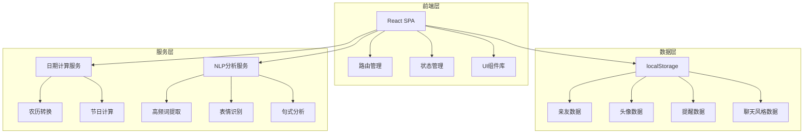

## 1. 架构设计



## 2. 技术栈说明

- **前端框架**: React 18 + TypeScript
- **构建工具**: Vite 5
- **样式方案**: TailwindCSS 3
- **状态管理**: Zustand
- **路由**: React Router 6
- **本地存储**: localStorage (纯前端应用，无后端)
- **NLP分析**: 浏览器端轻量级文本分析
- **头像生成**: Canvas API + SVG组件化
- **日期处理**: 农历转换库 lunar-javascript

## 3. 路由定义

| 路由 | 页面 | 说明 |
|------|------|------|
| `/` | 亲友广场 | 主页面，展示所有亲友头像网格 |
| `/add` | 添加亲友 | 创建新亲友表单 |
| `/edit/:id` | 编辑亲友 | 编辑已有亲友信息 |
| `/detail/:id` | 信息卡片 | 亲友详情页 |
| `/avatar/:id` | 头像定制 | 大头小人定制页面 |
| `/import/:id` | 聊天导入 | 导入聊天记录页面 |
| `/reminders` | 提醒管理 | 查看所有提醒 |
| `/calendar` | 节日日历 | 查看节日日历 |
| `/stats` | 数据统计 | 用户使用统计 |

## 4. 数据模型

### 4.1 亲友数据模型

```typescript
interface Relative {
  id: string;
  name: string;
  birthday: string; // ISO日期格式
  isLunar: boolean; // 是否农历
  relation: 'family' | 'friend' | 'colleague' | 'classmate' | 'other';
  phone?: string;
  hobbies?: string; // 爱好
  clothingSize?: string; // 衣服码号
  shoeSize?: string; // 鞋码
  notes?: string; // 备注
  avatar: AvatarConfig;
  chatStyle?: ChatStyle;
  createdAt: string;
  updatedAt: string;
}
```

### 4.2 头像配置模型

```typescript
interface AvatarConfig {
  faceShape: number; // 脸型索引 0-5
  hairstyle: number; // 发型索引 0-11
  eyeStyle: number; // 眼睛索引 0-7
  mouthStyle: number; // 嘴巴索引 0-5
  clothing: number; // 服饰索引 0-9
  accessory: number; // 配饰索引 0-7
  skinColor: string; // 肤色HEX
  hairColor: string; // 发色HEX
  clothingColor: string; // 衣服颜色HEX
}
```

### 4.3 聊天风格模型

```typescript
interface ChatStyle {
  highFrequencyWords: string[]; // 高频词TOP20
  commonEmojis: string[]; // 常用表情TOP10
  sentencePatterns: string[]; // 句式特征
  toneWords: string[]; // 语气词
  avgMessageLength: number; // 平均消息长度
  personality: '话多型' | '惜字如金型' | '均衡型';
  styleKeywords: string[]; // 风格关键词
}
```

### 4.4 提醒数据模型

```typescript
interface Reminder {
  id: string;
  relativeId: string;
  type: 'birthday' | 'mothers_day' | 'fathers_day' | 'custom';
  date: string;
  advanceDays: number[]; // 提前几天提醒 [1, 3, 7]
  isEnabled: boolean;
  lastNotified?: string;
}
```

## 5. 核心服务设计

### 5.1 日期计算服务

```typescript
// 功能：
// - 公历/农历转换
// - 计算距离生日天数
// - 计算母亲节/父亲节日期
// - 判断是否为节日
```

### 5.2 NLP分析服务（本地实现）

```typescript
// 功能：
// - 解析微信/QQ聊天记录格式
// - 提取高频词（分词+词频统计）
// - 识别emoji表情
// - 分析句式特征
// - 识别语气词
// - 计算平均消息长度
```

### 5.3 提醒服务

```typescript
// 功能：
// - 检查今日需要提醒的事件
// - 生成个性化提醒文案
// - 融入说话风格
// - 触发浏览器通知
```

## 6. 组件结构

```
src/
├── components/
│   ├── common/           # 通用组件
│   │   ├── Button.tsx
│   │   ├── Modal.tsx
│   │   ├── SearchBar.tsx
│   │   └── EmptyState.tsx
│   ├── avatar/           # 头像相关
│   │   ├── AvatarCard.tsx
│   │   ├── AvatarEditor.tsx
│   │   └── AvatarPreview.tsx
│   ├── relative/         # 亲友相关
│   │   ├── RelativeForm.tsx
│   │   ├── RelativeCard.tsx
│   │   └── InfoSection.tsx
│   ├── reminder/         # 提醒相关
│   │   ├── ReminderCard.tsx
│   │   └── ReminderList.tsx
│   └── chat/             # 聊天分析相关
│       ├── FileUpload.tsx
│       └── StylePreview.tsx
├── pages/
│   ├── Home.tsx
│   ├── AddRelative.tsx
│   ├── EditRelative.tsx
│   ├── Detail.tsx
│   ├── AvatarCustom.tsx
│   ├── ChatImport.tsx
│   ├── Reminders.tsx
│   ├── Calendar.tsx
│   └── Stats.tsx
├── services/
│   ├── dateService.ts
│   ├── nlpService.ts
│   ├── reminderService.ts
│   └── storageService.ts
├── stores/
│   └── useRelativeStore.ts
├── types/
│   └── index.ts
└── utils/
    ├── lunar.ts
    └── format.ts
```

## 7. 关键技术实现

### 7.1 头像渲染方案
使用SVG组件化实现，每个部件（脸型、发型、眼睛等）都是独立的SVG组件，通过组合生成完整头像。支持颜色自定义和实时预览。

### 7.2 聊天记录解析
正则匹配微信导出格式（时间戳+昵称+内容），提取对方消息，进行本地分词和统计分析。

### 7.3 本地存储策略
- 亲友数据：JSON格式存储在localStorage
- 头像配置：内联在亲友数据中
- 聊天风格：分析完成后存储在对应亲友数据中
- 提醒状态：单独存储，记录最后通知时间
