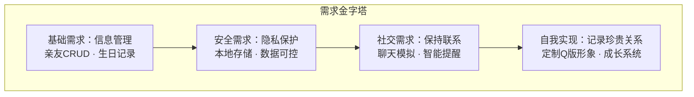
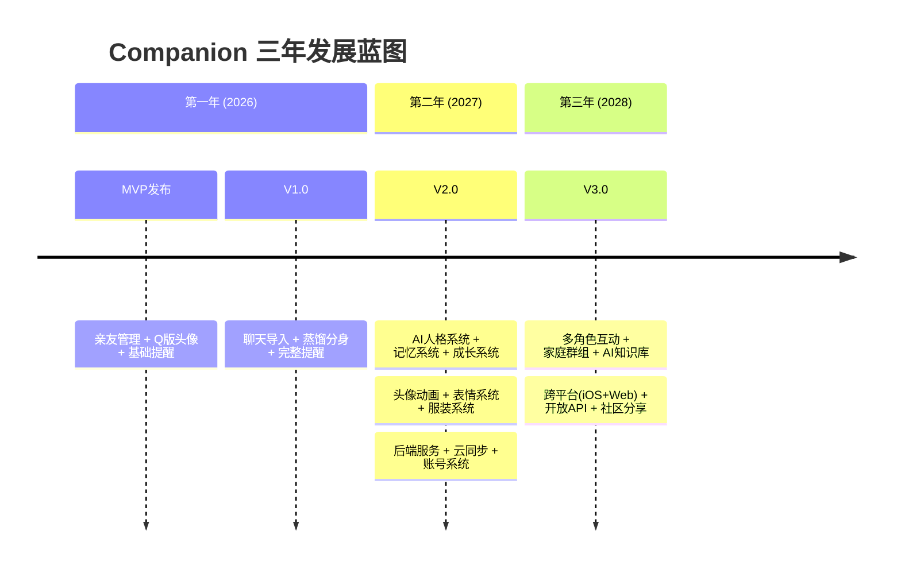

# 00 — 产品愿景 (Project Vision)

> **Companion（伴伴）— 让每一段关系都被温柔记住**

---

## 一、愿景声明

### 1.1 一句话愿景

> **让每一段关系都被温柔记住。**

### 1.2 详细愿景

在快节奏的现代社会中，我们的社交关系越来越多，但真正被用心记住的却越来越少。我们记得同事的工号，却忘了他的生日；我们加了无数微信好友，却不知道上一次真诚问候是什么时候；我们有太多聊天记录，却没有一个地方能让这些记忆变成温暖的陪伴。

**Companion（伴伴）** 要解决的，就是这个问题。

我们不是又一个社交应用，不是又一个通讯录工具。Companion 是一个**关系守护者**——它帮助你：

- 用心记录每一个重要的人
- 用 AI 还原他们独特的说话方式
- 用 Q 版形象让记忆变得可爱
- 用智能提醒确保你不再错过任何重要日子

我们相信，**被记住本身就是一种温柔**。

### 1.3 核心信念

```
┌─────────────────────────────────────────────────────────┐
│                                                         │
│   隐私是基本权利 ─── 所有数据留在你手中                    │
│                                                         │
│   技术应该有温度 ─── AI 是朋友，不是工具                   │
│                                                         │
│   可爱是一种力量 ─── Q 版风格让科技变得亲切                │
│                                                         │
│   记住即是温柔 ─── 每一条记录都是对关系的珍视               │
│                                                         │
└─────────────────────────────────────────────────────────┘
```

---

## 二、核心价值观

### 2.1 隐私至上 (Privacy First)

**承诺：你的数据只属于你。**

- 所有个人数据存储在本地设备
- 聊天记录分析完全在浏览器端完成
- 不上传任何用户数据到服务器
- 不追踪、不分析、不出售用户行为
- 用户可以随时导出或删除所有数据

**设计决策：** 在隐私与便利之间，我们永远选择隐私。即使这意味着某些功能（如云同步）需要更长的开发时间，我们也只会在确保端到端加密的前提下提供。

### 2.2 温暖陪伴 (Warm Companion)

**承诺：像一个认识多年的老朋友。**

- AI 回复有温度，不机械、不说教、不 PUA
- 每个亲友都有独特的数字形象
- 提醒不是冰冷的通知，而是带着关心的问候
- 聊天模拟还原真实的说话方式

**设计决策：** 我们拒绝"效率至上"的设计思路。Companion 不是用来提高社交效率的，而是用来**守护社交温度**的。每一条提醒、每一次对话，都应该让用户感受到温暖。

### 2.3 可爱有趣 (Cute & Fun)

**承诺：让科技变得亲切。**

- Q 版头像让每个人都有可爱的数字形象
- 1000+ 素材组合，每个人都不一样
- 成长系统让关系"活"起来
- 表情、动画让交互充满乐趣

**设计决策：** "可爱"不是低幼，而是一种设计哲学。Q 版风格降低了科技的冰冷感，让所有年龄段的用户都能轻松接受。从 8 岁到 80 岁，可爱是通用语言。

### 2.4 智能而不侵入 (Smart but Non-intrusive)

**承诺：该提醒时提醒，该安静时安静。**

- AI 分析在后台静默完成
- 提醒频率可自定义
- 不推送广告、不推送无关内容
- 智能但克制

**设计决策：** 我们反对"注意力经济"的设计模式。Companion 不会通过推送通知来争夺你的注意力，而是安静地在需要时出现。

### 2.5 简单直接 (Simple & Direct)

**承诺：三步完成任何操作。**

- 添加一个亲友：3 步
- 定制一个头像：3 步
- 导入聊天记录：3 步
- 设置一个提醒：3 步

**设计决策：** 每个核心功能都必须能在 3 步内完成。如果超过 3 步，说明流程需要重新设计。

---

## 三、目标用户

### 3.1 主要用户画像

#### 画像 A：小雨（26岁，职场新人）

```
┌────────────────────────────────────────┐
│  姓名：小雨                              │
│  年龄：26                               │
│  职业：UI设计师                          │
│  特点：社交活跃，但经常忘记朋友生日         │
│  痛点：                               │
│  - 微信好友500+，但不知道上次联系是什么时候  │
│  - 去年忘了妈妈的生日，很内疚              │
│  - 想给每个朋友画Q版头像但不会画画          │
│  期望：一个能帮我记住重要日子的温暖工具      │
└────────────────────────────────────────┘
```

#### 画像 B：阿杰（35岁，程序员父亲）

```
┌────────────────────────────────────────┐
│  姓名：阿杰                              │
│  年龄：35                               │
│  职业：后端开发                          │
│  特点：工作忙碌，社交圈稳定               │
│  痛点：                               │
│  - 总是临时想起来家人生日                  │
│  - 想给孩子做成长记录但没有好的工具          │
│  - 担心隐私问题，不想用社交App记录家人信息   │
│  期望：安全、隐私、好用的家庭关系管理工具     │
└────────────────────────────────────────┘
```

#### 画像 C：小月（45岁，中年母亲）

```
┌────────────────────────────────────────┐
│  姓名：小月                              │
│  年龄：45                               │
│  职业：中学老师                          │
│  特点：重视家庭，记忆力开始下降             │
│  痛点：                               │
│  - 老人的生日总记混                       │
│  - 想给每个家人做生日提醒但太复杂            │
│  - 希望看到全家福式的家人管理               │
│  期望：简单好用，最好有点可爱               │
└────────────────────────────────────────┘
```

#### 画像 D：小林（22岁，大学生）

```
┌────────────────────────────────────────┐
│  姓名：小林                              │
│  年龄：22                               │
│  职业：大学生                            │
│  特点：重度社交用户，喜欢个性化             │
│  痛点：                               │
│  - 毕业后怕和室友失去联系                  │
│  - 想用有趣的头像代替照片                  │
│  - 喜欢AI聊天，但现有AI太"AI味"           │
│  期望：有趣、个性化、有社交记忆的工具        │
└────────────────────────────────────────┘
```

### 3.2 用户需求层次



---

## 四、核心用户场景

### 场景 1：新用户首次使用

```
小雨下载了 Companion →
选择"添加第一个亲友" →
输入妈妈的基本信息 →
选择Q版头像（圆脸+短发+红裙子）→
设置生日提醒（提前3天+当天）→
完成！妈妈有了可爱的数字形象
```

### 场景 2：Q 版头像定制

```
小雨想给闺蜜画头像 →
进入头像定制页面 →
选择"素材捏脸"模式 →
调整脸型（心形脸）→ 选择发型（长卷发）→ 选眼睛（大眼睛）→ 选嘴巴（微笑）→
选择服装（连衣裙）→ 加配饰（蝴蝶结）→
调整发色（栗色）→ 服装颜色（粉色）→
保存！一个独一无二的Q版闺蜜诞生了
```

### 场景 3：聊天记录导入

```
阿杰想给去世的爷爷做数字纪念 →
导入爷爷的微信聊天记录 →
系统自动分析聊天风格：
  - 爷爷说话简短，常用"嗯""好""注意身体"
  - 活跃时间在早上8-10点
  - 经常发语音（短消息占比高）
  - 最常说的话题：吃饭、天气、身体
→ 生成"蒸馏分身"
→ 阿杰和爷爷的数字分身聊天
→ "爷爷"回复："嗯，今天冷，多穿点"
→ 阿杰眼眶湿润
```

### 场景 4：节日提醒

```
母亲节前3天 →
Companion 推送提醒：
"小雨，母亲节快到了哦！记得给妈妈准备一个小惊喜~
你妈妈最喜欢吃你做的红烧排骨，要不要试试？"
→ 小雨感动，打开App →
看到妈妈的Q版头像在提醒卡片上微笑着 →
决定周末回家做饭
```

### 场景 5：家庭关系管理

```
小月打开Companion →
看到"全家福"视图：
  - 爷爷（85岁，双鱼座，属龙）
  - 奶奶（82岁，巨蟹座，属虎）
  - 爸爸（70岁，天蝎座，属马）
  - 妈妈（68岁，金牛座，属羊）
  - 丈夫、儿子、女儿...
每个家人都有Q版头像，生日倒计时清晰显示
→ 小月再也不用担心记混生日了
```

### 场景 6：社交关系维护

```
小林毕业了 →
用Companion记录每个室友的信息：
  - 室友A：爱打游戏，说话爱用"666"
  - 室友B：文艺青年，常发古诗词
  - 室友C：吃货，聊什么都能扯到美食
→ 导入群聊记录，分析每个人的聊天风格
→ 每次打开Companion，就像回到宿舍时光
```

---

## 五、产品定位

### 5.1 我们是什么

> Companion 是一个**关系守护者**——帮助你用心记录、温柔记住每一段重要关系。

### 5.2 我们不是什么

| 我们是 | 我们不是 |
|--------|----------|
| 关系管理工具 | 社交应用 |
| 隐私友好的本地App | 云端服务 |
| 温暖的AI陪伴 | 智能助手 |
| 可爱的Q版形象 | 捏脸游戏 |
| 有温度的提醒 | 日历工具 |

### 5.3 竞品对比

| 维度 | 通讯录 | 生日提醒App | 社交App | **Companion** |
|------|--------|------------|---------|---------------|
| 关系管理 | 基础 | 无 | 好友列表 | **深度** |
| Q版头像 | 无 | 无 | 系统预设 | **1000+自定义** |
| 聊天模拟 | 无 | 无 | 无 | **蒸馏分身** |
| 隐私保护 | 一般 | 一般 | 差 | **本地存储** |
| AI能力 | 无 | 无 | 聊天AI | **风格迁移** |
| 情感价值 | 低 | 低 | 中 | **高** |

---

## 六、核心差异化

### 6.1 五大独特卖点

#### 卖点 1：隐私至上

所有数据存储在本地，聊天分析在设备端完成。我们不设服务器，不收集数据，不追踪用户。这不仅是功能，更是**价值观**。

#### 卖点 2：蒸馏分身

通过导入聊天记录，AI 分析对方的说话风格，生成"蒸馏分身"——一个用真实表达模式回复的数字形象。不是通用AI，而是**你的朋友**的说话方式。

核心算法：
- 高频词提取 → 语言指纹
- 句式模板蒸馏 → 回复模式
- 表达DNA分析 → 独特风格
- 情感倾向分析 → 情绪映射
- 活跃时间分析 → 时间感知

#### 卖点 3：Q 版头像引擎

不是简单的捏脸游戏，而是完整的角色引擎：

- 5 种脸型 × 10 种发型 × 6 种眼睛 × 5 种嘴巴 × 8 种服装 × 6 种配饰
- SVG 组件化，支持任意组合
- 肤色、发色、服色完全自定义
- 未来支持 Lottie 动画、表情系统、成长系统

#### 卖点 4：智能提醒

不是冰冷的日期通知，而是带着关心的温暖问候：

```
普通App: "明天是妈妈的生日"
Companion: "小雨，明天是妈妈的生日哦！去年你送了她一条围巾，
          今年要不要试试别的？妈妈说过喜欢手工的东西~"
```

#### 卖点 5：关系可视化

用 Q 版头像网格展示所有亲友，每个头像都是独一无二的。支持按关系分类、按生日排序、搜索查找。一屏看到所有重要的人。

---

## 七、长期愿景

### 7.1 三年发展蓝图



### 7.2 终极愿景

**Companion 不只是一个App，而是一种新的关系维护方式。**

未来，我们希望：

1. **每个家庭都有自己的 Companion** — 全家人的关系、生日、回忆都在这里
2. **每段珍贵的对话都被保存** — 聊天记录不再是沉没的记忆，而是可互动的温暖
3. **每个人都有自己的 Q 版形象** — 不是照片，而是更有温度的卡通形象
4. **AI 成为关系的守护者** — 不是替代人类社交，而是帮助人类更好地维护关系

---

## 八、关键指标

### 8.1 核心指标

| 指标 | 定义 | 目标（V1.0） |
|------|------|-------------|
| DAU | 日活跃用户数 | 1000+ |
| 留存率 | 7日留存 | 40%+ |
| 头像定制率 | 完成头像定制的用户占比 | 80%+ |
| 聊天导入率 | 导入聊天记录的用户占比 | 30%+ |
| 提醒设置率 | 设置提醒的用户占比 | 60%+ |
| NPS | 净推荐值 | 50+ |

### 8.2 体验指标

| 指标 | 目标 |
|------|------|
| 首次添加亲友 | ≤ 60秒 |
| Q版头像定制 | ≤ 3分钟 |
| 聊天记录导入 | ≤ 2分钟 |
| 设置提醒 | ≤ 30秒 |
| 冷启动时间 | ≤ 2秒 |

---

## 九、产品生态系统

```mermaid
graph TB
    subgraph "Companion 生态系统"
        User[用户]
        
        subgraph "核心功能"
            RM[亲友管理]
            AV[Q版头像]
            CH[聊天模拟]
            RM2[智能提醒]
            CL[节日日历]
        end
        
        subgraph "AI引擎"
            NL[NLP分析]
            DS[蒸馏分身]
            CP[性格识别]
            ST[风格迁移]
        end
        
        subgraph "数据层"
            LS[本地存储]
            DC[数据加密]
            BK[备份恢复]
        end
        
        subgraph "未来扩展"
            CL2[云同步]
            API[开放API]
            SH[社区分享]
            IOS[iOS版本]
        end
    end
    
    User --> RM
    User --> AV
    User --> CH
    User --> RM2
    User --> CL
    
    CH --> DS
    CH --> NL
    AV --> CP
    
    RM --> LS
    CH --> LS
    AV --> LS
    
    LS --> DC
    LS --> BK
    
    CL2 -.-> LS
    API -.-> DS
    SH -.-> AV
    IOS -.-> User
```



---

## 十、设计哲学

### 10.1 四个"不"

| 原则 | 说明 |
|------|------|
| **不打扰** | 推送通知克制而精准，不为了活跃度而打扰用户 |
| **不说教** | AI 回复像朋友聊天，不是长辈教育 |
| **不 PUA** | 不制造焦虑，不用"你已经N天没联系TA了"这种话术 |
| **不机械** | 每句话都有温度，拒绝"好的，已为您完成"式的回复 |

### 10.2 四个"要"

| 原则 | 说明 |
|------|------|
| **要温暖** | 每个交互都传递关心和温度 |
| **要真实** | 模拟真实的说话方式，不是AI腔 |
| **要可爱** | Q版风格贯穿始终，让科技变得亲切 |
| **要尊重** | 尊重用户隐私、尊重每段关系、尊重个体差异 |

---

> **Companion（伴伴）— 让每一段关系都被温柔记住。**
