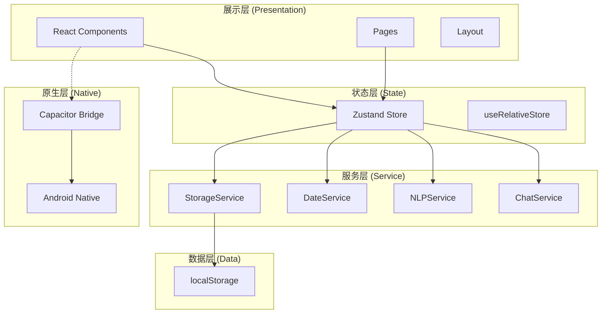
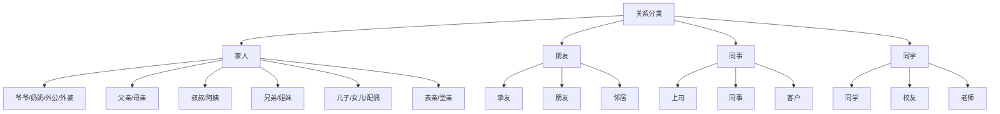
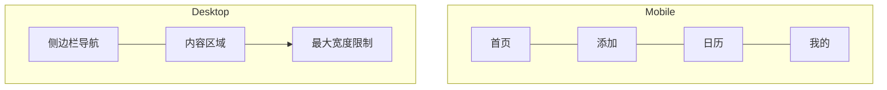
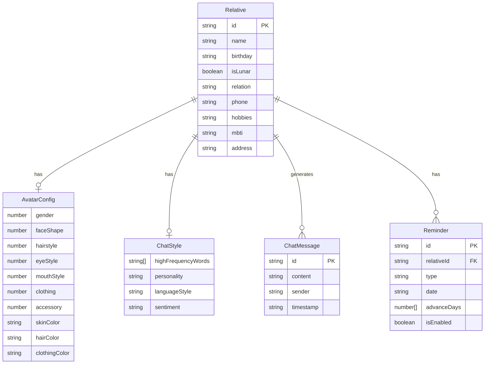
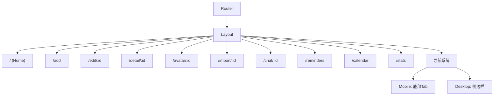

# 01 — 产品需求文档 (Product Requirements Document)

> **Companion（伴伴）v1.0 PRD**
> 版本：v1.0 | 最后更新：2026-06-28

---

## 一、产品概述

### 1.1 基本信息

| 字段 | 内容 |
|------|------|
| 产品名称 | Companion（伴伴） |
| 版本 | v1.0 (MVP 已完成) |
| 平台 | Android (Capacitor) → 未来 iOS + Web |
| 技术栈 | React 18 + TypeScript + Vite + TailwindCSS + Zustand |
| 一句话描述 | 一个温暖的关系守护者，让每一段关系都被温柔记住 |

### 1.2 核心功能矩阵

| 功能模块 | 功能 | 优先级 | 状态 |
|----------|------|--------|------|
| F01 | 亲友管理 | P0 | ✅ 已完成 |
| F02 | Q版头像定制 | P0 | ✅ 已完成 |
| F03 | 聊天记录导入与分析 | P1 | ✅ 已完成 |
| F04 | 聊天模拟（蒸馏分身） | P1 | ✅ 已完成 |
| F05 | 提醒系统 | P1 | ✅ 已完成 |
| F06 | 节日日历 | P2 | ✅ 已完成 |
| F07 | 数据统计 | P2 | ✅ 已完成 |
| F08 | 主题系统 | P1 | ✅ 已完成 |
| F09 | 响应式布局 | P1 | ✅ 已完成 |

### 1.3 系统架构图



---

## 二、用户画像

### 2.1 用户群体

| 用户群 | 年龄 | 特征 | 核心需求 |
|--------|------|------|----------|
| 职场新人 | 22-30 | 社交活跃但常忘纪念日 | 关系管理 + 提醒 |
| 年轻父母 | 28-40 | 工作忙碌但重视家庭 | 家庭记录 + Q版头像 |
| 中年父母 | 40-55 | 记忆力下降但重视亲情 | 简单好用的提醒 |
| 大学生 | 18-25 | 喜欢个性化和有趣的东西 | Q版头像 + AI聊天 |

### 2.2 用户旅程


---

## 三、功能需求

### F01：亲友管理

#### 功能描述

用户可以添加、编辑、删除亲友信息，每个亲友有完整的个人信息档案。

#### 用户故事

| ID | 作为... | 我想要... | 以便... |
|----|---------|-----------|---------|
| F01-01 | 用户 | 添加亲友并填写基本信息 | 记录亲友资料 |
| F01-02 | 用户 | 选择亲友关系分类 | 快速识别关系类型 |
| F01-03 | 用户 | 编辑已有亲友信息 | 更新变化的资料 |
| F01-04 | 用户 | 删除亲友 | 清理不需要的记录 |
| F01-05 | 用户 | 搜索和筛选亲友 | 快速找到特定的人 |

#### 关系分类体系



#### 数据字段

| 字段 | 类型 | 必填 | 说明 |
|------|------|------|------|
| name | string | ✅ | 姓名 |
| birthday | string | ❌ | 生日（ISO格式） |
| isLunar | boolean | ❌ | 是否农历 |
| relation | string | ✅ | 关系类型 |
| phone | string | ❌ | 电话 |
| hobbies | string | ❌ | 爱好 |
| clothingSize | string | ❌ | 衣服码号 |
| shoeSize | string | ❌ | 鞋码 |
| notes | string | ❌ | 备注 |
| mbti | string | ❌ | MBTI人格类型 |
| address | string | ❌ | 居住地址 |
| avatar | AvatarConfig | ✅ | Q版头像配置 |
| avatarImage | string | ❌ | 上传的头像图片(Base64) |

---

### F02：Q 版头像定制

#### 功能描述

提供两种头像定制模式：
1. **素材捏脸**：通过选择不同的面部特征、发型、服装等SVG素材组合生成Q版小人
2. **照片上传**：上传照片后裁剪为圆形头像或Q版大头照

#### 用户故事

| ID | 作为... | 我想要... | 以便... |
|----|---------|-----------|---------|
| F02-01 | 用户 | 选择不同脸型 | 匹配亲友的脸型特征 |
| F02-02 | 用户 | 选择发型 | 匹配亲友的发型 |
| F02-03 | 用户 | 选择眼睛和嘴巴 | 表达亲友的表情特征 |
| F02-04 | 用户 | 选择服装和配饰 | 体现亲友的穿着风格 |
| F02-05 | 用户 | 自定义颜色 | 更贴近真实形象 |
| F02-06 | 用户 | 上传照片裁剪 | 使用真实照片 |

#### 头像配置模型

```typescript
interface AvatarConfig {
  gender: number;        // 0=女孩 1=男孩
  faceShape: number;     // 脸型 (0-4) → 5种
  hairstyle: number;     // 发型 (0-9) → 10种(男5+女5)
  eyeStyle: number;      // 眼睛 (0-5) → 6种
  mouthStyle: number;    // 嘴巴 (0-4) → 5种
  clothing: number;      // 服饰 (0-7) → 8种
  accessory: number;     // 配饰 (0-5) → 6种
  skinColor: string;     // 肤色 HEX
  hairColor: string;     // 发色 HEX
  clothingColor: string; // 服色 HEX
}
```

#### SVG 渲染规格

| 属性 | 规格 |
|------|------|
| viewBox | 200×200 |
| 渲染方式 | SVG组件组合 |
| 描边色 | #5C3D2E |
| 描边宽度 | 2.5px |
| 裁剪方式 | 圆形 |
| 渲染顺序 | 发后层 → 身体 → 头部 → 发前层 → 眼 → 嘴 → 腮红 → 配饰 |

---

### F03：聊天记录导入与分析

#### 功能描述

支持导入微信/QQ聊天记录，通过本地NLP分析提取对方的聊天风格特征。

#### 用户故事

| ID | 作为... | 我想要... | 以便... |
|----|---------|-----------|---------|
| F03-01 | 用户 | 导入微信聊天记录 | 分析亲友的聊天风格 |
| F03-02 | 用户 | 查看分析结果 | 了解亲友的表达特征 |
| F03-03 | 用户 | 确认或修正分析结果 | 确保风格准确 |

#### NLP 分析维度

| 维度 | 说明 | 输出 |
|------|------|------|
| 高频词 | 最常使用的词语 | string[] TOP20 |
| 常用表情 | 最常使用的emoji | string[] TOP10 |
| 句式特征 | 常见的句子结构 | string[] |
| 语气词 | 口头禅和语气词 | string[] |
| 平均消息长度 | 消息平均字数 | number |
| 性格分类 | 话多/惜字如金/均衡 | enum |
| 语言风格 | 正式/随意/混合 | enum |
| 情感倾向 | 积极/中性/消极/混合 | enum |
| 话题偏好 | 常讨论的话题 | string[] |
| 活跃时间 | 活跃的时间段 | number[] |
| 表达DNA | 最具辨识度的表达方式 | string[] |

#### 蒸馏心智模型


---

### F04：聊天模拟

#### 功能描述

基于蒸馏分身，模拟亲友的说话方式与用户对话。

#### 用户故事

| ID | 作为... | 我想要... | 以便... |
|----|---------|-----------|---------|
| F04-01 | 用户 | 和亲友的分身聊天 | 回忆他们的说话方式 |
| F04-02 | 用户 | 看到真实的回复风格 | 感受温暖的陪伴 |
| F04-03 | 用户 | 选择不同话题 | 体验不同场景的对话 |

#### 回复生成优先级

| 优先级 | 方式 | 说明 |
|--------|------|------|
| 1 | 真实回复模式 | 从聊天记录中提取的真实短句 |
| 2 | 旧版表达习惯 | greetingPatterns, farewellPatterns 等 |
| 3 | 真实通用回复 | realReplyPatterns.general |
| 4 | 组合回复 | 句式模板 + 高频词 + 上下文 |
| 5 | 表达DNA修饰 | 应用独特的表达习惯 |

#### 消息分类

| 分类 | 关键词示例 |
|------|-----------|
| 问候 | 你好、嗨、在吗、早上好 |
| 告别 | 拜拜、再见、晚安、先这样 |
| 提问 | 什么、怎么、为什么、吗 |
| 惊讶 | 真的、哇、天哪、厉害 |
| 笑声 | 哈哈、笑、嘿嘿、233 |
| 认同 | 对、是、没错、确实、好的 |
| 安慰 | 没事、别担心、会好的、加油 |

---

### F05：提醒系统

#### 功能描述

支持生日、母亲节、父亲节和自定义提醒，可设置提前天数。

#### 用户故事

| ID | 作为... | 我想要... | 以便... |
|----|---------|-----------|---------|
| F05-01 | 用户 | 设置生日提醒 | 不忘记亲友生日 |
| F05-02 | 用户 | 设置节日提醒 | 母亲节/父亲节不遗漏 |
| F05-03 | 用户 | 自定义提醒 | 纪念日等特殊日期 |
| F05-04 | 用户 | 设置提前提醒天数 | 有充足准备时间 |

#### 提醒类型

| 类型 | 说明 | 农历支持 |
|------|------|---------|
| birthday | 生日提醒 | ✅ |
| mothers_day | 母亲节 | ❌（固定5月第二周日） |
| fathers_day | 父亲节 | ❌（固定6月第三周日） |
| custom | 自定义 | ✅ |

---

### F06：节日日历

#### 功能描述

日历视图展示亲友生日和各种节日，支持农历显示。

#### 核心功能

- 月度日历视图
- 亲友生日标记（Q版头像小图标）
- 节假日标记
- 农历/公历切换
- 生日倒计时

---

### F07：数据统计

#### 功能描述

展示用户使用数据和亲友管理统计。

#### 统计维度

| 统计项 | 说明 |
|--------|------|
| 亲友总数 | 总共添加了多少亲友 |
| 关系分布 | 家人/朋友/同事/同学占比 |
| 头像定制率 | 定制了Q版头像的亲友比例 |
| 聊天导入率 | 导入了聊天记录的亲友比例 |
| 提醒设置率 | 设置了提醒的亲友比例 |
| 生日分布 | 各月份生日数量 |

---

### F08：主题系统

#### 功能描述

支持深色/浅色主题切换，所有组件自动适配。

#### 实现方式

- 使用 TailwindCSS 的 `dark:` 类名
- 通过 `useTheme` Hook 管理状态
- 持久化用户偏好到 localStorage
- 跟随系统设置（prefers-color-scheme）

---

### F09：响应式布局

#### 功能描述

支持手机、平板、桌面三种布局模式。

#### 断点定义

| 断点 | 宽度 | 布局模式 |
|------|------|----------|
| Mobile | 0 - 640px | 底部Tab导航 |
| Tablet | 641 - 1024px | 底部Tab导航（宽屏） |
| Desktop | 1025px+ | 左侧固定侧边栏 |

#### 导航模式



---

## 四、非功能需求

### 4.1 性能要求

| 指标 | 目标 |
|------|------|
| 首屏加载 | ≤ 2秒 |
| 页面切换 | ≤ 300ms |
| 头像渲染 | ≤ 100ms |
| 聊天分析 | ≤ 5秒（1万条消息） |
| 冷启动 | ≤ 3秒 |
| APK大小 | ≤ 15MB |

### 4.2 安全与隐私

| 要求 | 说明 |
|------|------|
| 数据本地化 | 所有数据存储在设备本地 |
| 无网络请求 | 无服务器通信 |
| 无追踪 | 不追踪用户行为 |
| 数据加密 | 敏感数据加密存储（V2.0） |
| 用户控制 | 随时可导出/删除所有数据 |

### 4.3 可访问性

| 要求 | 说明 |
|------|------|
| 最小点击区域 | 44×44px |
| 对比度 | WCAG AA（4.5:1） |
| 字体大小 | 最小14px |
| 深色模式 | 完整支持 |

### 4.4 国际化

| 阶段 | 语言支持 |
|------|----------|
| V1.0 | 中文简体 |
| V2.0 | 中文简体 + 英语 |
| V3.0 | 多语言（日语、韩语等） |

---

## 五、数据模型

### 5.1 完整类型定义

```typescript
// 关系分类
interface RelationCategory {
  key: string;
  label: string;
  items: { key: string; label: string }[];
}

// 头像配置
interface AvatarConfig {
  gender: number;        // 0=女孩 1=男孩
  faceShape: number;     // 脸型 (0-4)
  hairstyle: number;     // 发型 (0-9)
  eyeStyle: number;      // 眼睛 (0-5)
  mouthStyle: number;    // 嘴巴 (0-4)
  clothing: number;      // 服饰 (0-7)
  accessory: number;     // 配饰 (0-5)
  skinColor: string;     // 肤色
  hairColor: string;     // 发色
  clothingColor: string; // 服色
}

// 聊天风格
interface ChatStyle {
  highFrequencyWords: string[];
  commonEmojis: string[];
  sentencePatterns: string[];
  toneWords: string[];
  avgMessageLength: number;
  personality: '话多型' | '惜字如金型' | '均衡型';
  styleKeywords: string[];
  languageStyle: 'formal' | 'casual' | 'mixed';
  sentiment: 'positive' | 'neutral' | 'negative' | 'mixed';
  topicPreferences: string[];
  activeHours: number[];
  responseLengthPattern: 'short' | 'medium' | 'long' | 'variable';
  greetingPatterns: string[];
  farewellPatterns: string[];
  questionPatterns: string[];
  agreementPatterns: string[];
  hesitationPatterns: string[];
  laughterPatterns: string[];
  punctuationStyle: {
    useExclamation: boolean;
    useQuestion: boolean;
    useEllipsis: boolean;
    useTilde: boolean;
  };
  realReplyPatterns: {
    greeting: string[];
    farewell: string[];
    agreement: string[];
    question: string[];
    comfort: string[];
    surprise: string[];
    general: string[];
    laughter: string[];
  };
  sentenceTemplates: string[];
  communicationTraits: {
    questionFrequency: number;
    emojiFrequency: number;
    avgReplyLength: number;
    isInitiator: boolean;
    usesVoiceMessages: boolean;
  };
  expressionDNA: string[];
}

// 亲友数据
interface Relative {
  id: string;
  name: string;
  birthday: string;
  isLunar: boolean;
  relation: string;
  phone?: string;
  hobbies?: string;
  clothingSize?: string;
  shoeSize?: string;
  notes?: string;
  avatar: AvatarConfig;
  avatarImage?: string;
  chatStyle?: ChatStyle;
  zodiac?: string;
  chineseZodiac?: string;
  mbti?: string;
  address?: string;
  createdAt: string;
  updatedAt: string;
}

// 聊天消息
interface ChatMessage {
  id: string;
  content: string;
  sender: 'user' | 'avatar';
  timestamp: string;
}

// 提醒
interface Reminder {
  id: string;
  relativeId: string;
  type: 'birthday' | 'mothers_day' | 'fathers_day' | 'custom';
  date: string;
  advanceDays: number[];
  isEnabled: boolean;
  lastNotified?: string;
}
```

### 5.2 数据模型关系图



---

## 六、页面规范

### 6.1 页面清单

| 路由 | 页面 | 功能 |
|------|------|------|
| `/` | Home | 亲友广场，头像网格展示 |
| `/add` | AddRelative | 添加亲友表单 |
| `/edit/:id` | EditRelative | 编辑亲友信息 |
| `/detail/:id` | Detail | 亲友详情卡片 |
| `/avatar/:id` | AvatarCustom | Q版头像定制 |
| `/import/:id` | ChatImport | 聊天记录导入 |
| `/chat/:id` | Chat | 聊天模拟 |
| `/reminders` | Reminders | 提醒管理 |
| `/calendar` | Calendar | 节日日历 |
| `/stats` | Stats | 数据统计 |

### 6.2 页面布局规范

#### Home 页面

```
┌─────────────────────────┐
│  🔍 搜索栏               │
├─────────────────────────┤
│  [全部] [家人] [朋友]     │ ← 分类筛选标签
│  [同事] [同学]            │
├─────────────────────────┤
│  ┌─────┐ ┌─────┐       │
│  │ 头像 │ │ 头像 │       │ ← 头像网格
│  │ 姓名 │ │ 姓名 │       │
│  │ 关系 │ │ 关系 │       │
│  └─────┘ └─────┘       │
│  ┌─────┐ ┌─────┐       │
│  │ 头像 │ │ 头像 │       │
│  │ 姓名 │ │ 姓名 │       │
│  └─────┘ └─────┘       │
│                         │
│           ＋ 添加亲友     │ ← FAB按钮
├─────────────────────────┤
│  🏠  📅  🔔  👤         │ ← 底部导航
└─────────────────────────┘
```

#### AvatarCustom 页面

```
┌─────────────────────────┐
│  ← 头像定制              │
├─────────────────────────┤
│                         │
│    ┌───────────────┐    │
│    │   Q版头像预览   │    │ ← 实时预览
│    │   (200×200)   │    │
│    └───────────────┘    │
│                         │
├─────────────────────────┤
│ [脸型] [发型] [眼睛]     │ ← 分类标签
│ [嘴巴] [服装] [配饰]     │
├─────────────────────────┤
│  ┌──┐ ┌──┐ ┌──┐ ┌──┐  │
│  │素材│ │素材│ │素材│ │素材│  │ ← 素材网格
│  └──┘ └──┘ └──┘ └──┘  │
│  ┌──┐ ┌──┐ ┌──┐ ┌──┐  │
│  │素材│ │素材│ │素材│ │素材│  │
│  └──┘ └──┘ └──┘ └──┘  │
├─────────────────────────┤
│  肤色 ● ● ● ● ● ● ● ●  │ ← 颜色选择
│  发色 ● ● ● ● ● ● ● ●  │
│  服色 ● ● ● ● ● ● ● ●  │
└─────────────────────────┘
```

---

## 七、路由架构



---

## 八、发布计划

### 8.1 Phase 1: MVP（当前）

- [x] 亲友 CRUD
- [x] Q版头像捏脸
- [x] 照片上传裁剪
- [x] 基础提醒
- [x] 深色/浅色主题
- [x] Android 打包
- [x] 响应式布局

### 8.2 Phase 2: V1.0

- [ ] 聊天记录导入优化
- [ ] 蒸馏分身升级
- [ ] 完整提醒系统
- [ ] 节日日历增强
- [ ] 更多头像素材（200+）
- [ ] 性能优化

### 8.3 Phase 3: V2.0

- [ ] AI 人格系统
- [ ] 记忆系统
- [ ] 成长系统
- [ ] 头像动画（Lottie）
- [ ] 后端服务
- [ ] 云同步
- [ ] 用户账号

### 8.4 Phase 4: V3.0

- [ ] 多角色互动
- [ ] 家庭群组
- [ ] iOS 版本
- [ ] Web 版本
- [ ] 开放 API
- [ ] 社区分享

---

## 九、风险评估

| 风险 | 影响 | 可能性 | 缓解措施 |
|------|------|--------|----------|
| localStorage 容量限制 | 数据丢失 | 中 | 迁移到 IndexedDB |
| 聊天分析准确度低 | 用户体验差 | 中 | 持续优化算法 |
| Android 兼容性 | 部分设备不可用 | 低 | Capacitor 兼容层 |
| 隐私合规 | 法律风险 | 低 | 纯本地架构 |

---

> **Companion PRD v1.0** — 持续迭代，持续完善。
