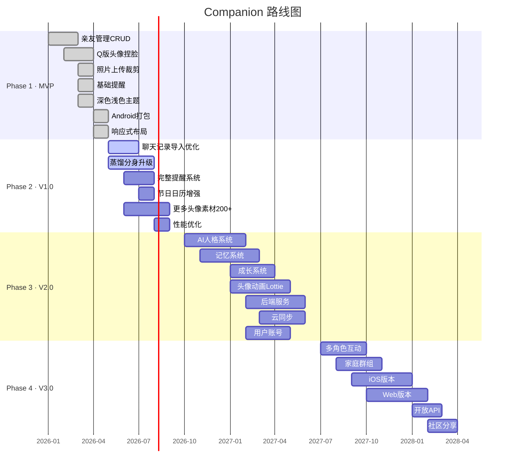
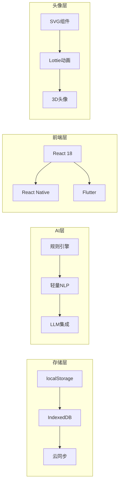

# 02 — 产品路线图 (Roadmap)

> **Companion（伴伴）三年发展路线图**

---

## 一、总览

---

## 二、Phase 1: MVP（已完成）

> 时间：2026-Q1 ~ 2026-Q2 | 状态：✅ 已完成

### 目标
构建最小可用产品，验证核心假设。

### 已完成功能

| 功能 | 描述 | 状态 |
|------|------|------|
| 亲友 CRUD | 添加/编辑/删除亲友，关系分类 | ✅ |
| Q版头像捏脸 | 5脸型×10发型×6眼×5嘴×8服饰×6配饰 | ✅ |
| 照片上传裁剪 | 圆形/Q版大头裁剪 | ✅ |
| 基础提醒 | 生日提醒 | ✅ |
| 深色/浅色主题 | TailwindCSS dark mode | ✅ |
| Android 打包 | Capacitor Android | ✅ |
| 响应式布局 | Mobile + Desktop 双模式 | ✅ |

### 技术里程碑

| 里程碑 | 完成日期 |
|--------|----------|
| 项目初始化（Vite + React + TS） | 2026-01 |
| 核心数据模型定义 | 2026-01 |
| Q版SVG头像引擎开发 | 2026-02 |
| 聊天记录解析引擎 | 2026-03 |
| 蒸馏分身回复生成器 | 2026-03 |
| 首个APK构建成功 | 2026-05 |

---

## 三、Phase 2: V1.0（进行中）

> 时间：2026-Q2 ~ 2026-Q3 | 状态：🔄 进行中

### 目标
完善核心功能，提升用户体验，为 AI 功能奠定基础。

### 功能规划

| 功能 | 描述 | 优先级 | 状态 |
|------|------|--------|------|
| 聊天记录导入优化 | 支持更多格式，提升解析准确度 | P0 | 🔄 |
| 蒸馏分身升级 | 更真实的回复生成，上下文理解 | P0 | 🔄 |
| 完整提醒系统 | 母亲节/父亲节/自定义提醒 | P1 | 📋 |
| 节日日历增强 | 农历节日，节日提醒文案 | P1 | 📋 |
| 更多头像素材 | 扩展到 200+ 素材组合 | P1 | 📋 |
| 性能优化 | 首屏加载 ≤ 2s，头像渲染 ≤ 100ms | P2 | 📋 |
| 数据导出/备份 | JSON导出，数据恢复 | P2 | 📋 |

### 技术里程碑

| 里程碑 | 目标日期 |
|--------|----------|
| 聊天记录多格式支持 | 2026-06 |
| NLP 分析引擎升级 | 2026-07 |
| 提醒系统完整实现 | 2026-08 |
| 200+ 头像素材完成 | 2026-09 |
| 性能基准测试通过 | 2026-09 |

---

## 四、Phase 3: V2.0

> 时间：2026-Q4 ~ 2027-Q2 | 状态：📋 规划中

### 目标
引入 AI 智能系统，构建完整的角色引擎，开始云端化。

### 功能规划

| 功能 | 描述 | 优先级 |
|------|------|--------|
| AI 人格系统 | 统一的AI人格定义，温柔/理性/不说教 | P0 |
| 记忆系统 | AI记住用户的偏好和历史互动 | P0 |
| 头像动画 | Lottie动画，表情切换，动作系统 | P1 |
| 表情系统 | 8种基础表情，12种扩展表情 | P1 |
| 服装系统 | 季节服装、职业服装、特殊场合 | P1 |
| 成长系统 | 关系亲密度、互动记录、里程碑 | P1 |
| 后端服务 | Node.js/Go 后端，RESTful API | P0 |
| 云同步 | 端到端加密同步 | P0 |
| 用户账号 | 邮箱/手机号注册 | P0 |

### 技术里程碑

| 里程碑 | 目标日期 |
|--------|----------|
| AI 人格引擎 MVP | 2026-11 |
| 记忆系统架构 | 2026-12 |
| Lottie 动画集成 | 2027-02 |
| 后端 API v1 | 2027-03 |
| 端到端加密实现 | 2027-04 |
| V2.0 Beta 发布 | 2027-05 |

---

## 五、Phase 4: V3.0

> 时间：2027-Q3 ~ 2028-Q2 | 状态：🔮 远期规划

### 目标
多角色互动，跨平台，社区生态。

### 功能规划

| 功能 | 描述 | 优先级 |
|------|------|--------|
| 多角色互动 | 亲友的Q版形象可以互相对话 | P1 |
| 家庭群组 | 家庭成员共享空间 | P1 |
| AI 知识库 | 基于关系的知识图谱 | P2 |
| iOS 版本 | React Native 或 Flutter | P0 |
| Web 版本 | PWA 或独立Web应用 | P1 |
| 开放 API | 第三方集成 | P2 |
| 社区分享 | Q版形象分享，模板市场 | P2 |
| 多语言 | 英语、日语、韩语 | P2 |

---

## 六、技术演进计划

### 6.1 存储层演进

| 阶段 | 方案 | 容量 | 特点 |
|------|------|------|------|
| V1.0 | localStorage | 5-10MB | 简单，同步 |
| V1.5 | IndexedDB | 50MB+ | 异步，大容量 |
| V2.0 | IndexedDB + 云同步 | 无限 | 端到端加密 |
| V3.0 | 分布式存储 | 无限 | 多设备同步 |

### 6.2 AI 层演进

| 阶段 | 方案 | 能力 | 特点 |
|------|------|------|------|
| V1.0 | 规则引擎 + 关键词匹配 | 基础聊天模拟 | 离线，快速 |
| V1.5 | 轻量NLP + 模板蒸馏 | 风格迁移 | 离线，准确 |
| V2.0 | 本地小模型 | 理解上下文 | 离线，智能 |
| V3.0 | LLM API（可选） | 深度对话 | 在线，最强 |

### 6.3 头像层演进

| 阶段 | 方案 | 素材量 | 特点 |
|------|------|--------|------|
| V1.0 | SVG组件组合 | 40种 | 轻量，矢量 |
| V1.5 | SVG + 增强 | 200+种 | 更多选择 |
| V2.0 | SVG + Lottie动画 | 200+种+动画 | 生动，有趣 |
| V3.0 | 3D头像（可选） | 无限 | 最真实 |

---

## 七、里程碑详细规划

### 7.1 设计里程碑

| 里程碑 | 目标日期 | 交付物 |
|--------|----------|--------|
| CDS v1.0 发布 | 2026-06-28 | 40+规范文档 |
| 设计系统完善 | 2026-08 | 完整组件库 |
| Figma 组件库 | 2026-09 | Figma文件 |
| 动画规范定稿 | 2027-02 | Lottie素材 |

### 7.2 测试里程碑

| 里程碑 | 目标日期 | 覆盖率 |
|--------|----------|--------|
| 核心功能单元测试 | 2026-07 | 80% |
| 组件集成测试 | 2026-09 | 70% |
| E2E 测试 | 2026-12 | 核心流程 |
| 性能测试 | 2026-09 | 基准通过 |
| 安全审计 | 2027-03 | 通过 |

---

## 八、关键指标追踪

| 指标 | MVP目标 | V1.0目标 | V2.0目标 |
|------|---------|----------|----------|
| DAU | 100 | 1,000 | 10,000 |
| 7日留存 | 20% | 40% | 50% |
| 头像定制率 | 50% | 80% | 90% |
| 聊天导入率 | 10% | 30% | 50% |
| NPS | 30 | 50 | 60 |

---

> **路线图持续更新，每季度评审一次。**
