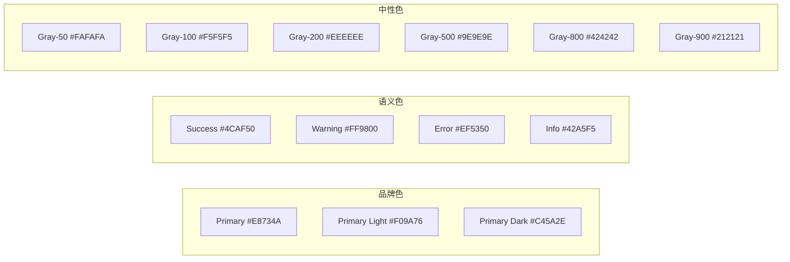

# 10 — 设计系统 (Design System)

> **Companion Design System (CDS-DS)**
> 版本：v1.0 | 日期：2026-06-28

---

## 一、设计系统概述

### 1.1 定义

Companion Design System 是 Companion 项目所有视觉设计的统一规范，确保跨页面、跨平台的视觉一致性。

### 1.2 设计灵感

| 来源 | 借鉴内容 |
|------|----------|
| Apple HIG | 一致性、清晰度、反馈机制 |
| Material Design 3 | 系统化的设计令牌、组件化思维 |
| Q版插画风格 | 可爱、圆润、温暖的视觉语言 |

### 1.3 适用范围

- 所有 UI 页面和组件
- Q版头像系统
- 动画和过渡效果
- 图标和插画
- 深色/浅色主题

---

## 二、设计令牌 (Design Tokens)

### 2.1 颜色令牌



#### 浅色模式

| Token | 值 | 用途 |
|-------|-----|------|
| `--color-primary` | #E8734A | 品牌主色 |
| `--color-primary-light` | #F09A76 | 主色浅 |
| `--color-primary-dark` | #C45A2E | 主色深 |
| `--color-success` | #4CAF50 | 成功/确认 |
| `--color-warning` | #FF9800 | 警告 |
| `--color-error` | #EF5350 | 错误/删除 |
| `--color-info` | #42A5F5 | 信息 |
| `--color-bg` | #FFFFFF | 页面背景 |
| `--color-surface` | #FFFFFF | 卡片表面 |
| `--color-text-primary` | #1A1A1A | 主要文本 |
| `--color-text-secondary` | #666666 | 次要文本 |
| `--color-text-tertiary` | #999999 | 辅助文本 |
| `--color-border` | #E5E5E5 | 边框 |

#### 深色模式

| Token | 值 | 用途 |
|-------|-----|------|
| `--color-bg` | #121212 | 页面背景 |
| `--color-surface` | #1E1E1E | 卡片表面 |
| `--color-text-primary` | #F5F5F5 | 主要文本 |
| `--color-text-secondary` | #B0B0B0 | 次要文本 |
| `--color-border` | #333333 | 边框 |

### 2.2 间距令牌 (8pt Grid)

| Token | 值 | Tailwind | 用途 |
|-------|-----|----------|------|
| `--space-1` | 4px | `p-1` / `m-1` | 微间距 |
| `--space-2` | 8px | `p-2` / `m-2` | 紧凑间距 |
| `--space-3` | 12px | `p-3` / `m-3` | 默认间距 |
| `--space-4` | 16px | `p-4` / `m-4` | 标准间距 |
| `--space-5` | 20px | `p-5` / `m-5` | 宽间距 |
| `--space-6` | 24px | `p-6` / `m-6` | 区块间距 |
| `--space-8` | 32px | `p-8` / `m-8` | 大区块间距 |
| `--space-10` | 40px | `p-10` / `m-10` | 页面边距 |
| `--space-12` | 48px | `p-12` / `m-12` | 安全区域 |

### 2.3 圆角令牌

| Token | 值 | Tailwind | 用途 |
|-------|-----|----------|------|
| `--radius-sm` | 8px | `rounded-lg` | 小圆角 |
| `--radius-md` | 12px | `rounded-xl` | 按钮、输入框 |
| `--radius-lg` | 16px | `rounded-2xl` | 中圆角 |
| `--radius-xl` | 20px | `rounded-[20px]` | 卡片 |
| `--radius-2xl` | 24px | `rounded-[24px]` | 模态框 |
| `--radius-full` | 999px | `rounded-full` | 圆形/胶囊 |

### 2.4 阴影令牌

| Token | 值 | 用途 |
|-------|-----|------|
| `--shadow-sm` | 0 1px 2px rgba(0,0,0,0.05) | 微阴影 |
| `--shadow-md` | 0 4px 12px rgba(0,0,0,0.05) | 卡片默认 |
| `--shadow-lg` | 0 8px 24px rgba(0,0,0,0.08) | 悬浮状态 |
| `--shadow-xl` | 0 12px 36px rgba(0,0,0,0.10) | 模态框 |

> **注意：** 阴影最大透明度不超过 0.10，保持柔和。

### 2.5 字体令牌

详见 [12_Typography.md](./12_Typography.md)

### 2.6 动画令牌

| Token | 值 | 用途 |
|-------|-----|------|
| `--duration-fast` | 150ms | 微交互 |
| `--duration-normal` | 250ms | 默认过渡 |
| `--duration-slow` | 350ms | 页面切换 |
| `--easing-default` | cubic-bezier(0.4, 0, 0.2, 1) | 默认缓动 |
| `--easing-bounce` | cubic-bezier(0.68, -0.55, 0.265, 1.55) | 弹性效果 |
| `--easing-smooth` | cubic-bezier(0.25, 0.1, 0.25, 1) | 平滑过渡 |

---

## 三、布局系统

### 3.1 响应式断点

| 断点 | 宽度 | 布局模式 | Tailwind |
|------|------|----------|----------|
| Mobile | 0 - 640px | 底部Tab导航 | `sm:` |
| Tablet | 641 - 1024px | 底部Tab（宽屏） | `md:` |
| Desktop | 1025px+ | 左侧固定侧边栏 | `lg:` |

### 3.2 安全区域

```css
/* iOS 安全区域 */
padding-top: env(safe-area-inset-top);
padding-bottom: env(safe-area-inset-bottom);
```

### 3.3 最大内容宽度

| 模式 | 最大宽度 | 居中方式 |
|------|----------|----------|
| Mobile | 100% | - |
| Tablet | 100% | - |
| Desktop | 1200px | margin: 0 auto |

---

## 四、组件规范速查

| 组件 | 高度 | 圆角 | 间距 | 说明 |
|------|------|------|------|------|
| 按钮 (Primary) | 48px | 12px | px-6 | 暖橙色背景 |
| 按钮 (Secondary) | 48px | 12px | px-6 | 边框样式 |
| 按钮 (Ghost) | 48px | 12px | px-6 | 无背景 |
| 输入框 | 52px | 12px | px-4 | 边框+聚焦高亮 |
| 卡片 | auto | 20px | p-4 | shadow-md |
| 头像 | 可变 | 999px | - | 圆形裁剪 |
| 图标 | 24px | 2px | - | Lucide |
| 标签 (Tag) | 28px | 999px | px-3 | 胶囊形 |
| 模态框 | auto | 24px | p-6 | 底部滑入 |
| Toast | auto | 12px | px-4 py-3 | 顶部滑入 |
| 列表项 | 56px | 0 | px-4 | 底部1px分割线 |

---

## 五、深色模式

### 5.1 切换方式

```typescript
// 通过 useTheme Hook 管理
const { theme, toggleTheme } = useTheme();

// 持久化到 localStorage
// 跟随系统偏好 (prefers-color-scheme)
```

### 5.2 色彩映射规则

| 浅色模式 | 深色模式 |
|----------|----------|
| 白色背景 #FFFFFF | 深灰背景 #121212 |
| 浅灰表面 #F5F5F5 | 暗灰表面 #1E1E1E |
| 深色文本 #1A1A1A | 浅色文本 #F5F5F5 |
| 边框 #E5E5E5 | 边框 #333333 |
| 品牌色不变 | 品牌色不变 |

### 5.3 对比度验证

所有颜色组合必须通过 WCAG AA（4.5:1）对比度检查。

---

## 六、设计决策矩阵

| 场景 | 选择 | 说明 |
|------|------|------|
| 主要操作 | Primary Button | 暖橙色背景 |
| 次要操作 | Secondary Button | 边框样式 |
| 取消/返回 | Ghost Button | 无背景 |
| 成功反馈 | Success Toast | 绿色 + 图标 |
| 错误反馈 | Error Toast | 红色 + 图标 |
| 确认操作 | 模态框 | 底部滑入 |
| 轻量提示 | Toast | 顶部滑入，3秒消失 |
| 信息展示 | 卡片 | 圆角20px + 阴影 |
| 列表数据 | 列表项 | 56px高度 + 分割线 |

---

> **Companion Design System — 统一的视觉语言，温暖的设计体验。**
