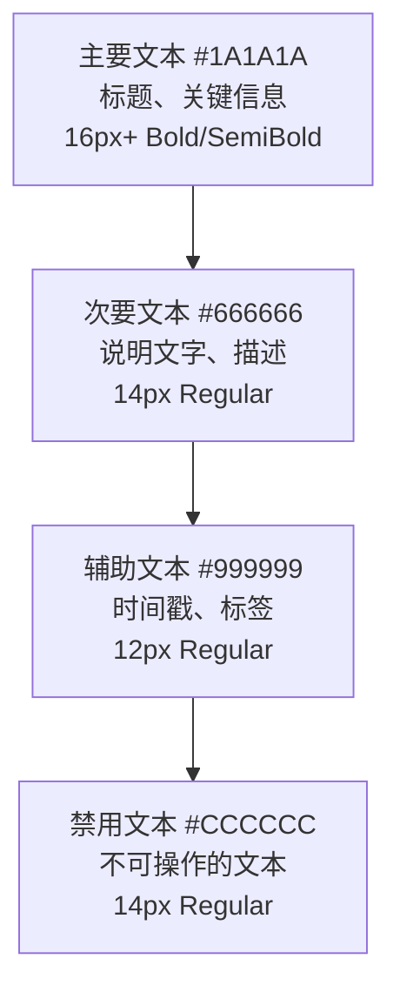

# 12 — 字体排版系统 (Typography)

> **Companion 的文字规范：清晰、友好、易读**

---

## 一、字体选择

### 1.1 字体栈

```css
/* 中文优先的系统字体栈 */
font-family: 
  -apple-system,
  BlinkMacSystemFont,
  "Segoe UI",
  "PingFang SC",
  "Hiragino Sans GB",
  "Microsoft YaHei",
  "Helvetica Neue",
  Arial,
  sans-serif;
```

### 1.2 选择理由

| 字体 | 平台 | 说明 |
|------|------|------|
| -apple-system | iOS/macOS | 系统默认，最佳体验 |
| PingFang SC | iOS/macOS | 苹果中文字体 |
| Microsoft YaHei | Windows | 微软雅黑 |
| Segoe UI | Windows | Windows系统字体 |
| Helvetica Neue | macOS | 经典西文字体 |
| Arial | 全平台 | 兜底字体 |

---

## 二、字号系统

### 2.1 字号规范

| 名称 | 大小 | 行高 | 字重 | Tailwind | 用途 |
|------|------|------|------|----------|------|
| Display | 32px | 40px | 700 | `text-4xl font-bold` | 页面大标题 |
| H1 | 24px | 32px | 700 | `text-2xl font-bold` | 页面标题 |
| H2 | 20px | 28px | 600 | `text-xl font-semibold` | 区块标题 |
| H3 | 18px | 26px | 600 | `text-lg font-semibold` | 小标题 |
| Body | 16px | 24px | 400 | `text-base font-normal` | 正文 |
| Body Small | 14px | 20px | 400 | `text-sm font-normal` | 辅助文本 |
| Caption | 12px | 16px | 400 | `text-xs font-normal` | 标注/标签 |
| Micro | 10px | 14px | 400 | `text-[10px] font-normal` | 极小标注 |

### 2.2 最小字号

- 正文最小：**14px**（确保可读性）
- 标注最小：**12px**
- **不要**使用小于 12px 的字号

### 2.3 行高规则

| 场景 | 行高比例 | 说明 |
|------|----------|------|
| 标题 | 1.33 | 紧凑 |
| 正文 | 1.5 | 标准 |
| 长文本 | 1.6 | 宽松 |

---

## 三、字重系统

| 名称 | 字重值 | Tailwind | 用途 |
|------|--------|----------|------|
| Regular | 400 | `font-normal` | 正文 |
| Medium | 500 | `font-medium` | 按钮、标签 |
| SemiBold | 600 | `font-semibold` | 小标题、强调 |
| Bold | 700 | `font-bold` | 大标题 |

### 使用规则

- **不要**在正文中使用 Bold
- **不要**在同一行混用超过2种字重
- 标题用 Bold/SemiBold，正文用 Regular/Medium

---

## 四、文本颜色层级

### 4.1 层级系统



### 4.2 使用场景

| 层级 | 场景 | 颜色 |
|------|------|------|
| Primary | 页面标题、卡片标题、重要信息 | #1A1A1A |
| Secondary | 说明文字、表单标签、列表描述 | #666666 |
| Tertiary | 时间戳、辅助说明、Placeholder | #999999 |
| Disabled | 不可点击的文本、加载中 | #CCCCCC |

---

## 五、文本对齐

| 场景 | 对齐方式 | 说明 |
|------|----------|------|
| 标题 | 左对齐 | 默认 |
| 正文 | 左对齐 | 默认 |
| 按钮文字 | 居中 | 按钮内 |
| 卡片标题 | 左对齐 | - |
| 空状态文字 | 居中 | 页面中央 |
| 数字 | 右对齐 | 表格内 |

---

## 六、特殊文本规范

### 6.1 链接文本

```css
color: #E8734A;          /* 品牌色 */
text-decoration: none;    /* 无下划线 */
border-bottom: 1px solid; /* 底部细线 */
```

### 6.2 强调文本

- **加粗**用于关键词强调
- *斜体*用于引用或术语
- `代码`用于技术术语

### 6.3 文本截断

```css
/* 单行截断 */
overflow: hidden;
text-overflow: ellipsis;
white-space: nowrap;

/* 多行截断（2行） */
display: -webkit-box;
-webkit-line-clamp: 2;
-webkit-box-orient: vertical;
```

---

## 七、中文排版特殊规则

| 规则 | 说明 |
|------|------|
| 中英文间距 | 中文和英文/数字之间加半角空格 |
| 标点符号 | 使用中文标点（，。！？） |
| 段落间距 | 段落之间使用 16px 间距 |
| 列表缩进 | 使用 8px 缩进或无缩进 |

### 示例

```
✅ 好的写法:
Companion 支持导入微信聊天记录，最多分析 10000 条消息。

❌ 不好的写法:
Companion支持导入微信聊天记录,最多分析10000条消息.
```

---

## 八、TailwindCSS 映射速查

```html
<!-- 标题 -->
<h1 class="text-2xl font-bold text-gray-900 dark:text-gray-50">页面标题</h1>
<h2 class="text-xl font-semibold text-gray-900 dark:text-gray-50">区块标题</h2>
<h3 class="text-lg font-semibold text-gray-800 dark:text-gray-100">小标题</h3>

<!-- 正文 -->
<p class="text-base text-gray-900 dark:text-gray-50">正文内容</p>
<p class="text-sm text-gray-600 dark:text-gray-400">辅助文本</p>
<p class="text-xs text-gray-500 dark:text-gray-500">标注文本</p>
```

---

> **Companion 字体排版 — 清晰易读，温暖友好。**
