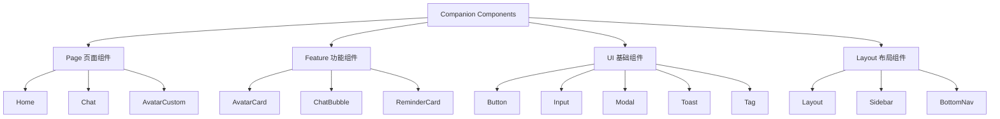

# 13 — 组件设计规范 (Component System)

> **Companion 的 UI 组件规范：统一、可复用、主题友好**

---

## 一、组件分类



---

## 二、基础组件规范

### 2.1 Button 按钮

| 属性 | Primary | Secondary | Ghost | Danger |
|------|---------|-----------|-------|--------|
| 高度 | 48px | 48px | 48px | 48px |
| 圆角 | 12px | 12px | 12px | 12px |
| 内边距 | px-6 | px-6 | px-6 | px-6 |
| 背景色 | #E8734A | transparent | transparent | #EF5350 |
| 文本色 | #FFFFFF | #E8734A | #E8734A | #FFFFFF |
| 边框 | 无 | 1px #E8734A | 无 | 无 |
| 字号 | 16px Medium | 16px Medium | 16px Medium | 16px Medium |

```tsx
// 示例
<button className="h-12 px-6 rounded-xl bg-primary text-white font-medium text-base
                   active:scale-95 transition-transform duration-150">
  添加亲友
</button>
```

**规则：**
- 最小宽度：120px
- 禁用状态：opacity-50 + cursor-not-allowed
- 加载状态：显示 Loading Spinner
- 点击反馈：scale-95 (150ms)

### 2.2 Input 输入框

| 属性 | 值 |
|------|-----|
| 高度 | 52px |
| 圆角 | 12px |
| 内边距 | px-4 |
| 边框 | 1px #E5E5E5 |
| 聚焦边框 | 1px #E8734A |
| 字号 | 16px |
| Placeholder色 | #999999 |

```tsx
<input className="h-[52px] px-4 rounded-xl border border-gray-200 
                  focus:border-primary focus:ring-2 focus:ring-primary/20
                  text-base text-gray-900 placeholder:text-gray-400
                  outline-none transition-all duration-150" />
```

**规则：**
- 标签在输入框上方，14px，#666666
- 必填标记：红色星号 *
- 错误状态：红色边框 + 错误文案在下方

### 2.3 Card 卡片

| 属性 | 值 |
|------|-----|
| 圆角 | 20px |
| 内边距 | p-4 (16px) |
| 阴影 | shadow-md |
| 背景 | bg-white dark:bg-gray-800 |
| 边框 | 无 |

```tsx
<div className="rounded-[20px] p-4 bg-white dark:bg-gray-800 
                shadow-md dark:shadow-gray-900/20">
  {/* 卡片内容 */}
</div>
```

**规则：**
- 卡片内间距统一 16px
- 卡片间距 12px
- 可点击卡片添加 active:scale-[0.98] 反馈

### 2.4 Avatar 头像

| 属性 | 值 |
|------|-----|
| 形状 | 圆形 (rounded-full) |
| 尺寸 | 48px / 64px / 80px / 120px |
| 描边 | 无（默认），可选 2px 品牌色 |

```tsx
// 小头像
<div className="w-12 h-12 rounded-full overflow-hidden">
  <AvatarPreview avatar={config} size={48} />
</div>

// 大头像
<div className="w-20 h-20 rounded-full overflow-hidden shadow-md">
  <AvatarPreview avatar={config} size={80} />
</div>
```

### 2.5 Tag 标签

| 属性 | 值 |
|------|-----|
| 高度 | 28px |
| 圆角 | 999px (胶囊) |
| 内边距 | px-3 |
| 字号 | 12px Medium |

```tsx
<span className="h-7 px-3 rounded-full bg-primary/10 text-primary 
                 text-xs font-medium inline-flex items-center">
  家人
</span>
```

### 2.6 Modal 模态框

| 属性 | 值 |
|------|-----|
| 圆角 | 24px |
| 内边距 | p-6 |
| 遮罩 | rgba(0,0,0,0.5) |
| 入场动画 | 从底部滑入 (250ms) |
| 最大宽度 | 400px |

### 2.7 Toast 提示

| 属性 | Success | Error | Info |
|------|---------|-------|------|
| 圆角 | 12px | 12px | 12px |
| 背景 | #E8F5E9 | #FFEBEE | #E3F2FD |
| 图标色 | #4CAF50 | #EF5350 | #42A5F5 |
| 入场 | 顶部滑入(200ms) | 顶部滑入 | 顶部滑入 |
| 自动消失 | 3秒 | 3秒 | 3秒 |

### 2.8 列表项 List Item

| 属性 | 值 |
|------|-----|
| 高度 | 56px（可变） |
| 内边距 | px-4 |
| 分割线 | 底部 1px #E5E5E5 |
| 点击反馈 | 背景变为 gray-50 |

---

## 三、组件状态

所有交互组件必须支持以下状态：

| 状态 | 视觉表现 |
|------|----------|
| Default | 正常显示 |
| Hover | 背景色加深（桌面端） |
| Active/Pressed | scale-95 缩小 |
| Disabled | opacity-50 + cursor-not-allowed |
| Loading | 显示 Spinner |
| Focus | ring-2 ring-primary |

---

## 四、主题支持

所有组件必须支持深色/浅色主题：

```tsx
// 正确：使用 Tailwind dark: 类名
<div className="bg-white dark:bg-gray-800 text-gray-900 dark:text-gray-50">

// 错误：硬编码颜色
<div className="bg-white text-black">
```

---

## 五、组件文件规范

```tsx
// 组件文件结构
import { useId } from 'react';

interface MyComponentProps {
  // Props 定义
}

export default function MyComponent({ ...props }: MyComponentProps) {
  const id = useId();
  
  // Hooks
  // State
  // Effects
  // Handlers
  
  return (
    <div className="...">
      {/* JSX */}
    </div>
  );
}
```

---

> **Companion 组件系统 — 统一规范，高效复用。**
