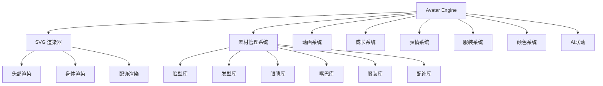

# 20 — 角色引擎 (Avatar Engine)

> **Companion Avatar Engine：不只是捏脸，而是完整的角色系统**

---

## 一、引擎架构



---

## 二、SVG 渲染器

### 2.1 渲染规格

| 属性 | 值 |
|------|-----|
| viewBox | 200×200 |
| 描边色 | #5C3D2E |
| 描边宽度 | 2.5px |
| 裁剪方式 | 圆形 (CSS rounded-full) |
| 渲染方式 | React SVG 组件组合 |

### 2.2 渲染层级

```
Layer 1: 发后层 (Hair Back)
Layer 2: 身体 (Body)
Layer 3: 服装 (Clothing)
Layer 4: 腿部 (Legs)
Layer 5: 鞋子 (Shoes)
Layer 6: 头部/脸型 (Head/Face)
Layer 7: 发前层 (Hair Front)
Layer 8: 眉毛 (Eyebrow)
Layer 9: 眼睛 (Eyes)
Layer 10: 嘴巴 (Mouth)
Layer 11: 腮红 (Blush)
Layer 12: 配饰 (Accessory)
```

### 2.3 头部坐标系

```
Head Center: (100, 48)
Head Radius: 28
Left Eye: (89, 48)
Right Eye: (111, 48)
Mouth Y: 62
Blush Left: (83, 56)
Blush Right: (117, 56)
```

---

## 三、素材管理系统

### 3.1 素材分类

| 部件 | 分类Key | 当前数量 | V2.0 目标 |
|------|---------|----------|-----------|
| 脸型 | faceShape | 5 | 8 |
| 发型 | hairstyle | 10 | 30 |
| 眼睛 | eyeStyle | 6 | 15 |
| 嘴巴 | mouthStyle | 5 | 12 |
| 眉毛 | eyebrow | 0 | 10 |
| 服装 | clothing | 8 | 20 |
| 配饰 | accessory | 6 | 15 |
| 帽子 | hat | 0 | 12 |
| 宠物 | pet | 0 | 10 |
| 背景 | background | 0 | 8 |

### 3.2 素材 ID 编码

```
{部件}_{性别}_{编号}

示例：
hair_M_01  → 男生发型-01
hair_F_01  → 女生发型-01
face_01    → 脸型-01（不分性别）
eye_01     → 眼睛-01（不分性别）
```

### 3.3 素材 JSON Schema

```typescript
interface AvatarAsset {
  id: string;           // 唯一标识
  category: string;     // 分类
  gender: 'male' | 'female' | 'unisex'; // 性别限制
  name: string;         // 显示名称
  thumbnail: string;    // 缩略图路径
  renderOrder: number;  // 渲染层级
  svg: React.FC<{color: string}>; // SVG 组件
}
```

---

## 四、AvatarConfig 数据模型

```typescript
interface AvatarConfig {
  gender: number;        // 0=女孩 1=男孩
  faceShape: number;     // 脸型索引 (0-4)
  hairstyle: number;     // 发型索引 (0-9)
  eyeStyle: number;      // 眼睛索引 (0-5)
  mouthStyle: number;    // 嘴巴索引 (0-4)
  clothing: number;      // 服饰索引 (0-7)
  accessory: number;     // 配饰索引 (0-5)
  skinColor: string;     // 肤色 HEX
  hairColor: string;     // 发色 HEX
  clothingColor: string; // 服色 HEX
}

// 默认值
const DEFAULT_AVATAR: AvatarConfig = {
  gender: 0,
  faceShape: 0,
  hairstyle: 0,
  eyeStyle: 0,
  mouthStyle: 0,
  clothing: 0,
  accessory: 0,
  skinColor: '#FFD5B8',
  hairColor: '#C68B59',
  clothingColor: '#D44A4A',
};
```

---

## 五、组合规则

### 5.1 性别约束

| 部件 | 男孩可用 | 女孩可用 |
|------|----------|----------|
| 发型 | 0-4 (短发) | 5-9 (长发/盘发) |
| 服装 | 0-3 | 4-7 |
| 其他 | 全部 | 全部 |

### 5.2 颜色自定义

| 颜色属性 | 默认值 | 可选范围 | 说明 |
|----------|--------|----------|------|
| skinColor | #FFD5B8 | 预设8色 + 自定义 | 肤色 |
| hairColor | #C68B59 | 预设8色 + 自定义 | 发色 |
| clothingColor | #D44A4A | 预设8色 + 自定义 | 服色 |

### 5.3 预设肤色

```
#FFD5B8 浅肤色（默认）
#F0C8A0 自然肤色
#D4A574 小麦肤色
#C68B59 棕色肤色
#8B6345 深棕色
#FFFAF0 瓷白色
#E8C8A0 暖白色
#B08060 深肤色
```

### 5.4 预设发色

```
#2D2D2D 黑色
#5C3D2E 深棕色
#C68B59 棕色（默认）
#E8C872 金色
#D44A4A 红色
#5B8DBE 蓝色
#9C7EB5 紫色
#6B9E6B 绿色
```

---

## 六、渲染优化

### 6.1 性能目标

| 指标 | 目标 |
|------|------|
| 首次渲染 | ≤ 100ms |
| 切换素材 | ≤ 50ms |
| 切换颜色 | ≤ 30ms |
| 内存占用 | ≤ 5MB |

### 6.2 优化策略

- SVG 组件按需加载
- 颜色切换使用 CSS transition（不重新渲染 SVG）
- 使用 React.memo 避免不必要的重渲染
- 素材数据懒加载

---

## 七、未来扩展

| 功能 | 阶段 | 说明 |
|------|------|------|
| Lottie 动画 | V2.0 | 表情/动作动画 |
| 3D 头像 | V3.0 | 可旋转的3D角色 |
| AI 联动 | V2.0 | 根据心情切换表情 |
| 成长系统 | V2.0 | 关系亲密度影响外观 |
| 打扮系统 | V2.0 | 季节/场合换装 |

---

> **Companion Avatar Engine — 让每个人都有独特的数字形象。**
