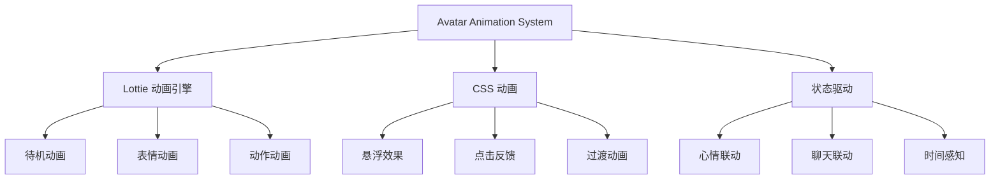

# 22 — 角色动画系统 (Avatar Animation)

> **Companion 角色动画：让 Q 版小人活起来**

---

## 一、动画系统架构



---

## 二、动画类型

### 2.1 待机动画 (Idle)

| 动画 | 描述 | 时长 | 循环 |
|------|------|------|------|
| breathing | 呼吸起伏 | 3s | 循环 |
| blink | 眨眼 | 4s | 循环 |
| sway | 轻微摇晃 | 5s | 循环 |
| float | 上下浮动 | 4s | 循环 |

### 2.2 表情动画 (Expression)

| 动画 | 描述 | 时长 | 触发 |
|------|------|------|------|
| smile | 微笑 | 0.5s | 收到好消息 |
| laugh | 大笑 | 0.8s | 收到有趣内容 |
| wave | 招手 | 1s | 打招呼 |
| heart | 比心 | 0.8s | 收到关心 |
| cry | 哭泣 | 1s | 收到难过内容 |
| angry | 生气 | 0.6s | 收到生气内容 |
| surprise | 惊讶 | 0.5s | 收到惊讶内容 |
| sleep | 打瞌睡 | 2s | 深夜时段 |

### 2.3 动作动画 (Action)

| 动画 | 描述 | 时长 | 触发 |
|------|------|------|------|
| walk | 走路 | 2s | 加载中 |
| jump | 跳跃 | 0.8s | 保存成功 |
| dance | 跳舞 | 2s | 庆祝 |
| bow | 鞠躬 | 1s | 感谢 |
| clap | 鼓掌 | 1s | 恭喜 |
| think | 思考 | 2s | 分析中 |
| present | 展示 | 1s | 展示结果 |

---

## 三、Lottie 动画规范

### 3.1 文件规范

| 属性 | 规范 |
|------|------|
| 格式 | Lottie JSON |
| 帧率 | 30fps |
| 尺寸 | 200×200px |
| 文件大小 | ≤ 50KB |
| 色彩模式 | 矢量（支持动态换色） |

### 3.2 Lottie 集成

```tsx
import Lottie from 'lottie-react';

interface AvatarAnimationProps {
  animation: 'idle' | 'smile' | 'wave' | 'heart' | 'walk';
  loop?: boolean;
  size?: number;
  color?: string; // 支持动态换色
}

export function AvatarAnimation({ 
  animation, 
  loop = false, 
  size = 200,
  color 
}: AvatarAnimationProps) {
  const data = useLottieAnimation(animation);
  
  return (
    <Lottie
      animationData={data}
      loop={loop}
      style={{ width: size, height: size }}
    />
  );
}
```

### 3.3 动画资源管理

```
src/assets/lottie/
├── idle/
│   ├── breathing.json
│   ├── blink.json
│   └── sway.json
├── expression/
│   ├── smile.json
│   ├── laugh.json
│   ├── wave.json
│   └── heart.json
├── action/
│   ├── walk.json
│   ├── jump.json
│   └── dance.json
└── ui/
    ├── loading.json
    └── success.json
```

---

## 四、CSS 动画补充

### 4.1 微动画（不需要 Lottie）

| 效果 | 实现 | 用途 |
|------|------|------|
| 悬浮放大 | `hover:scale-105` | 卡片悬浮 |
| 点击缩小 | `active:scale-95` | 按钮点击 |
| 颜色过渡 | `transition-colors` | 切换颜色 |
| 淡入淡出 | `animate-fade-in` | 页面切换 |

### 4.2 SVG 动画

```css
/* 头像颜色过渡 */
.avatar-color-transition {
  transition: fill 300ms cubic-bezier(0.4, 0, 0.2, 1);
}

/* 头像缩放动画 */
.avatar-scale-in {
  animation: avatarScaleIn 300ms cubic-bezier(0.68, -0.55, 0.265, 1.55);
}

@keyframes avatarScaleIn {
  from { transform: scale(0.8); opacity: 0; }
  to { transform: scale(1); opacity: 1; }
}
```

---

## 五、状态驱动动画

### 5.1 心情联动

| 心情 | 默认表情 | 说明 |
|------|----------|------|
| 开心 | smile | 微笑 |
| 平静 | idle | 待机 |
| 难过 | sad | 低落 |
| 惊讶 | surprise | 惊讶 |
| 生气 | angry | 生气 |

### 5.2 时间感知

| 时段 | 动画 | 说明 |
|------|------|------|
| 早上 6-9 | stretch | 伸懒腰 |
| 上午 9-12 | idle | 正常待机 |
| 中午 12-14 | eat | 吃饭 |
| 下午 14-18 | idle | 正常待机 |
| 晚上 18-22 | idle | 正常待机 |
| 深夜 22-6 | sleep | 打瞌睡 |

### 5.3 聊天联动

```
用户发送消息 →
检测情感类别 →
触发对应表情动画 →
动画完成后回到待机
```

---

## 六、性能优化

| 策略 | 说明 |
|------|------|
| 按需加载 | 仅加载当前需要的动画 |
| 复用实例 | 相同动画复用 Lottie 实例 |
| 降级方案 | 低端设备使用 CSS 动画 |
| 帧率控制 | 低端设备降至 15fps |

---

## 七、动画制作工具

| 工具 | 用途 | 说明 |
|------|------|------|
| After Effects | 原始动画制作 | 配合 Bodymovin 导出 |
| Lottie Editor | 在线编辑 | lottiefiles.com |
| SVGator | SVG 动画 | 轻量级 |
| CSS Animation | 简单过渡 | 无需额外工具 |

---

> **Companion 角色动画 — 让每个小人都有生命力。**
