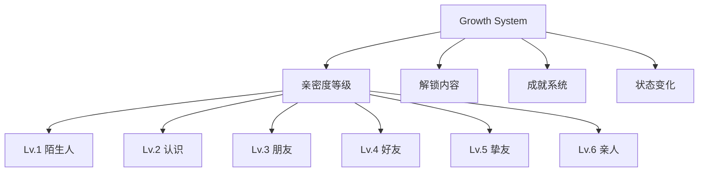

# 23 — 角色成长系统 (Avatar Growth)

> **Companion 成长系统：让关系"活"起来**

---

## 一、成长系统概念

### 1.1 核心理念

> 关系不是静止的，而是会"成长"的。

每个亲友的 Q 版头像会随着你们互动的增多而"成长"，体现关系的亲密度变化。

### 1.2 成长维度



---

## 二、亲密度等级

### 2.1 等级定义

| 等级 | 名称 | 经验值 | 说明 |
|------|------|--------|------|
| Lv.1 | 陌生人 | 0 | 刚添加 |
| Lv.2 | 认识 | 100 | 基本了解 |
| Lv.3 | 朋友 | 300 | 有互动 |
| Lv.4 | 好友 | 600 | 经常联系 |
| Lv.5 | 挚友 | 1000 | 深度关系 |
| Lv.6 | 亲人 | 2000 | 最亲密 |

### 2.2 经验值获取

| 行为 | 经验值 | 说明 |
|------|--------|------|
| 添加亲友 | +10 | 首次添加 |
| 编辑信息 | +5 | 完善资料 |
| 定制头像 | +20 | 完成头像 |
| 导入聊天 | +30 | 分析完成 |
| 聊天互动 | +10/次 | 每次对话 |
| 设置提醒 | +5 | 重要日子 |
| 查看详情 | +2/次 | 日常查看 |
| 特殊日期 | +20 | 生日/节日 |

### 2.3 经验值衰减

```typescript
// 30天无互动，每天衰减1点
function calculateDecay(lastInteraction: Date): number {
  const daysSince = differenceInDays(new Date(), lastInteraction);
  if (daysSince > 30) {
    return Math.min(daysSince - 30, 100); // 最多衰减100点
  }
  return 0;
}
```

---

## 三、解锁内容

### 3.1 等级解锁

| 等级 | 解锁内容 |
|------|----------|
| Lv.1 | 基础脸型、发型、服装 |
| Lv.2 | +3种特殊发型 |
| Lv.3 | +5种特殊服装 |
| Lv.4 | +特殊配饰（皇冠、翅膀） |
| Lv.5 | +专属表情动画 |
| Lv.6 | +终极外观（光环、星星背景） |

### 3.2 成就解锁

| 成就 | 条件 | 解锁 |
|------|------|------|
| 初次见面 | 添加第1个亲友 | 基础头像 |
| 社交达人 | 添加10个亲友 | 特殊边框 |
| 记忆大师 | 导入5份聊天记录 | 记忆光环 |
| 生日管家 | 设置10个生日提醒 | 生日帽 |
| 对话高手 | 聊天100次 | 对话气泡 |
| 关系守护者 | 所有亲友达到Lv.4 | 守护者徽章 |

---

## 四、外观状态变化

### 4.1 等级外观

| 等级 | 头像变化 | 说明 |
|------|----------|------|
| Lv.1 | 基础外观 | 无特殊效果 |
| Lv.2 | 轻微光晕 | 淡淡的光圈 |
| Lv.3 | 星星装饰 | 头像周围有小星星 |
| Lv.4 | 彩虹边框 | 彩色渐变边框 |
| Lv.5 | 动态光效 | 流动的光效 |
| Lv.6 | 光环 + 背景 | 天使光环 + 星空背景 |

### 4.2 季节变化

| 季节 | 头像变化 | 说明 |
|------|----------|------|
| 春 | 樱花飘落 | 粉色花瓣 |
| 夏 | 阳光灿烂 | 金色光芒 |
| 秋 | 枫叶飘落 | 橙色叶子 |
| 冬 | 雪花飘落 | 白色雪花 |

### 4.3 特殊日期变化

| 日期 | 变化 |
|------|------|
| 亲友生日 | 戴生日帽 + 蛋糕 |
| 母亲节 | 拿花束 |
| 圣诞节 | 圣诞帽 |
| 新年 | 新年服饰 |

---

## 五、数据模型

```typescript
interface AvatarGrowth {
  relativeId: string;
  level: number;          // 1-6
  experience: number;     // 当前经验值
  totalExp: number;       // 总经验值
  achievements: string[]; // 已解锁成就
  lastInteraction: Date;  // 最后互动时间
  seasonalEffect: string; // 当前季节效果
  unlockedItems: string[]; // 已解锁物品
}
```

---

## 六、UI 展示

### 6.1 成长进度条

```
┌─────────────────────────────────┐
│  Lv.3 朋友 ████████░░ 300/600  │
│  再互动30次即可升级到 Lv.4      │
└─────────────────────────────────┘
```

### 6.2 成就展示

```
┌─────────────────────────────────┐
│  🏆 已解锁成就                    │
│  ┌────┐ ┌────┐ ┌────┐          │
│  │初次│ │社交│ │记忆│          │
│  │见面│ │达人│ │大师│          │
│  └────┘ └────┘ └────┘          │
└─────────────────────────────────┘
```

---

## 七、隐私考量

- 所有成长数据存储在本地
- 不上传互动数据
- 成长系统完全离线可用
- 用户可以选择关闭成长系统

---

> **Companion 成长系统 — 记录每一次温暖的互动。**
