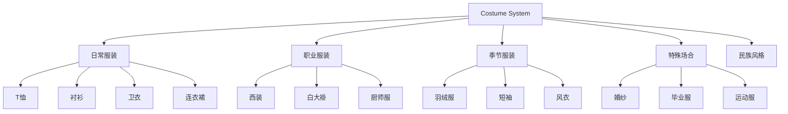

# 25 — 服装系统 (Costume System)

> **Companion 服装系统：为每个角色穿上合适的衣服**

---

## 一、服装系统概述

### 1.1 设计目标

- 覆盖日常、职业、季节、特殊场合
- 支持颜色自定义
- 未来支持搭配系统
- 与成长系统联动

### 1.2 服装分类



---

## 二、V1.0 服装清单

### 2.1 男生服装

| ID | 名称 | 描述 | 可换色 |
|----|------|------|--------|
| 0 | 圆领T恤 | 基础款 | ✅ |
| 1 | 翻领衬衫 | 正式款 | ✅ |
| 2 | 连帽卫衣 | 休闲款 | ✅ |
| 3 | 西装 | 职业款 | ✅ |

### 2.2 女生服装

| ID | 名称 | 描述 | 可换色 |
|----|------|------|--------|
| 4 | A字连衣裙 | 可爱款 | ✅ |
| 5 | 圆领毛衣 | 温暖款 | ✅ |
| 6 | 背带裙 | 俏皮款 | ✅ |
| 7 | 和服 | 特殊款 | ✅ |

---

## 三、V2.0 扩展服装

### 3.1 职业服装

| 名称 | 描述 | 解锁条件 |
|------|------|----------|
| 白大褂 | 医生/研究员 | Lv.3 |
| 厨师服 | 厨师 | Lv.3 |
| 护士服 | 护士 | Lv.3 |
| 工装 | 工程师 | Lv.3 |
| 制服 | 制服系列 | Lv.4 |

### 3.2 季节服装

| 名称 | 描述 | 季节 |
|------|------|------|
| 羽绒服 | 冬季保暖 | 冬 |
| 短袖T恤 | 夏季清凉 | 夏 |
| 风衣 | 春秋外套 | 春秋 |
| 毛衣 | 冬季内搭 | 冬 |
| 背心 | 夏季 | 夏 |

### 3.3 特殊场合

| 名称 | 描述 | 解锁条件 |
|------|------|----------|
| 婚纱 | 浪漫场合 | Lv.5 |
| 毕业服 | 毕业季 | 成就解锁 |
| 运动服 | 运动场景 | Lv.3 |
| 圣诞装 | 圣诞节 | 节日解锁 |
| 新年装 | 过年 | 节日解锁 |

### 3.4 民族风格

| 名称 | 描述 | 说明 |
|------|------|------|
| 汉服 | 中国风 | 文化传承 |
| 旗袍 | 经典中式 | 优雅 |
| 藏装 | 藏族风格 | 多元文化 |

---

## 四、颜色自定义

### 4.1 服装颜色规则

| 规则 | 说明 |
|------|------|
| 主色 | 服装主体颜色，可自定义 |
| 辅色 | 装饰/图案颜色，部分可自定义 |
| 描边 | 统一 #5C3D2E，不可修改 |

### 4.2 预设服装色

```
#D44A4A 红色（默认）
#5B8DBE 蓝色
#6B9E6B 绿色
#E8C872 黄色
#9C7EB5 紫色
#E8734A 橙色
#F5F5F5 白色
#424242 黑色
```

---

## 五、数据模型

```typescript
interface CostumeConfig {
  id: string;
  name: string;
  category: 'daily' | 'work' | 'season' | 'special' | 'cultural';
  gender: 'male' | 'female' | 'unisex';
  season?: 'spring' | 'summer' | 'autumn' | 'winter';
  unlockLevel?: number;   // 解锁等级
  unlockAchievement?: string; // 解锁成就
  primaryColor: string;   // 主色
  secondaryColor?: string; // 辅色
  svg: React.FC<CostumeProps>;
}
```

---

## 六、UI 展示

### 6.1 服装选择器

```
┌──────────────────────────────┐
│  服装商店                     │
├──────────────────────────────┤
│ [日常] [职业] [季节] [特殊]   │
├──────────────────────────────┤
│ ┌────┐ ┌────┐ ┌────┐       │
│ │ T恤 │ │衬衫│ │卫衣│       │
│ │ ✓  │ │ 🔒 │ │ ✓  │       │
│ └────┘ └────┘ └────┘       │
│ ┌────┐ ┌────┐ ┌────┐       │
│ │西装│ │婚纱│ │汉服│       │
│ │ 🔒 │ │ 🔒 │ │ 🔒 │       │
│ └────┘ └────┘ └────┘       │
├──────────────────────────────┤
│  🔒 = 需要达到 Lv.3 解锁     │
└──────────────────────────────┘
```

---

## 七、未来规划

| 功能 | 阶段 | 说明 |
|------|------|------|
| 服装配色系统 | V2.0 | 自由搭配颜色 |
| 服装搭配方案 | V2.0 | 预设搭配 |
| 季节自动切换 | V2.0 | 根据日期自动换装 |
| 服装市场 | V3.0 | 用户分享搭配 |
| 3D 服装预览 | V3.0 | 360度查看 |

---

> **Companion 服装系统 — 让每个角色都有自己的风格。**
