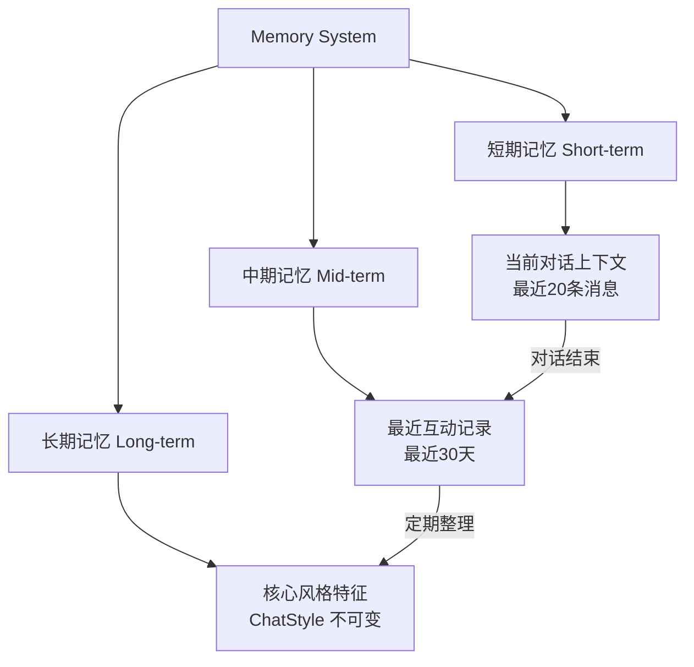
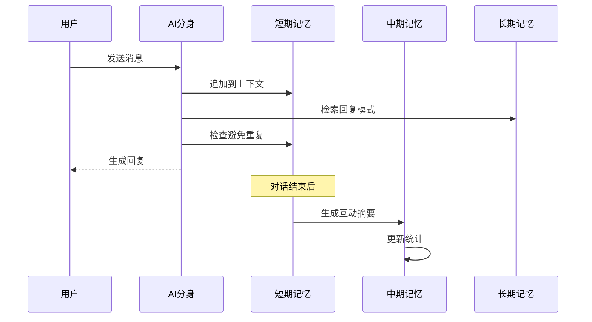

# 31 — AI 记忆系统 (AI Memory)

> **Companion AI 记忆：记住每一次温暖的对话**

---

## 一、记忆架构



---

## 二、三层记忆模型

### 2.1 短期记忆 (Short-term Memory)

| 属性 | 规格 |
|------|------|
| 容量 | 最近 20 条对话 |
| 存储 | 内存 (React State) |
| 生命周期 | 单次对话 |
| 用途 | 理解上下文、连贯对话 |

```typescript
interface ShortTermMemory {
  messages: ChatMessage[];   // 最近20条
  topic: string;             // 当前话题
  sentiment: number;         // 当前情感状态 -1~1
  turnCount: number;         // 对话轮次
}
```

### 2.2 中期记忆 (Mid-term Memory)

| 属性 | 规格 |
|------|------|
| 容量 | 最近 30 天互动摘要 |
| 存储 | localStorage |
| 生命周期 | 持久化 |
| 用途 | 了解近期互动模式 |

```typescript
interface MidTermMemory {
  recentInteractions: InteractionSummary[];
  lastChatDate: string;
  chatFrequency: number;       // 近期聊天频率
  dominantTopics: string[];    // 近期主要话题
  moodTrend: 'positive' | 'neutral' | 'negative'; // 近期情绪趋势
}

interface InteractionSummary {
  date: string;
  messageCount: number;
  topics: string[];
  sentiment: number;
}
```

### 2.3 长期记忆 (Long-term Memory)

| 属性 | 规格 |
|------|------|
| 容量 | 核心特征（压缩后） |
| 存储 | localStorage (ChatStyle) |
| 生命周期 | 永久 |
| 用途 | 保持人格一致性 |

```typescript
// 长期记忆 = ChatStyle（不可变的核心特征）
// 包含：高频词、语气词、句式、性格、情感倾向、表达DNA等
```

---

## 三、记忆使用规则

### 3.1 回复生成时的记忆调用

| 步骤 | 使用的记忆层 | 说明 |
|------|-------------|------|
| 1. 理解意图 | 短期 | 分析当前消息的情感类别 |
| 2. 检索模式 | 长期 | 查找匹配的回复模式 |
| 3. 选择回复 | 短期+长期 | 避免重复、保持一致 |
| 4. 修饰输出 | 长期 | 应用表达DNA |

### 3.2 记忆更新规则

| 记忆层 | 更新时机 | 说明 |
|--------|----------|------|
| 短期 | 每条消息 | 追加到上下文 |
| 中期 | 每次对话结束 | 摘要存储 |
| 长期 | 聊天记录重新分析时 | 重新蒸馏 |

### 3.3 关键原则

- **短期记忆不改变人格**：当前对话不影响核心风格
- **中期记忆是统计**：只是互动频率和话题的统计
- **长期记忆是基础**：所有回复都基于长期记忆生成

---

## 四、记忆容量管理

### 4.1 容量限制

| 记忆层 | 最大容量 | 超出处理 |
|--------|----------|----------|
| 短期 | 20条消息 | FIFO，删除最早 |
| 中期 | 30天数据 | 删除30天前数据 |
| 长期 | ChatStyle固定 | 重新分析时覆盖 |

### 4.2 存储空间

| 数据 | 预估大小 | 说明 |
|------|----------|------|
| 单人ChatStyle | ~5KB | 核心特征 |
| 单人聊天记录 | ~50KB | 1000条消息 |
| 中期记忆 | ~2KB | 30天摘要 |
| 50人总数据 | ~300KB | 远低于localStorage限制 |

---

## 五、隐私与记忆

| 原则 | 说明 |
|------|------|
| 全部本地 | 记忆数据不上传到任何服务器 |
| 用户控制 | 用户可查看/删除任何记忆层 |
| 透明性 | 用户可以看到AI"记住"了什么 |
| 最小化 | 只存储必要信息 |

---

## 六、数据模型

```typescript
interface AIMemory {
  relativeId: string;
  shortTerm: ShortTermMemory;
  midTerm: MidTermMemory;
  // 长期记忆存储在 Relative.chatStyle 中
}

interface ShortTermMemory {
  messages: ChatMessage[];
  topic: string;
  sentiment: number;
  turnCount: number;
}

interface MidTermMemory {
  recentInteractions: InteractionSummary[];
  lastChatDate: string;
  chatFrequency: number;
  dominantTopics: string[];
  moodTrend: 'positive' | 'neutral' | 'negative';
}

interface InteractionSummary {
  date: string;
  messageCount: number;
  topics: string[];
  sentiment: number;
}
```

---

## 七、记忆流程图



---

> **Companion AI 记忆 — 记住温暖，忘记打扰。**
