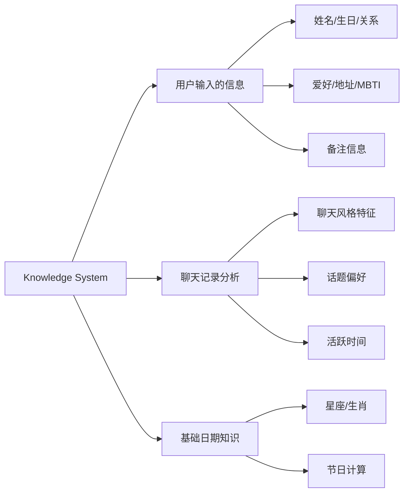

# 32 — AI 知识体系 (AI Knowledge)

> **Companion AI 知识：只说知道的，不编造不知道的**

---

## 一、知识来源



---

## 二、知识分类

### 2.1 基本信息知识

| 知识项 | 来源 | 可见 | 示例 |
|--------|------|------|------|
| 姓名 | 用户输入 | 是 | "小明" |
| 生日 | 用户输入 | 是 | "3月15日" |
| 关系 | 用户输入 | 是 | "朋友" |
| 星座 | 自动计算 | 是 | "双鱼座" |
| 生肖 | 自动计算 | 是 | "属龙" |

### 2.2 偏好信息知识

| 知识项 | 来源 | 可见 | 示例 |
|--------|------|------|------|
| 爱好 | 用户输入 | 是 | "打篮球、看电影" |
| 衣服码号 | 用户输入 | 是 | "L码" |
| 鞋码 | 用户输入 | 是 | "42码" |
| MBTI | 用户输入 | 是 | "INFP" |
| 语言风格 | 聊天分析 | 是 | "随意" |
| 性格特征 | 聊天分析 | 是 | "话多型" |

### 2.3 关系信息知识

| 知识项 | 来源 | 可见 | 示例 |
|--------|------|------|------|
| 称呼方式 | 聊天分析 | 是 | "小明叫我哥" |
| 互动频率 | 统计 | 是 | "每周聊3次" |
| 活跃时段 | 聊天分析 | 是 | "晚上8-10点" |
| 常聊话题 | 聊天分析 | 是 | "游戏、美食" |

### 2.4 行为模式知识

| 知识项 | 来源 | 可见 | 示例 |
|--------|------|------|------|
| 回复速度 | 推断 | 否 | 暗示在回复中体现 |
| 表达习惯 | 聊天分析 | 是 | "喜欢用反问句" |
| 笑的方式 | 聊天分析 | 是 | "哈哈哈" |
| 告别方式 | 聊天分析 | 是 | "先这样~" |

---

## 三、知识边界

### 3.1 三条红线

| 红线 | 说明 | 示例 |
|------|------|------|
| **不编造** | 不能说用户没告诉过的信息 | ❌ 编造"TA喜欢吃苹果" |
| **不推断** | 不能从有限信息做过度推断 | ❌ 从"喜欢猫"推断"不喜欢狗" |
| **不冒充** | 不能假装自己是真人 | 始终是"分身"身份 |

### 3.2 不知道时的回复

```
用户："TA最喜欢吃什么？"

❌ 错误："TA最喜欢吃火锅。"（编造）
✅ 正确："这个我还不太清楚呢~你可以告诉我，我记下来~"
✅ 正确："嗯...这个你好像还没告诉过我呢"
```

### 3.3 知识不足时的引导

```
当缺少某项知识时，AI 可以：
1. 诚实地说不知道
2. 引导用户提供信息
3. 使用已知信息进行回复
```

---

## 四、知识更新规则

### 4.1 更新触发

| 触发条件 | 更新内容 |
|----------|----------|
| 用户修改亲友信息 | 基本信息知识 |
| 重新导入聊天记录 | 聊天风格知识 |
| 用户手动备注 | 补充知识 |
| 时间推移 | 星座/生肖自动更新 |

### 4.2 知识版本

```typescript
interface KnowledgeVersion {
  version: number;        // 版本号
  lastUpdated: string;    // 最后更新时间
  source: 'user_input' | 'chat_analysis' | 'calculated';
  confidence: number;     // 置信度 0-1
}
```

---

## 五、知识使用优先级

| 优先级 | 知识类型 | 说明 |
|--------|----------|------|
| 1 | 用户直接输入 | 最可信 |
| 2 | 聊天分析结果 | 高可信 |
| 3 | 自动计算结果 | 确定性高 |
| 4 | 无知识 | 诚实说不知道 |

---

## 六、数据模型

```typescript
interface AIKnowledge {
  relativeId: string;
  
  // 基本信息
  basic: {
    name: string;
    birthday?: string;
    relation: string;
    zodiac?: string;
    chineseZodiac?: string;
  };
  
  // 偏好信息
  preferences: {
    hobbies?: string;
    mbti?: string;
    clothingSize?: string;
    shoeSize?: string;
  };
  
  // 聊天知识
  chat: {
    highFrequencyWords: string[];
    commonEmojis: string[];
    sentencePatterns: string[];
    personality: string;
    activeHours: number[];
    dominantTopics: string[];
  };
  
  // 元数据
  meta: {
    version: number;
    lastUpdated: string;
    confidence: number;
  };
}
```

---

## 七、隐私边界

| 规则 | 说明 |
|------|------|
| 不主动询问敏感信息 | 不问收入、感情状况等 |
| 不存储密码 | 绝不存储任何密码 |
| 不跨用户分享 | 一个人的信息不会出现在另一个人的对话中 |
| 用户可删除 | 用户可以删除任何知识 |

---

> **Companion AI 知识 — 知之为知之，不知为不知。**
