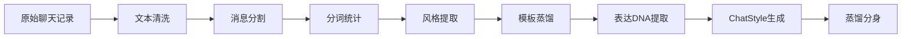
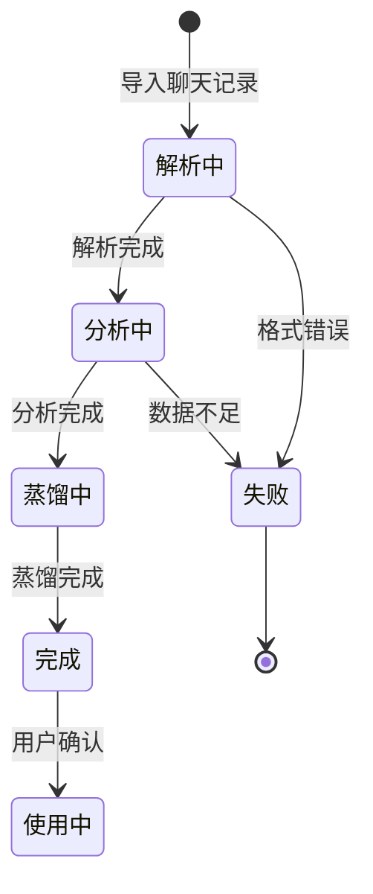

# 33 — AI 工作流 (AI Workflow)

> **Companion AI 工作流：从聊天记录到蒸馏分身的完整流程**

---

## 一、总体流程



---

## 二、聊天记录解析

### 2.1 支持的格式

#### 微信导出格式

```
2024年1月15日 14:32:15
张三: 你好啊
李四: 来了~
张三: 最近怎么样
李四: 还行吧，你呢
```

#### QQ导出格式

```
2024-01-15 14:32:15 张三
你好啊
2024-01-15 14:32:20 李四
来了~
```

### 2.2 解析正则

```typescript
// 微信格式
const WECHAT_REGEX = /^(\d{4}年\d{1,2}月\d{1,2}日\s+\d{2}:\d{2}:\d{2})\s*\n(.+?):\s*(.+)$/;

// QQ格式
const QQ_REGEX = /^(\d{4}-\d{2}-\d{2}\s+\d{2}:\d{2}:\d{2})\s+(.+?)\n(.+)$/;
```

### 2.3 文本清洗

| 清洗步骤 | 说明 | 示例 |
|----------|------|------|
| 去除系统消息 | 过滤"[图片]"等 | "[图片]" → 跳过 |
| 去除时间戳 | 只保留消息内容 | — |
| 合并连续消息 | 同一人连续消息合并 | — |
| 去除空消息 | 过滤空行 | — |

---

## 三、NLP 分析维度

### 3.1 分词与统计

```typescript
// 核心统计
function analyzeMessages(messages: string[]) {
  return {
    wordFrequency: extractHighFrequencyWords(messages),  // 高频词
    emojiFrequency: extractEmojis(messages),              // 表情统计
    toneWords: extractToneWords(messages),                // 语气词
    sentencePatterns: extractPatterns(messages),           // 句式
    avgLength: calculateAverageLength(messages),          // 平均长度
  };
}
```

### 3.2 分析输出

| 分析项 | 输出类型 | 说明 |
|--------|----------|------|
| 高频词 | string[] TOP20 | 最常用的词 |
| 常用表情 | string[] TOP10 | 最常用的emoji |
| 句式特征 | string[] | 常见句子结构 |
| 语气词 | string[] | 口头禅 |
| 平均消息长度 | number | 字数 |
| 性格分类 | enum | 话多/惜字如金/均衡 |
| 语言风格 | enum | 正式/随意/混合 |
| 情感倾向 | enum | 积极/中性/消极/混合 |
| 话题偏好 | string[] | 常讨论的话题 |
| 活跃时间 | number[] | 0-23小时 |
| 标点习惯 | PunctuationStyle | 感叹号/省略号/波浪号 |

### 3.3 性格分类规则

| 性格 | 条件 | 说明 |
|------|------|------|
| 话多型 | avgLength > 20 | 消息平均超过20字 |
| 惜字如金型 | avgLength < 8 | 消息平均不到8字 |
| 均衡型 | 8 ≤ avgLength ≤ 20 | 中间范围 |

---

## 四、蒸馏分身生成

### 4.1 回复模式蒸馏

从聊天记录中提取真实回复模式：

```typescript
function distillReplyPatterns(messages: ParsedMessage[]) {
  const patterns = {
    greeting: [],      // 问候模式
    farewell: [],      // 告别模式
    agreement: [],     // 认同模式
    comfort: [],       // 安慰模式
    surprise: [],      // 惊讶模式
    laughter: [],      // 笑声模式
    general: [],       // 通用模式
  };
  
  // 从真实对话中提取每种类型的回复
  for (const msg of messages) {
    const category = classifyMessage(msg.content);
    if (isReply(msg)) {
      patterns[category].push(msg.content);
    }
  }
  
  return patterns;
}
```

### 4.2 模板蒸馏

```typescript
function extractTemplates(replies: string[]): string[] {
  // 识别句式结构
  // "我觉得{X}挺好的"
  // "要不我们去{X}"
  // "你是不是{X}"
  
  return templates;
}
```

### 4.3 表达 DNA 提取

```typescript
function extractExpressionDNA(messages: string[]): string[] {
  const dna = [];
  
  // 检测独特的表达习惯
  if (hasPattern(messages, '喜欢用反问句')) dna.push('喜欢用反问句');
  if (hasPattern(messages, '句尾加"嘛"')) dna.push('常在句尾加"嘛"');
  if (hasPattern(messages, '先肯定再说但是')) dna.push('习惯先肯定再说但是');
  
  return dna;
}
```

---

## 五、回复生成算法

### 5.1 五级优先级

| 优先级 | 方式 | 概率权重 | 说明 |
|--------|------|----------|------|
| 1 | 真实回复模式 | 0.7 | realReplyPatterns中的真实短句 |
| 2 | 表达习惯模式 | 0.5 | greetingPatterns等 |
| 3 | 真实通用回复 | 0.6 | realReplyPatterns.general |
| 4 | 组合回复 | — | 句式模板+高频词 |
| 5 | 表达DNA修饰 | — | 最终修饰 |

### 5.2 完整回复生成流程

```typescript
function generateResponse(
  userMessage: string,
  chatStyle: ChatStyle,
  recentMessages: ChatMessage[]
): string {
  // 1. 检测用户消息的情感类别
  const category = detectMessageCategory(userMessage);
  
  // 2. 按优先级尝试生成回复
  
  // 优先级1: 真实回复模式
  if (hasRealReplies(chatStyle, category) && chance(0.7)) {
    return pickRealReply(chatStyle, category);
  }
  
  // 优先级2: 表达习惯模式
  if (hasPatterns(chatStyle, category) && chance(0.5)) {
    return pickPattern(chatStyle, category);
  }
  
  // 优先级3: 真实通用回复
  if (chatStyle.realReplyPatterns.general.length > 0 && chance(0.6)) {
    return pick(chatStyle.realReplyPatterns.general);
  }
  
  // 优先级4: 组合回复
  let response = composeResponse(userMessage, category, chatStyle);
  
  // 优先级5: 表达DNA修饰
  response = applyExpressionDNA(response, chatStyle);
  
  return response;
}
```

### 5.3 消息分类系统

```typescript
const CATEGORY_KEYWORDS = {
  greeting: ['你好', '嗨', '在吗', '早上好', '晚安'],
  farewell: ['拜拜', '再见', '晚安', '先这样', '走了'],
  question: ['什么', '怎么', '为什么', '吗', '？'],
  surprise: ['真的', '哇', '天哪', '厉害', '牛'],
  laughter: ['哈哈', '笑', '嘿嘿', '233'],
  agreement: ['对', '是', '没错', '确实', '好的'],
  comfort: ['没事', '别担心', '会好的', '加油'],
  positive: ['开心', '高兴', '棒', '好', '赞'],
  negative: ['难过', '伤心', '生气', '烦', '讨厌'],
};
```

---

## 六、质量保障

### 6.1 回复质量检查

| 检查项 | 规则 |
|--------|------|
| 长度一致 | 回复长度与原人风格一致 |
| 用词一致 | 使用原人的高频词 |
| 情感一致 | 情感倾向与原人一致 |
| 不重复 | 连续3条不重复同一回复 |
| 不编造 | 不虚构信息 |

### 6.2 分析质量指标

| 指标 | 目标 | 说明 |
|------|------|------|
| 最低消息数 | 50条 | 少于50条无法准确分析 |
| 推荐消息数 | 200条+ | 越多越准确 |
| 高频词准确率 | >80% | 用户认可度 |
| 回复相似度 | >60% | 与真实风格的相似度 |

---

## 七、工作流状态图



---

> **Companion AI 工作流 — 从真实对话到温暖分身。**
