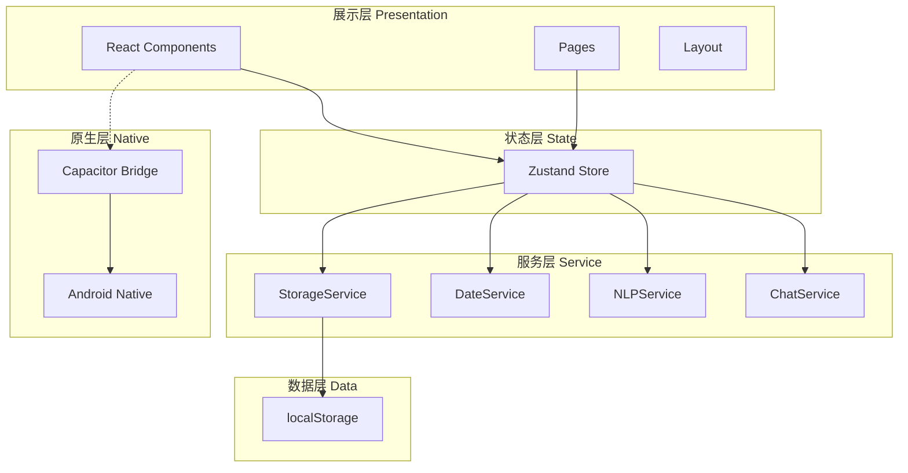
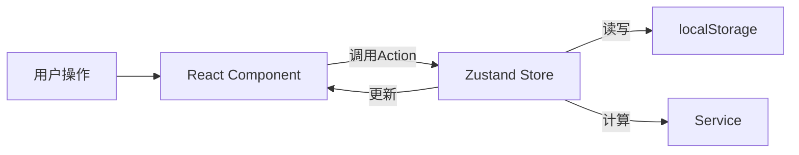
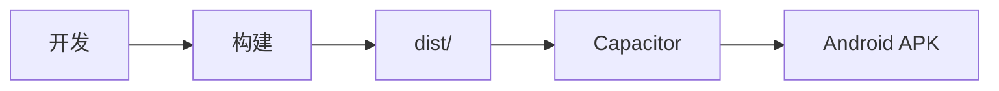

# 40 — 项目架构 (Project Architecture)

> **Companion 前端架构：清晰分层，模块化设计**

---

## 一、架构总览

---

## 二、技术栈

| 层面 | 技术 | 版本 |
|------|------|------|
| UI框架 | React | 18.3.1 |
| 语言 | TypeScript | ~5.8.3 |
| 构建 | Vite | ^6.3.5 |
| 样式 | TailwindCSS | ^3.4.17 |
| 状态 | Zustand | ^5.0.3 |
| 路由 | React Router DOM | ^7.3.0 |
| 图标 | Lucide React | ^0.511.0 |
| 原生 | Capacitor Android | ^8.4.1 |
| 工具 | clsx + tailwind-merge | — |

---

## 三、路由架构

| 路由 | 页面 | 组件 |
|------|------|------|
| `/` | 亲友广场 | Home |
| `/add` | 添加亲友 | AddRelative |
| `/edit/:id` | 编辑亲友 | EditRelative |
| `/detail/:id` | 信息卡片 | Detail |
| `/avatar/:id` | 头像定制 | AvatarCustom |
| `/import/:id` | 聊天导入 | ChatImport |
| `/chat/:id` | 聊天 | Chat |
| `/reminders` | 提醒管理 | Reminders |
| `/calendar` | 节日日历 | Calendar |
| `/stats` | 数据统计 | Stats |

---

## 四、数据流

---

## 五、组件架构

| 层级 | 职责 | 示例 |
|------|------|------|
| Page | 页面级组件，对应路由 | Home, Chat, Detail |
| Feature | 功能级组件，包含业务逻辑 | AvatarCard, ChatBubble |
| UI | 基础UI组件，无业务逻辑 | Button, Input, Modal |
| Layout | 布局组件 | Layout, Sidebar, BottomNav |

---

## 六、构建与部署

| 命令 | 说明 |
|------|------|
| `npm run dev` | 开发服务器 |
| `npm run build` | TypeScript编译 + Vite构建 |
| `npx cap sync` | 同步到Android |
| `npx cap open android` | 打开Android Studio |

---

## 七、安全架构

| 措施 | 说明 |
|------|------|
| 纯本地存储 | 无网络请求 |
| XSS防护 | React自动转义 |
| CSP | Content Security Policy |
| 数据加密 | V2.0 AES-256 |

---

> **Companion 架构 — 清晰分层，易于扩展。**
