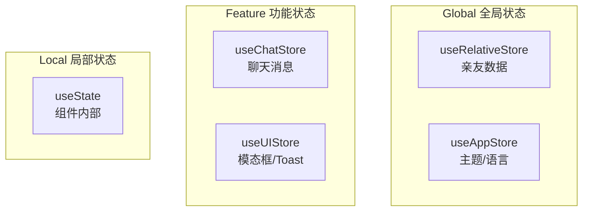

# 43 — 状态管理 (State Management)

> **Companion 状态管理：Zustand 驱动，简洁高效**

---

## 一、选型理由

| 方案 | 优点 | 缺点 | 结论 |
|------|------|------|------|
| Redux | 生态好 | 冗余代码多 | ❌ |
| MobX | 灵活 | 难追踪 | ❌ |
| Jotai | 轻量 | 小团队 | ❌ |
| **Zustand** | 简洁、TypeScript友好 | 生态较小 | ✅ |

---

## 二、状态分类



---

## 三、Store 设计

### 3.1 useRelativeStore（核心）

```typescript
interface RelativeStore {
  relatives: Relative[];
  chatMessages: Record<string, ChatMessage[]>;
  
  // CRUD
  loadRelatives: () => void;
  addRelative: (data: AddRelativeInput) => string;
  updateRelative: (id: string, data: Partial<Relative>) => void;
  deleteRelative: (id: string) => void;
  getRelative: (id: string) => Relative | undefined;
  
  // 头像
  updateAvatar: (id: string, avatar: Partial<AvatarConfig>, image?: string) => void;
  
  // 聊天
  updateChatStyle: (id: string, chatStyle: ChatStyle) => void;
  loadChatMessages: (relativeId: string) => void;
  addChatMessage: (relativeId: string, message: ChatMessage) => void;
  clearChatMessages: (relativeId: string) => void;
}
```

### 3.2 使用示例

```tsx
// ✅ 精确订阅（只重渲染需要的数据）
const relatives = useRelativeStore(state => state.relatives);
const addRelative = useRelativeStore(state => state.addRelative);

// ❌ 整体订阅（所有变更都重渲染）
const store = useRelativeStore();
```

---

## 四、持久化策略

```typescript
// localStorage 持久化
const storageService = {
  saveRelatives: (relatives: Relative[]) => {
    localStorage.setItem('relatives', JSON.stringify(relatives));
  },
  getRelatives: (): Relative[] => {
    const data = localStorage.getItem('relatives');
    return data ? JSON.parse(data) : [];
  },
};
```

---

## 五、Store 设计原则

| 原则 | 说明 |
|------|------|
| 单一职责 | 每个Store管理一个领域 |
| 最小化状态 | 只存必要数据 |
| 派生状态用selector | 不存可计算的值 |
| 不可变更新 | 使用展开运算符 |
| 持久化分离 | Store负责逻辑，Service负责存储 |

---

## 六、性能优化

```tsx
// ✅ Selector精确订阅
const name = useRelativeStore(
  state => state.relatives.find(r => r.id === id)?.name
);

// ✅ 使用 shallow 比较
import { useShallow } from 'zustand/shallow';
const { relatives, addRelative } = useRelativeStore(
  useShallow(state => ({
    relatives: state.relatives,
    addRelative: state.addRelative,
  }))
);
```

---

> **Companion 状态管理 — 简洁高效，精准订阅。**
