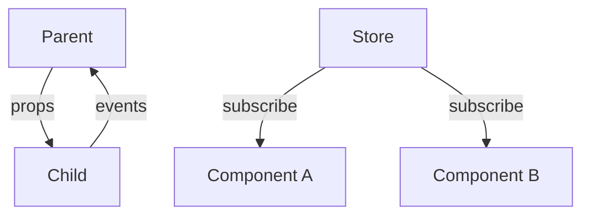

# 44 — 组件开发规范 (Component Convention)

> **Companion 组件开发：统一模式，高效复用**

---

## 一、组件分类

| 层级 | 目录 | 说明 |
|------|------|------|
| Page | `pages/` | 页面组件，对应路由 |
| Feature | `features/*/components/` | 功能组件，含业务逻辑 |
| UI | `shared/components/` | 基础UI，无业务逻辑 |
| Layout | `app/` | 布局组件 |

---

## 二、组件文件模板

```tsx
import { useId, useState, useCallback } from 'react';
import { cn } from '@/lib/utils';
import type { SomeType } from '@/types';

interface MyComponentProps {
  /** 主要数据 */
  data: SomeType;
  /** 尺寸 */
  size?: 'sm' | 'md' | 'lg';
  /** 自定义类名 */
  className?: string;
  /** 点击回调 */
  onClick?: () => void;
}

export default function MyComponent({
  data,
  size = 'md',
  className,
  onClick,
}: MyComponentProps) {
  const id = useId();
  const [state, setState] = useState(false);
  
  const handleClick = useCallback(() => {
    setState(prev => !prev);
    onClick?.();
  }, [onClick]);
  
  return (
    <div
      id={id}
      className={cn(
        // 基础样式
        "rounded-[20px] p-4",
        // 尺寸变体
        size === 'sm' && "p-2",
        size === 'lg' && "p-6",
        // 主题
        "bg-white dark:bg-gray-800",
        // 外部类名
        className
      )}
      onClick={handleClick}
      role="button"
      tabIndex={0}
    >
      {/* JSX */}
    </div>
  );
}
```

---

## 三、Props 设计规范

| 规则 | 说明 |
|------|------|
| 使用 interface | 不用 type 定义 Props |
| 可选属性提供默认值 | size = 'md' |
| 回调用 on 前缀 | onClick, onChange |
| boolean 用 is 前缀 | isActive, isVisible |
| children 类型 | React.ReactNode |
| 样式用 className | 不用 style |

---

## 四、组件通信



| 方式 | 场景 | 示例 |
|------|------|------|
| Props | 父→子 | `data={relative}` |
| Events | 子→父 | `onClick={handleClick}` |
| Store | 跨组件 | `useRelativeStore` |

---

## 五、memo 使用

```tsx
// ✅ 纯展示组件使用 memo
const AvatarCard = memo(function AvatarCard({ avatar, name }: AvatarCardProps) {
  return <div>...</div>;
});

// ❌ 不需要 memo 的场景
// - 频繁变化的组件
// - 简单组件（memo 开销大于收益）
```

---

## 六、主题支持

```tsx
// ✅ 所有组件必须支持深色模式
<div className="bg-white dark:bg-gray-800 text-gray-900 dark:text-gray-50">

// ✅ 颜色使用 Tailwind 类名
<div className="text-primary">

// ❌ 禁止硬编码颜色
<div style={{ color: '#E8734A' }}>
```

---

## 七、响应式

```tsx
// ✅ Mobile-first
<div className="grid grid-cols-2 sm:grid-cols-3 lg:grid-cols-4 gap-3">

// ✅ 导航模式切换
<div className="hidden lg:block"> {/* 桌面侧边栏 */}
<div className="lg:hidden fixed bottom-0"> {/* 移动底部栏 */}
```

---

## 八、可访问性

| 规则 | 说明 |
|------|------|
| role | 交互元素添加 role |
| tabIndex | 可聚焦元素添加 tabIndex |
| aria-label | 图标按钮添加 aria-label |
| 键盘 | 支持 Enter/Space 触发 |

---

> **Companion 组件开发 — 统一规范，高效复用。**
