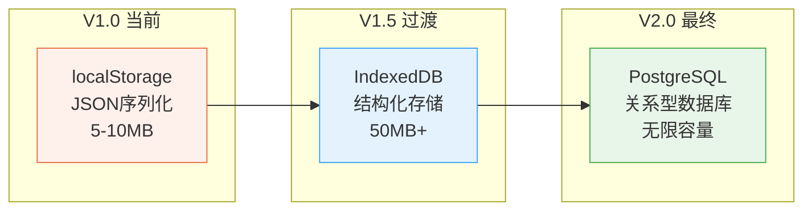
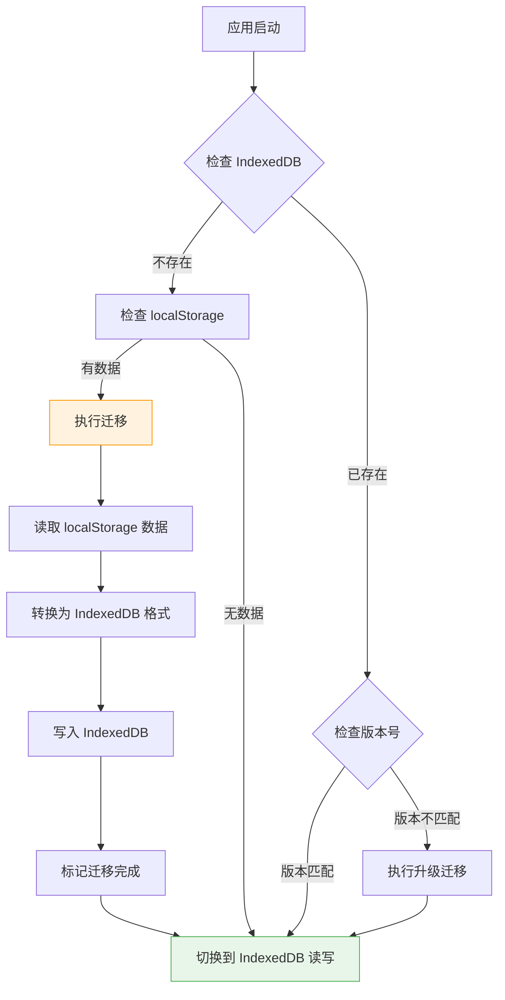
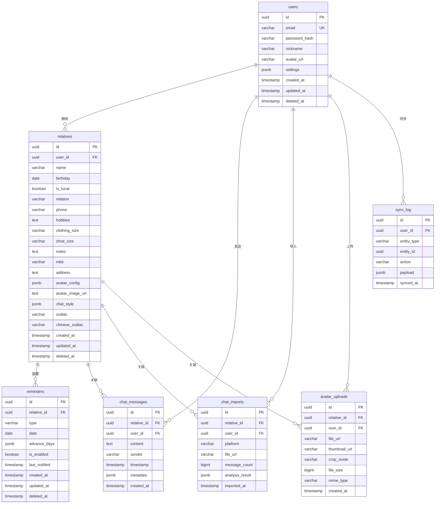
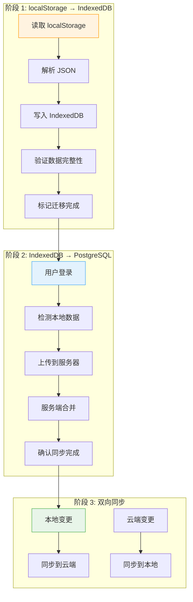
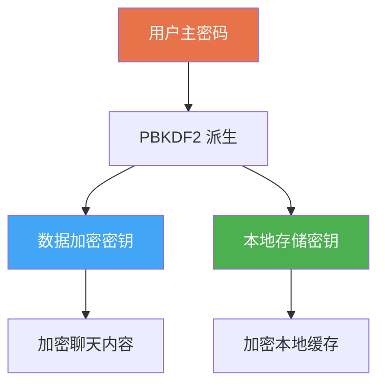

# 51 — 数据库设计规范 (Database Design Specification)

> **Companion（伴伴）数据库设计规范**
> 版本：v1.0 | 日期：2026-06-28 | 状态：正式发布

---

## 一、概述

### 1.1 存储演进路线

Companion 的数据存储经历了三个阶段的演进：



| 阶段 | 方案 | 容量 | 特点 | 时间 |
|------|------|------|------|------|
| V1.0 | localStorage | 5-10MB | 简单、同步、纯前端 | 当前 |
| V1.5 | IndexedDB | 50MB+ | 异步、大容量、结构化 | 2026-Q4 |
| V2.0 | PostgreSQL | 无限 | 关系型、多设备同步 | 2027-Q1 |

### 1.2 设计原则

| 原则 | 说明 |
|------|------|
| 隐私优先 | 所有数据默认本地存储，用户完全控制 |
| 离线可用 | 无网络时所有功能正常运行 |
| 渐进增强 | 从 localStorage 平滑迁移到 PostgreSQL |
| 数据完整 | 保证数据的一致性和完整性 |
| 可迁移 | 数据格式标准化，方便跨阶段迁移 |

---

## 二、当前阶段：localStorage（V1.0）

### 2.1 存储结构

当前所有数据以 JSON 字符串形式存储在 `localStorage` 中：

| 存储键 | 数据类型 | 说明 |
|--------|----------|------|
| `companion_app_relatives` | `Relative[]` | 亲友列表（全量） |
| `companion_app_reminders` | `Reminder[]` | 提醒列表（全量） |
| `companion_app_chat_{relativeId}` | `ChatMessage[]` | 聊天记录（按亲友分） |
| `companion_app_theme` | `string` | 主题偏好 |
| `companion_app_settings` | `string` | 用户设置 |

### 2.2 数据序列化

```typescript
// 所有数据通过 JSON.parse / JSON.stringify 进行序列化
const data: Relative[] = JSON.parse(localStorage.getItem('companion_app_relatives') || '[]');
localStorage.setItem('companion_app_relatives', JSON.stringify(data));
```

### 2.3 localStorage 的限制

| 限制 | 值 | 影响 |
|------|-----|------|
| 总容量 | 5-10MB（因浏览器而异） | 大量头像图片无法存储 |
| 数据类型 | 仅字符串 | 需要 JSON 序列化 |
| 同步 API | 阻塞主线程 | 大数据读写影响性能 |
| 无索引 | 不支持复杂查询 | 需要全量加载后过滤 |
| 无事务 | 无法保证原子性 | 并发写入可能丢失数据 |
| 同源策略 | 按域名隔离 | 无法跨域共享 |

### 2.4 容量估算

| 数据类型 | 单条大小 | 100条大小 | 说明 |
|----------|----------|-----------|------|
| Relative | ~2KB | ~200KB | 含AvatarConfig |
| Reminder | ~0.5KB | ~50KB | 基础提醒 |
| ChatMessage | ~0.3KB | ~300KB | 1000条消息 |
| ChatStyle | ~3KB | ~300KB | 聊天风格分析 |
| 头像图片（Base64） | ~100KB | ~10MB | 主要容量瓶颈 |

> **结论：** 当亲友数量超过 50 人或导入大量聊天记录时，localStorage 将达到瓶颈。

---

## 三、V1.5：IndexedDB 迁移

### 3.1 为什么选择 IndexedDB

| 特性 | localStorage | IndexedDB | 说明 |
|------|-------------|-----------|------|
| 容量 | 5-10MB | 50MB+ | 数十倍提升 |
| API | 同步 | 异步 | 不阻塞主线程 |
| 数据类型 | 仅字符串 | 任意类型 | 支持 Blob、ArrayBuffer |
| 索引 | 无 | 支持 | 可按字段查询 |
| 事务 | 无 | 支持 | 保证原子性 |
| 大对象 | 不支持 | 支持 | 存储图片文件 |
| 查询 | 全量加载 | 游标/索引 | 高效查询 |

### 3.2 IndexedDB 数据库结构

```mermaid
erDiagram
    DATABASE "companion_db" {
        STORE "relatives"
            STRING id PK
            STRING name
            STRING birthday
            STRING relation
            JSON avatar
            JSON chatStyle
            STRING createdAt
            STRING updatedAt
        
        STORE "reminders"
            STRING id PK
            STRING relativeId FK
            STRING type
            STRING date
            JSON advanceDays
            BOOLEAN isEnabled
        
        STORE "chatMessages"
            STRING id PK
            STRING relativeId FK
            STRING content
            STRING sender
            STRING timestamp
        
        STORE "chatImports"
            STRING id PK
            STRING relativeId FK
            STRING platform
            STRING importedAt
            NUMBER messageCount
        
        STORE "settings"
            STRING key PK
            ANY value
        
        STORE "syncQueue"
            STRING id PK
            STRING method
            STRING endpoint
            JSON body
            STRING createdAt
            NUMBER retryCount
    }
```

### 3.3 Store 定义

```typescript
// IndexedDB Store 定义
interface CompanionDB {
  relatives: {
    key: string;           // id
    value: Relative;
    indexes: {
      'by-relation': string;      // 按关系类型索引
      'by-birthday': string;      // 按生日索引
      'by-created': string;       // 按创建时间索引
    };
  };
  reminders: {
    key: string;           // id
    value: Reminder;
    indexes: {
      'by-relative': string;      // 按亲友ID索引
      'by-type': string;          // 按类型索引
      'by-date': string;          // 按日期索引
    };
  };
  chatMessages: {
    key: string;           // id
    value: ChatMessage;
    indexes: {
      'by-relative': string;      // 按亲友ID索引
      'by-timestamp': string;     // 按时间索引
    };
  };
  chatImports: {
    key: string;
    value: ChatImport;
    indexes: {
      'by-relative': string;
    };
  };
  settings: {
    key: string;           // 设置键名
    value: unknown;        // 设置值
  };
  syncQueue: {
    key: string;
    value: SyncQueueItem;
    indexes: {
      'by-created': string;
    };
  };
}
```

### 3.4 迁移方案



**迁移脚本示例：**

```typescript
async function migrateFromLocalStorage(): Promise<void> {
  // 1. 检查是否已迁移
  const migrated = await db.settings.get('migrated_from_ls');
  if (migrated) return;

  // 2. 迁移亲友数据
  const relativesJson = localStorage.getItem('companion_app_relatives');
  if (relativesJson) {
    const relatives: Relative[] = JSON.parse(relativesJson);
    const tx = db.transaction('relatives', 'readwrite');
    for (const relative of relatives) {
      await tx.store.add(relative);
    }
    await tx.done;
  }

  // 3. 迁移提醒数据
  const remindersJson = localStorage.getItem('companion_app_reminders');
  if (remindersJson) {
    const reminders: Reminder[] = JSON.parse(remindersJson);
    const tx = db.transaction('reminders', 'readwrite');
    for (const reminder of reminders) {
      await tx.store.add(reminder);
    }
    await tx.done;
  }

  // 4. 迁移聊天记录
  for (let i = 0; i < localStorage.length; i++) {
    const key = localStorage.key(i);
    if (key?.startsWith('companion_app_chat_')) {
      const relativeId = key.replace('companion_app_chat_', '');
      const messages: ChatMessage[] = JSON.parse(localStorage.getItem(key) || '[]');
      const tx = db.transaction('chatMessages', 'readwrite');
      for (const message of messages) {
        await tx.store.add(message);
      }
      await tx.done;
    }
  }

  // 5. 标记迁移完成
  await db.settings.put({ key: 'migrated_from_ls', value: true });

  console.log('数据迁移完成');
}
```

---

## 四、V2.0：PostgreSQL 后端

### 4.1 数据模型 ER 图



### 4.2 表结构定义（SQL）

#### users 表

```sql
CREATE TABLE users (
    id          UUID PRIMARY KEY DEFAULT gen_random_uuid(),
    email       VARCHAR(255) NOT NULL UNIQUE,
    password_hash VARCHAR(255) NOT NULL,
    nickname    VARCHAR(50) NOT NULL,
    avatar_url  VARCHAR(500),
    settings    JSONB DEFAULT '{}',
    created_at  TIMESTAMPTZ NOT NULL DEFAULT NOW(),
    updated_at  TIMESTAMPTZ NOT NULL DEFAULT NOW(),
    deleted_at  TIMESTAMPTZ
);

-- 索引
CREATE INDEX idx_users_email ON users(email) WHERE deleted_at IS NULL;
CREATE INDEX idx_users_created ON users(created_at);
```

#### relatives 表

```sql
CREATE TABLE relatives (
    id              UUID PRIMARY KEY DEFAULT gen_random_uuid(),
    user_id         UUID NOT NULL REFERENCES users(id) ON DELETE CASCADE,
    name            VARCHAR(50) NOT NULL,
    birthday        DATE,
    is_lunar        BOOLEAN DEFAULT FALSE,
    relation        VARCHAR(50) NOT NULL,
    phone           VARCHAR(20),
    hobbies         VARCHAR(500),
    clothing_size   VARCHAR(10),
    shoe_size       VARCHAR(10),
    notes           VARCHAR(500),
    mbti            VARCHAR(10),
    address         TEXT,
    avatar_config   JSONB NOT NULL DEFAULT '{}',
    avatar_image_url VARCHAR(500),
    chat_style      JSONB,
    zodiac          VARCHAR(20),
    chinese_zodiac  VARCHAR(20),
    created_at      TIMESTAMPTZ NOT NULL DEFAULT NOW(),
    updated_at      TIMESTAMPTZ NOT NULL DEFAULT NOW(),
    deleted_at      TIMESTAMPTZ
);

-- 索引
CREATE INDEX idx_relatives_user ON relatives(user_id) WHERE deleted_at IS NULL;
CREATE INDEX idx_relatives_relation ON relatives(user_id, relation) WHERE deleted_at IS NULL;
CREATE INDEX idx_relatives_birthday ON relatives(user_id, birthday) WHERE deleted_at IS NULL AND birthday IS NOT NULL;
CREATE INDEX idx_relatives_created ON relatives(user_id, created_at);
CREATE INDEX idx_relatives_updated ON relatives(updated_at);

-- 复合索引：用于同步
CREATE INDEX idx_relatives_sync ON relatives(user_id, updated_at) WHERE deleted_at IS NULL;
```

#### reminders 表

```sql
CREATE TABLE reminders (
    id          UUID PRIMARY KEY DEFAULT gen_random_uuid(),
    relative_id UUID NOT NULL REFERENCES relatives(id) ON DELETE CASCADE,
    type        VARCHAR(20) NOT NULL CHECK (type IN ('birthday', 'mothers_day', 'fathers_day', 'custom')),
    date        DATE NOT NULL,
    advance_days JSONB DEFAULT '[3, 1]',
    is_enabled  BOOLEAN DEFAULT TRUE,
    last_notified TIMESTAMPTZ,
    created_at  TIMESTAMPTZ NOT NULL DEFAULT NOW(),
    updated_at  TIMESTAMPTZ NOT NULL DEFAULT NOW(),
    deleted_at  TIMESTAMPTZ
);

-- 索引
CREATE INDEX idx_reminders_relative ON reminders(relative_id) WHERE deleted_at IS NULL;
CREATE INDEX idx_reminders_type ON reminders(relative_id, type) WHERE deleted_at IS NULL;
CREATE INDEX idx_reminders_date ON reminders(date, is_enabled) WHERE deleted_at IS NULL;
CREATE INDEX idx_reminders_enabled ON reminders(is_enabled, date) WHERE deleted_at IS NULL AND is_enabled = TRUE;
CREATE INDEX idx_reminders_updated ON reminders(updated_at);
```

#### chat_messages 表

```sql
CREATE TABLE chat_messages (
    id          UUID PRIMARY KEY DEFAULT gen_random_uuid(),
    relative_id UUID NOT NULL REFERENCES relatives(id) ON DELETE CASCADE,
    user_id     UUID NOT NULL REFERENCES users(id) ON DELETE CASCADE,
    content     TEXT NOT NULL,
    sender      VARCHAR(10) NOT NULL CHECK (sender IN ('user', 'avatar')),
    timestamp   TIMESTAMPTZ NOT NULL,
    metadata    JSONB DEFAULT '{}',
    created_at  TIMESTAMPTZ NOT NULL DEFAULT NOW()
);

-- 索引
CREATE INDEX idx_chat_messages_relative ON chat_messages(relative_id, timestamp);
CREATE INDEX idx_chat_messages_user ON chat_messages(user_id);
CREATE INDEX idx_chat_messages_created ON chat_messages(created_at);

-- 分区（按月分区，优化大数据量查询）
CREATE TABLE chat_messages_partitioned (
    LIKE chat_messages INCLUDING ALL
) PARTITION BY RANGE (created_at);
```

#### chat_imports 表

```sql
CREATE TABLE chat_imports (
    id              UUID PRIMARY KEY DEFAULT gen_random_uuid(),
    relative_id     UUID NOT NULL REFERENCES relatives(id) ON DELETE CASCADE,
    user_id         UUID NOT NULL REFERENCES users(id) ON DELETE CASCADE,
    platform        VARCHAR(20) NOT NULL CHECK (platform IN ('wechat', 'qq', 'other')),
    file_url        VARCHAR(500),
    message_count   INTEGER DEFAULT 0,
    analysis_result JSONB,
    imported_at     TIMESTAMPTZ NOT NULL DEFAULT NOW()
);

-- 索引
CREATE INDEX idx_chat_imports_relative ON chat_imports(relative_id);
CREATE INDEX idx_chat_imports_user ON chat_imports(user_id);
```

#### avatar_uploads 表

```sql
CREATE TABLE avatar_uploads (
    id            UUID PRIMARY KEY DEFAULT gen_random_uuid(),
    relative_id   UUID NOT NULL REFERENCES relatives(id) ON DELETE CASCADE,
    user_id       UUID NOT NULL REFERENCES users(id) ON DELETE CASCADE,
    file_url      VARCHAR(500) NOT NULL,
    thumbnail_url VARCHAR(500),
    crop_mode     VARCHAR(10) CHECK (crop_mode IN ('circle', 'avatar')),
    file_size     INTEGER,
    mime_type     VARCHAR(20),
    created_at    TIMESTAMPTZ NOT NULL DEFAULT NOW()
);

-- 索引
CREATE INDEX idx_avatar_uploads_relative ON avatar_uploads(relative_id);
CREATE INDEX idx_avatar_uploads_user ON avatar_uploads(user_id);
```

#### sync_log 表

```sql
CREATE TABLE sync_log (
    id          UUID PRIMARY KEY DEFAULT gen_random_uuid(),
    user_id     UUID NOT NULL REFERENCES users(id) ON DELETE CASCADE,
    entity_type VARCHAR(30) NOT NULL,  -- relative, reminder, chat_message, etc.
    entity_id   UUID NOT NULL,
    action      VARCHAR(10) NOT NULL CHECK (action IN ('create', 'update', 'delete')),
    payload     JSONB,
    synced_at   TIMESTAMPTZ NOT NULL DEFAULT NOW()
);

-- 索引
CREATE INDEX idx_sync_log_user ON sync_log(user_id, synced_at);
CREATE INDEX idx_sync_log_entity ON sync_log(entity_type, entity_id);
```

### 4.3 JSONB 字段详细定义

#### avatar_config JSONB 结构

```json
{
  "gender": 0,
  "faceShape": 2,
  "hairstyle": 3,
  "eyeStyle": 1,
  "mouthStyle": 2,
  "clothing": 5,
  "accessory": 0,
  "skinColor": "#FFD5B8",
  "hairColor": "#3D2B1F",
  "clothingColor": "#D44A4A"
}
```

#### chat_style JSONB 结构

```json
{
  "highFrequencyWords": ["嗯", "好", "知道了"],
  "commonEmojis": ["😊", "👍"],
  "sentencePatterns": ["我觉得{内容}挺好的"],
  "toneWords": ["嘛", "呢", "哦"],
  "avgMessageLength": 15,
  "personality": "话多型",
  "styleKeywords": ["口语化", "关心型"],
  "languageStyle": "casual",
  "sentiment": "positive",
  "topicPreferences": ["生活", "工作"],
  "activeHours": [8, 9, 10, 12, 18, 19, 20],
  "responseLengthPattern": "short",
  "realReplyPatterns": {
    "greeting": ["来了来了", "在呢"],
    "farewell": ["拜拜", "回见"],
    ["agreement": ["确实", "对对对"]],
    "general": ["嗯嗯", "好嘞", "行"]
  },
  "communicationTraits": {
    "questionFrequency": 0.3,
    "emojiFrequency": 0.2,
    "avgReplyLength": 12,
    "isInitiator": false,
    "usesVoiceMessages": false
  },
  "expressionDNA": ["喜欢用反问句", "常在句尾加嘛"]
}
```

#### settings JSONB 结构

```json
{
  "theme": "light",
  "language": "zh-CN",
  "syncEnabled": true,
  "syncFrequency": "realtime",
  "reminderDefaults": {
    "advanceDays": [7, 3, 1]
  },
  "privacy": {
    "analyticsOptIn": false,
    "crashReportOptIn": false
  }
}
```

---

## 五、索引策略

### 5.1 索引设计原则

| 原则 | 说明 |
|------|------|
| 按查询模式建索引 | 分析最常用的查询，为 WHERE/JOIN/ORDER BY 字段建索引 |
| 复合索引字段顺序 | 区分度高的字段放前面 |
| 部分索引 | 只对有效数据建索引（排除已删除记录） |
| 避免过度索引 | 每个索引都有写入开销 |
| 定期分析 | 使用 EXPLAIN ANALYZE 分析查询计划 |

### 5.2 核心索引清单

| 表 | 索引名 | 字段 | 类型 | 用途 |
|----|--------|------|------|------|
| relatives | idx_relatives_user | user_id | B-tree | 按用户查询 |
| relatives | idx_relatives_relation | user_id, relation | B-tree | 按关系筛选 |
| relatives | idx_relatives_birthday | user_id, birthday | B-tree | 生日查询 |
| relatives | idx_relatives_updated | updated_at | B-tree | 同步增量查询 |
| reminders | idx_reminders_date | date, is_enabled | B-tree | 即将到期查询 |
| chat_messages | idx_chat_messages_relative | relative_id, timestamp | B-tree | 聊天记录查询 |
| sync_log | idx_sync_log_user | user_id, synced_at | B-tree | 同步日志查询 |

### 5.3 查询性能基准

| 查询类型 | 目标响应时间 | 说明 |
|----------|-------------|------|
| 单条记录查询 | ≤ 5ms | 主键查询 |
| 列表查询（20条） | ≤ 50ms | 分页查询 |
| 模糊搜索 | ≤ 100ms | ILIKE 查询 |
| 聚合统计 | ≤ 200ms | COUNT/GROUP BY |
| 全量同步 | ≤ 2s | 增量数据拉取 |

---

## 六、数据迁移方案

### 6.1 迁移策略



### 6.2 迁移规则

| 规则 | 说明 |
|------|------|
| 不丢失数据 | 迁移前后数据量一致 |
| 可回滚 | 保留原始数据直到确认迁移成功 |
| 原子操作 | 迁移要么全部成功，要么全部回滚 |
| 数据验证 | 迁移后验证所有记录的完整性 |
| 用户感知 | 迁移过程中显示进度提示 |

### 6.3 数据验证清单

| 验证项 | 说明 | 方法 |
|--------|------|------|
| 记录数量 | 迁移前后记录数一致 | COUNT 比较 |
| 必填字段 | 所有必填字段不为空 | NULL 检查 |
| 数据类型 | 字段类型正确 | 类型校验 |
| 关联完整性 | 外键关联正确 | JOIN 查询 |
| JSON 格式 | JSONB 字段格式正确 | JSON 校验 |

---

## 七、备份策略

### 7.1 备份类型

| 类型 | 频率 | 保留时间 | 说明 |
|------|------|----------|------|
| 全量备份 | 每天 | 30 天 | 完整数据库快照 |
| 增量备份 | 每小时 | 7 天 | 自上次备份以来的变更 |
| 事务日志 | 实时 | 3 天 | 所有写操作日志 |

### 7.2 客户端数据导出

用户可以导出所有数据为 JSON 文件：

```json
{
  "version": "1.0",
  "exportedAt": "2026-06-28T10:00:00.000Z",
  "userId": "usr_001",
  "data": {
    "relatives": [...],
    "reminders": [...],
    "chatMessages": {
      "rel_001": [...],
      "rel_002": [...]
    },
    "settings": {...}
  }
}
```

### 7.3 数据恢复

```typescript
async function importFromBackup(file: File): Promise<void> {
  const text = await file.text();
  const backup = JSON.parse(text);
  
  // 验证备份格式
  if (backup.version !== '1.0') {
    throw new Error('不支持的备份版本');
  }
  
  // 逐项恢复
  const tx = db.transaction(['relatives', 'reminders', 'chatMessages'], 'readwrite');
  
  for (const relative of backup.data.relatives) {
    await tx.objectStore('relatives').put(relative);
  }
  
  for (const reminder of backup.data.reminders) {
    await tx.objectStore('reminders').put(reminder);
  }
  
  for (const [relativeId, messages] of Object.entries(backup.data.chatMessages)) {
    for (const message of messages as ChatMessage[]) {
      await tx.objectStore('chatMessages').put(message);
    }
  }
  
  await tx.done;
  console.log('数据恢复完成');
}
```

---

## 八、数据加密

### 8.1 加密策略

| 数据 | 加密方式 | 说明 |
|------|----------|------|
| 聊天内容 | AES-256-GCM | 端到端加密 |
| 头像图片 | 无加密 | 本地文件 |
| 用户密码 | bcrypt | 单向哈希 |
| 传输数据 | TLS 1.3 | 传输加密 |

### 8.2 加密密钥管理



### 8.3 加密实现

```typescript
// 加密聊天消息
async function encryptMessage(
  content: string, 
  key: CryptoKey
): Promise<string> {
  const iv = crypto.getRandomValues(new Uint8Array(12));
  const encoded = new TextEncoder().encode(content);
  
  const encrypted = await crypto.subtle.encrypt(
    { name: 'AES-GCM', iv },
    key,
    encoded
  );
  
  // 将 IV 和加密数据合并存储
  const combined = new Uint8Array(iv.length + encrypted.byteLength);
  combined.set(iv);
  combined.set(new Uint8Array(encrypted), iv.length);
  
  return btoa(String.fromCharCode(...combined));
}
```

---

## 九、性能优化

### 9.1 查询优化

| 策略 | 说明 | 适用场景 |
|------|------|----------|
| 分页查询 | 每次只加载 20 条 | 列表页面 |
| 延迟加载 | 按需加载详情数据 | 详情页面 |
| 索引覆盖 | 索引包含所有查询字段 | 高频查询 |
| 缓存策略 | 内存缓存热点数据 | 首页数据 |
| 批量操作 | 批量插入/更新 | 数据迁移 |

### 9.2 存储优化

| 策略 | 说明 | 适用场景 |
|------|------|----------|
| 图片压缩 | 使用 WebP 格式 | 头像图片 |
| 缩略图 | 生成多尺寸缩略图 | 列表展示 |
| 数据压缩 | GZIP 压缩 JSON 数据 | 本地存储 |
| 分区存储 | 按时间/用户分区 | 聊天记录 |

---

## 十、监控与维护

### 10.1 数据库监控

| 指标 | 告警阈值 | 说明 |
|------|----------|------|
| 连接数 | > 80% | 连接池使用率 |
| 查询延迟 | > 200ms | P95 响应时间 |
| 存储使用 | > 80% | 磁盘使用率 |
| 慢查询 | > 1s | 执行时间 |

### 10.2 数据清理

| 数据类型 | 保留策略 | 清理方式 |
|----------|----------|----------|
| 聊天消息 | 永久保留 | 用户手动清理 |
| 同步日志 | 30 天 | 自动清理 |
| 临时文件 | 7 天 | 自动清理 |
| 已删除数据 | 30 天后物理删除 | 定时任务 |

---

> **Companion 数据库设计规范 — 从 localStorage 到 PostgreSQL 的渐进式演进。**
