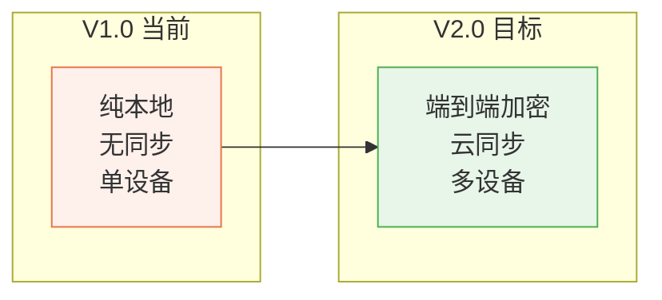
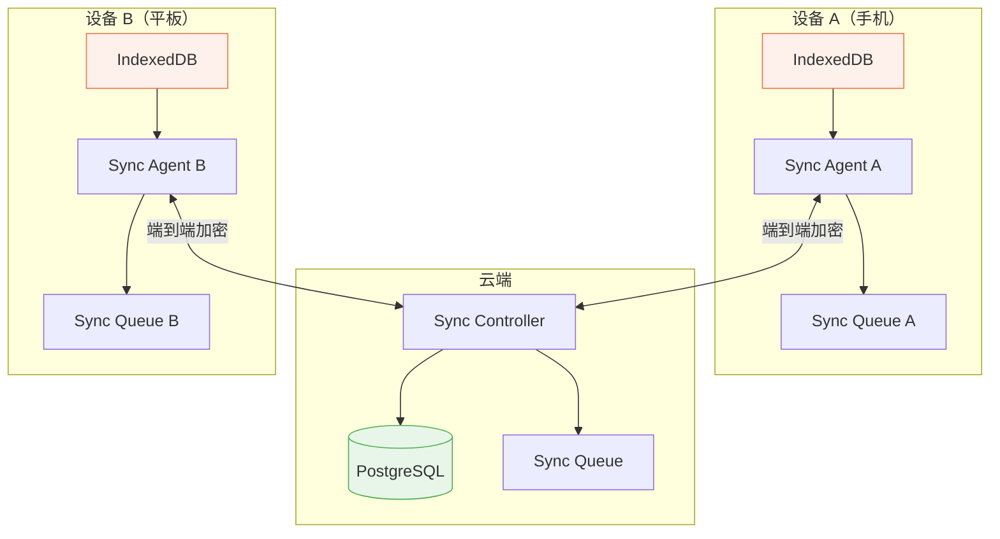
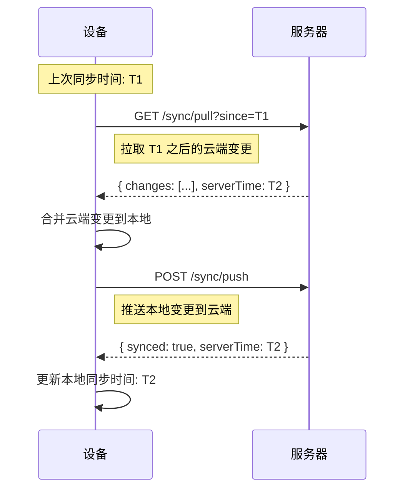
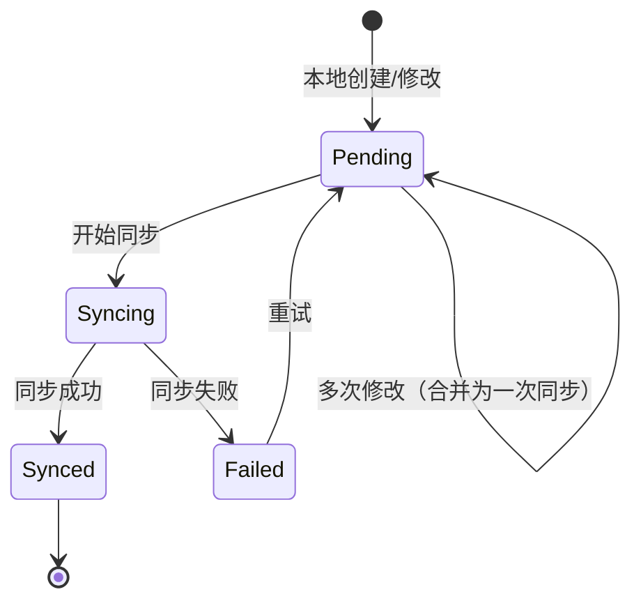
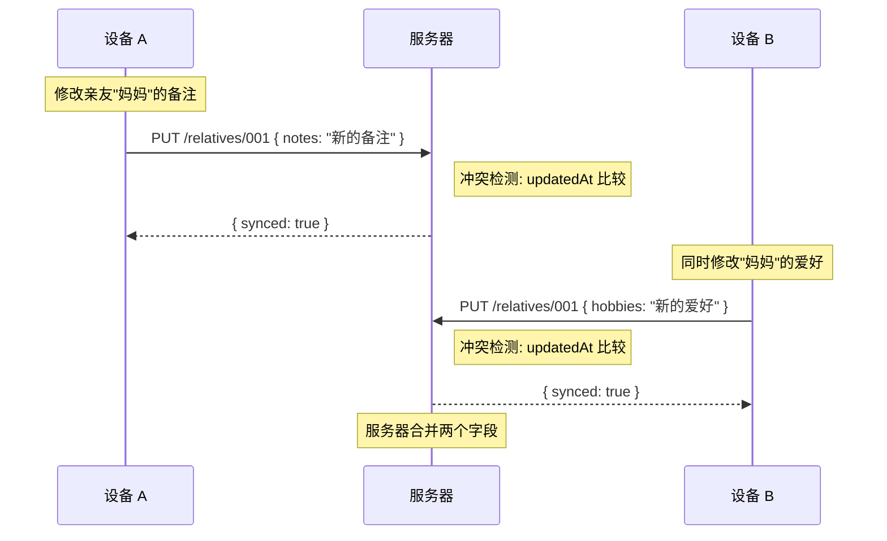
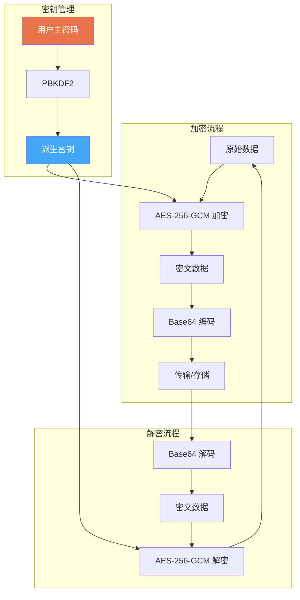
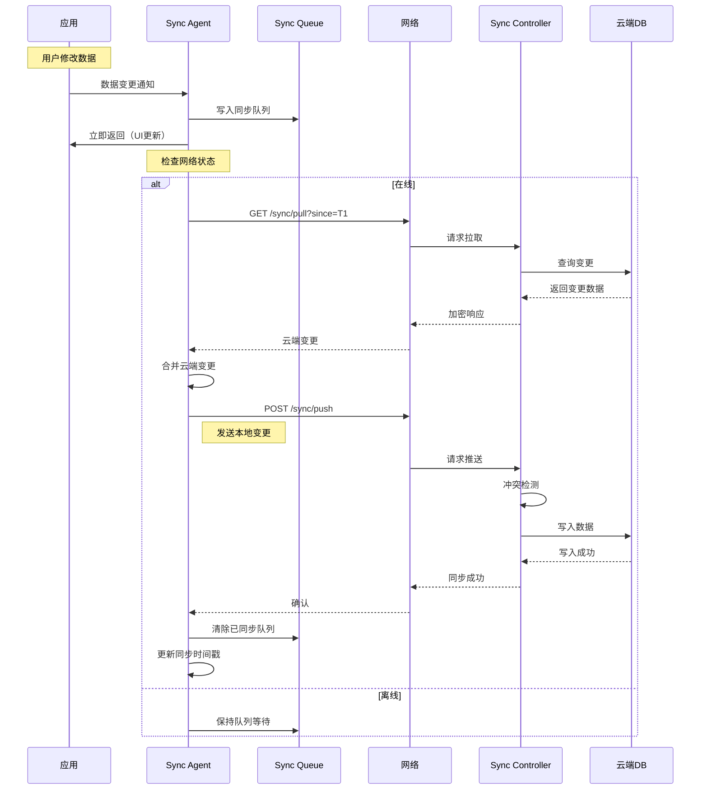
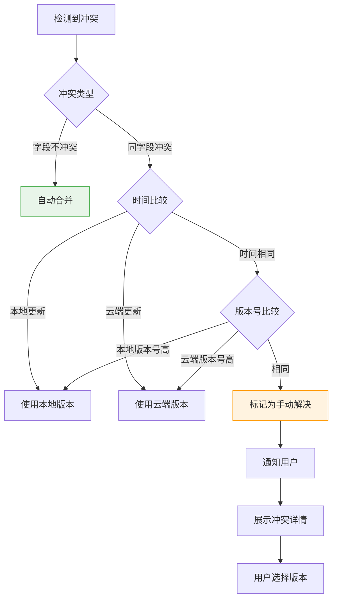
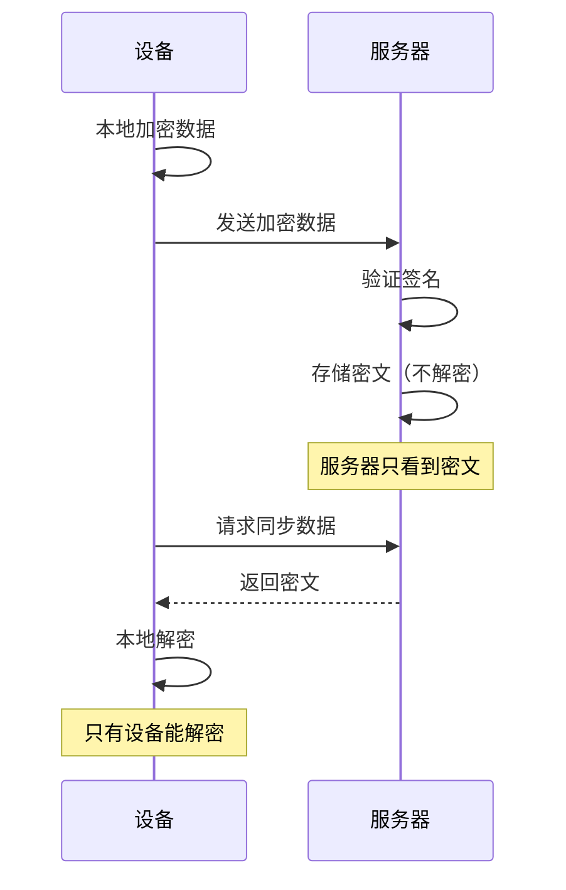

# 52 — 同步系统规范 (Sync System Specification)

> **Companion（伴伴）同步系统规范**
> 版本：v1.0 | 日期：2026-06-28 | 状态：正式发布

---

## 一、概述

### 1.1 同步演进路线



| 阶段 | 方案 | 特点 | 时间 |
|------|------|------|------|
| V1.0 | 纯本地 | localStorage，无同步，单设备 | 当前 |
| V2.0 | 端到端加密云同步 | IndexedDB + 云端，多设备同步 | 2027-Q1 |

### 1.2 核心设计原则

| 原则 | 说明 |
|------|------|
| 隐私优先 | 端到端加密，服务器无法读取明文数据 |
| 离线优先 | 无网络时功能完全正常 |
| 数据一致 | 最终一致性，确保多设备数据同步 |
| 低带宽 | 增量同步，只传输变更数据 |
| 可恢复 | 同步中断后可从断点恢复 |

---

## 二、同步架构

### 2.1 系统架构图



### 2.2 同步组件

| 组件 | 位置 | 职责 |
|------|------|------|
| Sync Agent | 设备端 | 管理本地同步队列，执行同步操作 |
| Sync Queue | 设备端 | 存储待同步的变更操作 |
| Sync Controller | 云端 | 协调多设备同步，合并冲突 |
| Sync Log | 云端 | 记录所有同步操作日志 |

---

## 三、同步策略：增量同步

### 3.1 增量同步原理



### 3.2 同步时间戳

每条数据记录包含同步相关的时间戳：

```typescript
interface SyncMetadata {
  createdAt: string;       // 创建时间
  updatedAt: string;       // 最后更新时间
  syncedAt?: string;       // 最后同步时间
  syncVersion: number;     // 同步版本号（每次修改+1）
  isLocalOnly: boolean;    // 是否仅本地存在（未同步到云端）
  isDeleted: boolean;      // 是否已删除（软删除）
}
```

### 3.3 同步状态机



---

## 四、冲突解决：Last Write Wins

### 4.1 冲突检测

当同一数据在多个设备上被修改时，产生冲突：



### 4.2 Last Write Wins 策略

```
如果 remote.updatedAt > local.updatedAt:
    使用远程数据覆盖本地
如果 remote.updatedAt < local.updatedAt:
    使用本地数据覆盖远程
如果 remote.updatedAt == local.updatedAt:
    使用 syncVersion 更高的版本
如果 syncVersion 也相同:
    保留两个版本，标记为冲突，用户手动处理
```

### 4.3 字段级合并

对于非冲突字段的修改，采用字段级合并：

```typescript
function mergeRelative(local: Relative, remote: Relative): Relative {
  const merged = { ...local };
  
  // 对每个字段，选择 updatedAt 更新的版本
  const fields = ['name', 'birthday', 'relation', 'phone', 'hobbies', 'notes', 'avatar'];
  
  for (const field of fields) {
    if (remote[field] && remote.updatedAt > local.updatedAt) {
      merged[field] = remote[field];
    }
  }
  
  // 始终取最新的 updatedAt
  merged.updatedAt = Math.max(
    new Date(local.updatedAt).getTime(),
    new Date(remote.updatedAt).getTime()
  ) > 0 ? remote.updatedAt : local.updatedAt;
  
  return merged;
}
```

### 4.4 冲突处理优先级

| 优先级 | 条件 | 处理方式 |
|--------|------|----------|
| 1 | 字段不冲突 | 自动合并 |
| 2 | 同字段冲突，时间不同 | 取最新的（LWW） |
| 3 | 同字段冲突，时间相同 | 取版本号更高的 |
| 4 | 完全相同冲突 | 随机选择，标记为已解决 |

---

## 五、数据加密：AES-256

### 5.1 加密架构



### 5.2 密钥层级

| 层级 | 密钥 | 用途 | 存储位置 |
|------|------|------|----------|
| L0 | 用户主密码 | 人类记忆 | 用户大脑 |
| L1 | 主密钥 (MK) | 派生其他密钥 | 服务端加密存储 |
| L2 | 数据密钥 (DK) | 加密用户数据 | 设备本地 |
| L3 | 会话密钥 (SK) | 加密传输数据 | 内存中 |

### 5.3 密钥派生

```typescript
// 从用户密码派生主密钥
async function deriveMasterKey(
  password: string, 
  salt: Uint8Array
): Promise<CryptoKey> {
  const encoder = new TextEncoder();
  const keyMaterial = await crypto.subtle.importKey(
    'raw',
    encoder.encode(password),
    'PBKDF2',
    false,
    ['deriveKey']
  );
  
  return crypto.subtle.deriveKey(
    {
      name: 'PBKDF2',
      salt,
      iterations: 100000,  // OWASP 推荐
      hash: 'SHA-256'
    },
    keyMaterial,
    { name: 'AES-GCM', length: 256 },
    false,
    ['encrypt', 'decrypt']
  );
}

// 派生数据密钥
async function deriveDataKey(
  masterKey: CryptoKey,
  dataId: string
): Promise<CryptoKey> {
  const encoder = new TextEncoder();
  const derivedKey = await crypto.subtle.deriveKey(
    {
      name: 'HKDF',
      salt: encoder.encode(dataId),
      hash: 'SHA-256'
    },
    masterKey,
    { name: 'AES-GCM', length: 256 },
    false,
    ['encrypt', 'decrypt']
  );
  
  return derivedKey;
}
```

### 5.4 加密配置

| 参数 | 值 | 说明 |
|------|-----|------|
| 算法 | AES-256-GCM | 认证加密 |
| 密钥长度 | 256 位 | AES-256 |
| IV 长度 | 12 字节 | GCM 推荐 |
| Tag 长度 | 128 位 | GCM 默认 |
| PBKDF2 迭代 | 100,000 | OWASP 推荐 |
| Salt 长度 | 32 字节 | 随机生成 |

### 5.5 加密示例

```typescript
// 加密数据
async function encrypt(
  data: string, 
  key: CryptoKey
): Promise<string> {
  const iv = crypto.getRandomValues(new Uint8Array(12));
  const encoded = new TextEncoder().encode(data);
  
  const encrypted = await crypto.subtle.encrypt(
    { name: 'AES-GCM', iv },
    key,
    encoded
  );
  
  // IV + 密文 + Tag
  const result = new Uint8Array(iv.length + encrypted.byteLength);
  result.set(iv);
  result.set(new Uint8Array(encrypted), iv.length);
  
  return btoa(String.fromCharCode(...result));
}

// 解密数据
async function decrypt(
  encryptedData: string, 
  key: CryptoKey
): Promise<string> {
  const data = Uint8Array.from(atob(encryptedData), c => c.charCodeAt(0));
  
  const iv = data.slice(0, 12);
  const ciphertext = data.slice(12);
  
  const decrypted = await crypto.subtle.decrypt(
    { name: 'AES-GCM', iv },
    key,
    ciphertext
  );
  
  return new TextDecoder().decode(decrypted);
}
```

---

## 六、同步流程

### 6.1 完整同步流程图



### 6.2 同步触发时机

| 触发条件 | 说明 | 同步方式 |
|----------|------|----------|
| 数据修改 | 用户创建/更新/删除数据 | 立即加入队列 |
| 应用启动 | 打开应用时 | 全量拉取 |
| 网络恢复 | 从离线切换到在线 | 拉取 + 推送队列 |
| 定时同步 | 每 5 分钟检查一次 | 增量同步 |
| 手动同步 | 用户点击同步按钮 | 全量同步 |

### 6.3 同步数据格式

```typescript
// 同步请求
interface SyncPushRequest {
  lastSyncTime: string;          // 上次同步时间
  changes: SyncChange[];         // 本地变更列表
  deviceInfo: {
    deviceId: string;
    platform: string;
    appVersion: string;
  };
}

// 单个变更
interface SyncChange {
  entityType: 'relative' | 'reminder' | 'chatMessage' | 'chatStyle';
  entityId: string;
  action: 'create' | 'update' | 'delete';
  data?: unknown;                // create/update 时的数据
  updatedAt: string;             // 变更时间
  syncVersion: number;           // 同步版本号
}

// 同步响应
interface SyncPushResponse {
  serverTime: string;            // 服务器时间
  synced: number;                // 成功同步的数量
  conflicts: SyncConflict[];     // 冲突列表
}

// 同步冲突
interface SyncConflict {
  entityType: string;
  entityId: string;
  localVersion: unknown;
  remoteVersion: unknown;
  resolvedBy: 'local' | 'remote' | 'manual';
}
```

---

## 七、离线优先设计

### 7.1 离线优先原则

```
1. 所有数据操作优先在本地执行
2. UI 响应不依赖网络请求
3. 后台静默同步，用户无感知
4. 离线时功能完全正常
5. 在线时自动同步到云端
```

### 7.2 离线检测

```typescript
class NetworkMonitor {
  private listeners: Array<(online: boolean) => void> = [];
  
  constructor() {
    window.addEventListener('online', () => this.notify(true));
    window.addEventListener('offline', () => this.notify(false));
  }
  
  get isOnline(): boolean {
    return navigator.onLine;
  }
  
  onChange(callback: (online: boolean) => void): () => void {
    this.listeners.push(callback);
    return () => {
      this.listeners = this.listeners.filter(l => l !== callback);
    };
  }
  
  private notify(online: boolean): void {
    this.listeners.forEach(l => l(online));
  }
}
```

### 7.3 同步队列管理

```typescript
class SyncQueue {
  private queue: SyncQueueItem[] = [];
  
  // 添加操作到队列
  enqueue(item: Omit<SyncQueueItem, 'id' | 'retryCount'>): void {
    const queueItem: SyncQueueItem = {
      ...item,
      id: crypto.randomUUID(),
      retryCount: 0,
    };
    
    this.queue.push(queueItem);
    this.saveQueue();
  }
  
  // 批量同步
  async processQueue(): Promise<void> {
    if (!navigator.onLine) return;
    
    const batch = this.queue.slice(0, 50); // 每批最多50条
    
    try {
      await this.syncBatch(batch);
      // 移除已同步的项
      this.queue = this.queue.filter(item => !batch.includes(item));
      this.saveQueue();
    } catch (error) {
      // 增加重试计数
      for (const item of batch) {
        item.retryCount++;
      }
      // 移除超过最大重试次数的项
      this.queue = this.queue.filter(item => item.retryCount < item.maxRetries);
      this.saveQueue();
    }
  }
}
```

### 7.4 冲突处理策略（离线场景）



---

## 八、多设备同步

### 8.1 设备管理

```typescript
interface Device {
  id: string;               // 设备唯一标识
  name: string;             // 设备名称
  platform: string;         // android | ios | web
  appVersion: string;       // 应用版本
  lastSyncAt: string;       // 最后同步时间
  isActive: boolean;        // 是否活跃
}
```

### 8.2 设备间同步策略

| 策略 | 说明 |
|------|------|
| 全量拉取 | 新设备首次同步时拉取全部数据 |
| 增量同步 | 日常使用时只同步变更 |
| 双向同步 | 任何设备的修改都会同步到其他设备 |
| 后台同步 | 静默同步，不影响前台操作 |

### 8.3 冲突解决优先级

当多个设备同时修改同一数据时：

```
1. 比较 updatedAt 时间戳
2. 时间戳不同 → 使用最新的（Last Write Wins）
3. 时间戳相同 → 比较 syncVersion
4. 版本号相同 → 保留两个版本，用户手动选择
```

---

## 九、同步性能优化

### 9.1 性能指标

| 指标 | 目标 | 说明 |
|------|------|------|
| 同步延迟 | < 3s | 从修改到其他设备可见 |
| 带宽消耗 | < 1KB/次 | 增量同步 |
| 电量消耗 | < 1%/天 | 后台同步 |
| 内存占用 | < 10MB | 同步队列缓存 |

### 9.2 优化策略

| 策略 | 说明 | 效果 |
|------|------|------|
| 批量同步 | 合并多次操作为一次请求 | 减少网络请求 |
| 数据压缩 | GZIP 压缩传输数据 | 减少带宽 |
| 差异计算 | 只传输变更字段 | 减少数据量 |
| 优先级队列 | 重要操作优先同步 | 降低延迟 |
| 智能调度 | 根据网络状况调整频率 | 节省电量 |

### 9.3 节流与防抖

```typescript
// 数据修改节流：200ms 内的多次修改合并为一次同步
const throttledSync = throttle((change: SyncChange) => {
  syncQueue.enqueue(change);
}, 200);

// 同步请求防抖：500ms 内不重复发送同步请求
const debouncedSync = debounce(() => {
  syncAgent.processQueue();
}, 500);
```

---

## 十、安全规范

### 10.1 传输安全

| 规范 | 说明 |
|------|------|
| HTTPS | 所有通信强制 HTTPS |
| TLS 1.3 | 使用最新 TLS 版本 |
| 证书固定 | 客户端证书固定 |
| 数据签名 | 请求/响应签名验证 |

### 10.2 存储安全

| 规范 | 说明 |
|------|------|
| 端到端加密 | 数据在设备端加密后传输 |
| 密钥隔离 | 不同数据使用不同密钥 |
| 安全删除 | 删除数据后覆写存储 |
| 审计日志 | 记录所有敏感操作 |

### 10.3 同步安全流程



---

## 十一、错误处理

### 11.1 同步错误类型

| 错误类型 | 说明 | 处理方式 |
|----------|------|----------|
| 网络不可用 | 设备离线 | 保持队列等待 |
| 超时 | 请求超过 30s | 重试（指数退避） |
| 认证失败 | Token 过期 | 刷新 Token 后重试 |
| 冲突 | 数据版本冲突 | 自动合并或用户选择 |
| 服务端错误 | 500 错误 | 重试 3 次后放弃 |
| 存储满 | 本地存储空间不足 | 提示用户清理 |

### 11.2 重试策略

```typescript
// 指数退避重试
async function retryWithBackoff<T>(
  fn: () => Promise<T>,
  maxRetries: number = 3,
  baseDelay: number = 1000
): Promise<T> {
  let lastError: Error;
  
  for (let i = 0; i <= maxRetries; i++) {
    try {
      return await fn();
    } catch (error) {
      lastError = error as Error;
      
      if (i < maxRetries) {
        const delay = baseDelay * Math.pow(2, i);
        const jitter = delay * 0.1 * Math.random();
        await new Promise(resolve => setTimeout(resolve, delay + jitter));
      }
    }
  }
  
  throw lastError!;
}
```

---

## 十二、监控与日志

### 12.1 同步监控指标

| 指标 | 说明 | 告警阈值 |
|------|------|----------|
| 同步成功率 | 成功同步的百分比 | < 99% |
| 平均同步延迟 | 从修改到同步完成的时间 | > 5s |
| 队列积压 | 待同步操作数量 | > 100 |
| 冲突率 | 冲突发生的频率 | > 5% |

### 12.2 同步日志

```typescript
interface SyncLog {
  id: string;
  deviceId: string;
  action: 'push' | 'pull' | 'merge' | 'conflict';
  entityType: string;
  entityId: string;
  status: 'success' | 'failed' | 'conflict';
  duration: number;           // 毫秒
  error?: string;
  timestamp: string;
}
```

---

## 十三、V1.0 到 V2.0 迁移计划

### 13.1 迁移步骤

| 步骤 | 内容 | 时间 |
|------|------|------|
| 1 | 用户注册/登录 | V2.0 发布时 |
| 2 | 上传本地数据到云端 | 首次登录时 |
| 3 | 启用云同步 | 用户设置中开启 |
| 4 | 迁移完成后可选 | 保留本地备份 |

### 13.2 迁移检查清单

- [ ] 用户确认上传数据
- [ ] 数据加密后上传
- [ ] 验证上传完整性
- [ ] 保留本地数据备份
- [ ] 启用自动同步
- [ ] 测试多设备同步
- [ ] 验证冲突解决

---

> **Companion 同步系统规范 — 安全、可靠、高效的数据同步。**
