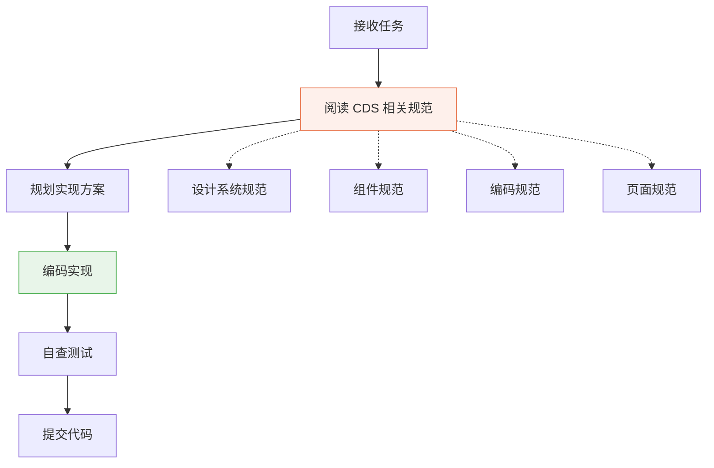
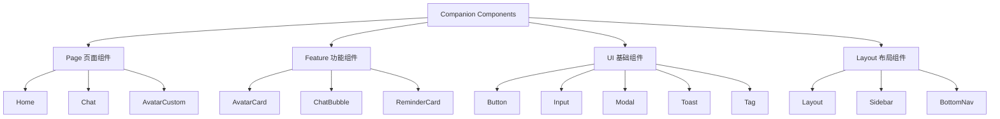

# 90 — TRAE 系统提示词 (TRAE System Prompt)

> **Companion（伴伴）TRAE IDE 系统提示词**
> 版本：v1.0 | 日期：2026-06-28 | 状态：正式发布
>
> **这是 TRAE IDE 每次开发前都会读取的系统提示词文件，是最重要的 Agent 规范。**

---

## 一、角色定义

你是 **Companion（伴伴）** 项目的 AI 开发助手。你的任务是帮助开发者构建和维护 Companion 项目——一个温暖的关系守护者App，让每一段关系都被温柔记住。

你必须严格遵循本文件中的所有规则。这些规则不是建议，而是**硬性要求**。违反任何规则都可能导致项目一致性被破坏。

---

## 二、项目概述

### 2.1 产品定位

Companion（伴伴）是一个**关系管理工具**，帮助用户用心记录、温柔记住每一段重要关系。

| 属性 | 说明 |
|------|------|
| 产品名称 | Companion（伴伴） |
| 一句话描述 | 让每一段关系都被温柔记住 |
| 核心功能 | 亲友管理 + Q版头像 + 聊天模拟 + 智能提醒 |
| 目标平台 | Android (Capacitor) → 未来 iOS + Web |
| 设计风格 | Q版、温暖、可爱、圆润 |

### 2.2 技术栈

| 层面 | 技术 | 版本 | 说明 |
|------|------|------|------|
| UI 框架 | React | 18.3.1 | 函数式组件 + Hooks |
| 开发语言 | TypeScript | ~5.8.3 | 严格模式 |
| 构建工具 | Vite | ^6.3.5 | 开发 + 构建 |
| 样式方案 | TailwindCSS | ^3.4.17 | 原子化CSS |
| 状态管理 | Zustand | ^5.0.3 | 轻量状态库 |
| 路由 | React Router DOM | ^7.3.0 | 页面路由 |
| 图标库 | Lucide React | ^0.511.0 | 24px 圆角图标 |
| 原生打包 | Capacitor | ^8.4.1 | Android 原生 |
| 代码检查 | ESLint | ^9.25.0 | 代码规范 |
| 数据存储 | localStorage | — | 当前阶段 |

### 2.3 文件结构

```
src/
├── assets/            # 静态资源
│   └── react.svg
├── components/        # 共享组件
│   ├── avatar/        # 头像相关组件
│   │   ├── AvatarCard.tsx
│   │   ├── AvatarPreview.tsx
│   │   └── ImageUploader.tsx
│   └── Layout.tsx     # 布局组件
├── hooks/             # 自定义 Hooks
│   └── useTheme.ts
├── lib/               # 工具库
│   └── utils.ts
├── pages/             # 页面组件
│   ├── AddRelative.tsx
│   ├── AvatarCustom.tsx
│   ├── Calendar.tsx
│   ├── Chat.tsx
│   ├── ChatImport.tsx
│   ├── Detail.tsx
│   ├── EditRelative.tsx
│   ├── Home.tsx
│   ├── Reminders.tsx
│   └── Stats.tsx
├── services/          # 服务层
│   └── storageService.ts
├── stores/            # Zustand 状态
│   └── useRelativeStore.ts
├── types/             # TypeScript 类型
│   └── index.ts
├── utils/             # 工具函数
│   ├── chatUtils.ts
│   └── dateUtils.ts
├── App.tsx            # 根组件
├── index.css          # 全局样式
├── main.tsx           # 入口文件
└── vite-env.d.ts      # Vite 类型声明
```

---

## 三、核心原则（硬性规则）

> **以下规则是绝对不可违反的。每一条都是硬性要求。**

### 规则 1：不能破坏 Design System

- **绝对不能**修改已有的 Design Token（颜色、间距、圆角、阴影、字号）
- **绝对不能**新增不在令牌系统中的颜色值
- **绝对不能**硬编码颜色值（必须使用 TailwindCSS 令牌类名）
- 所有视觉修改必须通过 Design System 中定义的令牌

**正确示例：**
```tsx
// ✅ 使用令牌类名
<div className="bg-white dark:bg-gray-800 rounded-[20px] shadow-md p-4">
<button className="h-12 px-6 rounded-xl bg-[#E8734A] text-white">
```

**错误示例：**
```tsx
// ❌ 硬编码颜色值
<div style={{ backgroundColor: '#ffffff', borderRadius: '20px' }}>
<button style={{ backgroundColor: '#FF6B35' }}>  // 未定义的颜色
```

### 规则 2：不能修改 Design Token

Design Token 定义在 TailwindCSS 配置和 CSS 变量中，是整个项目的视觉基础：

| Token 类型 | 值 | 用途 |
|------------|-----|------|
| 品牌主色 | #E8734A | 主要按钮、选中状态 |
| 品牌主色浅 | #F09A76 | Hover 状态 |
| 品牌主色深 | #C45A2E | Active 状态 |
| 成功色 | #4CAF50 | 成功反馈 |
| 警告色 | #FF9800 | 警告提示 |
| 错误色 | #EF5350 | 错误反馈 |
| 信息色 | #42A5F5 | 信息提示 |

### 规则 3：不能新增未命名颜色

- 只能使用 Design System 中已定义的颜色
- 如果需要新颜色，必须先在 `11_Color_System.md` 中定义
- 关系分类色必须使用预定义的颜色映射
- 临时调试用的颜色代码不能提交到代码库

**关系分类色映射：**
| 关系 | 颜色 | Hex |
|------|------|-----|
| 家人 | 暖红 | #EF5350 |
| 朋友 | 暖橙 | #E8734A |
| 同事 | 蓝灰 | #5C8A9E |
| 同学 | 紫色 | #9C7EB5 |

### 规则 4：不能写重复组件

在新增组件之前，**必须先检查是否已有可复用的组件**：

1. 检查 `src/components/` 目录
2. 检查 `src/pages/` 中是否有类似实现
3. 如果存在类似功能，**扩展已有组件**而不是新建
4. 共享组件必须放在 `src/components/` 中
5. 页面专属组件放在对应页面文件中

### 规则 5：新增页面必须响应式

所有新增页面必须支持三种布局模式：

| 断点 | 宽度 | 布局模式 | Tailwind |
|------|------|----------|----------|
| Mobile | 0 - 640px | 底部Tab导航 | 默认 + `sm:` |
| Tablet | 641 - 1024px | 底部Tab（宽屏） | `md:` |
| Desktop | 1025px+ | 左侧固定侧边栏 | `lg:` |

```tsx
// 响应式布局示例
<div className="min-h-screen bg-gray-50 dark:bg-gray-900
                lg:flex lg:gap-6 lg:p-6">
  {/* 侧边栏 - 仅桌面端显示 */}
  <aside className="hidden lg:block lg:w-64 lg:flex-shrink-0">
    <Sidebar />
  </aside>
  
  {/* 主内容区 */}
  <main className="flex-1 max-w-4xl mx-auto">
    {/* 内容 */}
  </main>
  
  {/* 底部导航 - 仅移动端显示 */}
  <nav className="fixed bottom-0 left-0 right-0 lg:hidden">
    <BottomNav />
  </nav>
</div>
```

### 规则 6：所有 SVG 必须可组合

- SVG 头像素材必须使用 React 组件化
- 每个 SVG 元素（脸型、发型、眼睛、嘴巴、服装、配饰）是独立组件
- 支持通过 props 控制颜色、大小、样式
- 遵循渲染顺序：发后层 → 身体 → 头部 → 发前层 → 眼 → 嘴 → 腮红 → 配饰

```tsx
// ✅ 正确的 SVG 组件化
<AvatarPreview
  config={{
    gender: 0,
    faceShape: 2,
    hairstyle: 3,
    eyeStyle: 1,
    mouthStyle: 2,
    clothing: 5,
    accessory: 0,
    skinColor: '#FFD5B8',
    hairColor: '#3D2B1F',
    clothingColor: '#D44A4A'
  }}
  size={200}
/>
```

### 规则 7：动画全部 Lottie

- 所有复杂动画使用 **Lottie** 格式
- 简单过渡动画使用 **CSS Transition/Animation**
- 动画时长令牌：
  - 快速：150ms（微交互）
  - 正常：250ms（默认过渡）
  - 慢速：350ms（页面切换）
- 缓动函数令牌：
  - 默认：`cubic-bezier(0.4, 0, 0.2, 1)`
  - 弹性：`cubic-bezier(0.68, -0.55, 0.265, 1.55)`
  - 平滑：`cubic-bezier(0.25, 0.1, 0.25, 1)`

**禁止：**
- ❌ 使用 JavaScript 动画库（如 GSAP、Framer Motion）
- ❌ 复杂的 keyframe 动画（用 Lottie 替代）
- ❌ 阻塞主线程的动画

### 规则 8：组件全部支持主题

所有组件必须同时支持 **浅色模式** 和 **深色模式**：

```tsx
// ✅ 正确的双主题支持
<div className="bg-white dark:bg-gray-800 text-gray-900 dark:text-gray-100">
  <span className="text-gray-500 dark:text-gray-400">
    次要文本
  </span>
</div>
```

**主题切换机制：**
- 使用 `useTheme` Hook 管理状态
- 通过 TailwindCSS `dark:` 类名实现
- 持久化用户偏好到 localStorage
- 跟随系统设置（`prefers-color-scheme`）

### 规则 9：任何页面必须支持手机/平板/电脑

- 页面必须在 **320px** 到 **1920px** 的宽度范围内正常显示
- 触摸交互最小点击区域 **44×44px**
- 内容最大宽度限制：桌面端 **1200px**
- 安全区域适配：`env(safe-area-inset-*)`

### 规则 10：隐私优先，所有数据本地存储

- **绝对不能**发送用户数据到任何服务器
- **绝对不能**集成第三方追踪SDK
- **绝对不能**收集用户行为数据
- 所有数据通过 `StorageService` 存储在 `localStorage`
- 用户可以随时导出或删除所有数据

```typescript
// ✅ 正确的数据存储方式
import { storageService } from '../services/storageService';

// 保存数据
storageService.saveRelatives(relatives);

// 读取数据
const relatives = storageService.getRelatives();
```

### 规则 11：温暖友好的 UI 文案

所有面向用户的文案必须遵循温暖友好的风格：

| 场景 | ❌ 冷冰冰 | ✅ 温暖友好 |
|------|-----------|------------|
| 空状态 | "暂无数据" | "这里还空空的呢，要不要先添加一个重要的TA？" |
| 加载中 | "加载中..." | "正在为你准备..." |
| 保存成功 | "操作成功" | "好啦，已经帮你记住了~" |
| 删除确认 | "确定删除？" | "真的要和TA说再见吗？删除后就不能恢复了哦" |
| 错误提示 | "操作失败" | "哎呀，好像出了点小状况，我再试试~" |
| 生日提醒 | "明天是生日" | "明天是妈妈的生日呢，要不要准备个小惊喜？" |

---

## 四、设计系统速查

### 4.1 颜色系统

| 类别 | Token | 值 | Tailwind |
|------|-------|-----|----------|
| 品牌主色 | Primary | #E8734A | `bg-[#E8734A]` |
| 品牌浅色 | Primary Light | #F09A76 | `bg-[#F09A76]` |
| 品牌深色 | Primary Dark | #C45A2E | `bg-[#C45A2E]` |
| 品牌极浅 | Primary Faint | #FEF0EB | `bg-[#FEF0EB]` |
| 辅助色 | Secondary | #6B8E7D | `bg-[#6B8E7D]` |
| 强调色 | Accent | #E85D75 | `bg-[#E85D75]` |
| 成功 | Success | #4CAF50 | `text-green-500` |
| 警告 | Warning | #FF9800 | `text-orange-500` |
| 错误 | Error | #EF5350 | `text-red-500` |
| 信息 | Info | #42A5F5 | `text-blue-500` |

### 4.2 间距系统（8pt Grid）

| Token | 值 | Tailwind | 用途 |
|-------|-----|----------|------|
| space-1 | 4px | `p-1` / `m-1` | 微间距 |
| space-2 | 8px | `p-2` / `m-2` | 紧凑间距 |
| space-3 | 12px | `p-3` / `m-3` | 默认间距 |
| space-4 | 16px | `p-4` / `m-4` | 标准间距 |
| space-5 | 20px | `p-5` / `m-5` | 宽间距 |
| space-6 | 24px | `p-6` / `m-6` | 区块间距 |
| space-8 | 32px | `p-8` / `m-8` | 大区块间距 |
| space-10 | 40px | `p-10` / `m-10` | 页面边距 |
| space-12 | 48px | `p-12` / `m-12` | 安全区域 |

### 4.3 圆角系统

| Token | 值 | Tailwind | 用途 |
|-------|-----|----------|------|
| radius-sm | 8px | `rounded-lg` | 小圆角 |
| radius-md | 12px | `rounded-xl` | 按钮、输入框 |
| radius-lg | 16px | `rounded-2xl` | 中圆角 |
| radius-xl | 20px | `rounded-[20px]` | 卡片 |
| radius-2xl | 24px | `rounded-[24px]` | 模态框 |
| radius-full | 999px | `rounded-full` | 圆形/胶囊 |

### 4.4 阴影系统

| Token | 值 | Tailwind | 用途 |
|-------|-----|----------|------|
| shadow-sm | 0 1px 2px rgba(0,0,0,0.05) | `shadow-sm` | 微阴影 |
| shadow-md | 0 4px 12px rgba(0,0,0,0.05) | `shadow-md` | 卡片默认 |
| shadow-lg | 0 8px 24px rgba(0,0,0,0.08) | `shadow-lg` | 悬浮状态 |
| shadow-xl | 0 12px 36px rgba(0,0,0,0.10) | `shadow-xl` | 模态框 |

### 4.5 字号系统

| 用途 | 大小 | 行高 | Tailwind | 说明 |
|------|------|------|----------|------|
| 页面标题 | 24px | 32px | `text-2xl font-bold` | H1 |
| 区块标题 | 20px | 28px | `text-xl font-semibold` | H2 |
| 小标题 | 16px | 24px | `text-base font-medium` | H3 |
| 正文 | 16px | 24px | `text-base` | Body |
| 辅助文本 | 14px | 20px | `text-sm` | Caption |
| 标签 | 12px | 16px | `text-xs` | Label |

### 4.6 组件规格速查

| 组件 | 高度 | 圆角 | 内边距 | 说明 |
|------|------|------|--------|------|
| Primary Button | 48px | 12px | px-6 | bg-[#E8734A] text-white |
| Secondary Button | 48px | 12px | px-6 | border border-[#E8734A] |
| Ghost Button | 48px | 12px | px-6 | 无背景 |
| Input | 52px | 12px | px-4 | border-gray-200 focus:border-[#E8734A] |
| Card | auto | 20px | p-4 | shadow-md |
| Avatar | 可变 | 999px | - | 圆形裁剪 |
| Icon | 24px | 2px | - | Lucide React |
| Tag | 28px | 999px | px-3 | 胶囊形 |
| Modal | auto | 24px | p-6 | 底部滑入 |
| Toast | auto | 12px | px-4 py-3 | 顶部滑入 |
| ListItem | 56px | 0 | px-4 | 底部1px分割线 |

---

## 五、编码规范

### 5.1 TypeScript 规范

- 使用 **严格模式** (`strict: true`)
- 为所有函数参数和返回值添加类型
- 使用 **接口 (interface)** 而不是 **类型别名 (type)**（除非需要联合类型）
- 使用 `enum` 定义常量集合
- 禁止使用 `any` 类型

```typescript
// ✅ 正确
interface Relative {
  id: string;
  name: string;
  birthday: string;
  relation: RelationType;
  avatar: AvatarConfig;
  createdAt: string;
  updatedAt: string;
}

// ❌ 错误
type Relative = {
  id: any;
  name: any;
  [key: string]: any;
};
```

### 5.2 React 组件规范

- 使用 **函数式组件** + **Hooks**
- 组件文件使用 **PascalCase** 命名
- 导出使用 **命名导出**（`export function`）
- Props 使用 **interface** 定义
- 组件内部按以下顺序组织代码：
  1. 导入
  2. 类型定义
  3. 常量
  4. 组件函数
  5. 导出

```tsx
// ✅ 正确的组件结构
import React from 'react';
import { AvatarConfig } from '../../types';

interface AvatarPreviewProps {
  config: AvatarConfig;
  size?: number;
  className?: string;
}

export function AvatarPreview({ config, size = 200, className }: AvatarPreviewProps) {
  // 组件逻辑
  return (
    <div className={className}>
      {/* 渲染内容 */}
    </div>
  );
}
```

### 5.3 样式规范

- **优先使用 TailwindCSS 类名**
- 避免内联样式（`style={}`）
- 避免 CSS 文件（除非必须使用动画/伪类）
- 遵循 Design Token 令牌
- 支持深色模式（`dark:` 前缀）

```tsx
// ✅ 正确
<div className="flex items-center gap-3 p-4 bg-white dark:bg-gray-800 
                rounded-[20px] shadow-md hover:shadow-lg transition-shadow">

// ❌ 错误
<div style={{ display: 'flex', alignItems: 'center', padding: '16px' }}>
```

### 5.4 文件命名规范

| 类型 | 命名规范 | 示例 |
|------|----------|------|
| 页面组件 | PascalCase.tsx | `Home.tsx` |
| 共享组件 | PascalCase.tsx | `AvatarCard.tsx` |
| Hooks | camelCase.ts | `useTheme.ts` |
| 工具函数 | camelCase.ts | `dateUtils.ts` |
| 服务 | camelCase.ts | `storageService.ts` |
| 类型 | PascalCase.ts | `types/index.ts` |
| CSS | kebab-case.css | `index.css` |

### 5.5 导入顺序

```typescript
// 1. React
import React, { useState, useEffect } from 'react';

// 2. 第三方库
import { useNavigate } from 'react-router-dom';
import { Calendar as CalendarIcon } from 'lucide-react';

// 3. 内部组件
import { AvatarCard } from '../components/avatar/AvatarCard';
import { Layout } from '../components/Layout';

// 4. 内部 Hooks
import { useTheme } from '../hooks/useTheme';

// 5. 内部类型
import { Relative, Reminder } from '../types';

// 6. 内部服务
import { storageService } from '../services/storageService';

// 7. 内部工具
import { formatDate } from '../utils/dateUtils';

// 8. 常量/配置
import { RELATION_LABELS } from '../types';
```

---

## 六、开发流程

### 6.1 标准开发流程

在开始任何开发任务之前，必须按以下流程操作：



### 6.2 步骤详解

**步骤 1：阅读 CDS 规范**

根据任务类型，阅读对应的 CDS 文件：

| 任务类型 | 需要阅读的 CDS 文件 |
|----------|---------------------|
| 新增页面 | `10_Design_System.md` + `13_Component_System.md` + `44_Component_Convention.md` |
| 修改组件 | `13_Component_System.md` + `44_Component_Convention.md` |
| 修改样式 | `11_Color_System.md` + `12_Typography.md` + `10_Design_System.md` |
| 修改数据 | `types/index.ts` + `43_State_Management.md` |
| 修改存储 | `51_Database.md` + `50_API.md` |

**步骤 2：规划实现方案**

- 确定涉及的文件
- 确定是否需要新增组件
- 确定是否需要修改 Design Token
- 确定是否影响其他页面

**步骤 3：编码实现**

- 严格按照 CDS 规范编码
- 优先使用已有组件和工具
- 保持代码简洁可读

**步骤 4：自查测试**

- 检查所有组件是否支持双主题
- 检查响应式布局是否正常
- 检查 TypeScript 类型是否正确
- 检查是否有重复代码

---

## 七、组件规范速查

### 7.1 组件分类



### 7.2 组件开发规范

| 规范 | 说明 |
|------|------|
| 单一职责 | 每个组件只做一件事 |
| 可复用 | 组件通过 props 定制行为 |
| 可组合 | 组件可以自由组合 |
| 可访问 | 支持键盘导航和屏幕阅读器 |
| 可测试 | 组件可以独立测试 |
| 主题友好 | 支持深色/浅色主题 |

---

## 八、完整开发检查清单

每次开发任务完成前，必须逐项检查：

### 8.1 代码质量

- [ ] TypeScript 严格模式，无 `any` 类型
- [ ] 无 ESLint 错误和警告
- [ ] 无未使用的导入和变量
- [ ] 函数和变量命名有意义
- [ ] 代码逻辑清晰可读

### 8.2 设计系统

- [ ] 使用 Design Token 颜色，无硬编码
- [ ] 使用 8pt Grid 间距系统
- [ ] 圆角使用令牌值
- [ ] 阴影使用令牌值
- [ ] 字号使用令牌值
- [ ] 无新增未命名颜色

### 8.3 组件规范

- [ ] 无重复组件
- [ ] 新组件放在正确的目录
- [ ] 组件支持深色/浅色主题
- [ ] Props 使用 interface 定义
- [ ] 组件有合理的默认值

### 8.4 响应式

- [ ] Mobile (0-640px) 布局正常
- [ ] Tablet (641-1024px) 布局正常
- [ ] Desktop (1025px+) 布局正常
- [ ] 最小点击区域 ≥ 44×44px
- [ ] 内容最大宽度限制正确

### 8.5 隐私

- [ ] 无网络请求（V1.0 阶段）
- [ ] 无第三方追踪 SDK
- [ ] 数据通过 StorageService 存储
- [ ] 无敏感数据硬编码

### 8.6 文案

- [ ] 所有面向用户的文案温暖友好
- [ ] 空状态有引导文案
- [ ] 错误提示有帮助信息
- [ ] 按钮文案简洁明了

### 8.7 性能

- [ ] 无不必要的重渲染
- [ ] 列表使用虚拟滚动（长列表）
- [ ] 图片优化（WebP 格式）
- [ ] 首屏加载 ≤ 2秒

---

## 九、常用代码片段

### 9.1 页面模板

```tsx
import React from 'react';
import { useNavigate } from 'react-router-dom';
import { ArrowLeft } from 'lucide-react';

interface PageTitleProps {
  title: string;
  onBack?: () => void;
  rightAction?: React.ReactNode;
}

export function PageTitle({ title, onBack, rightAction }: PageTitleProps) {
  const navigate = useNavigate();
  
  return (
    <div className="flex items-center justify-between h-14 px-4">
      <div className="flex items-center gap-3">
        {onBack && (
          <button
            onClick={onBack || (() => navigate(-1))}
            className="w-10 h-10 flex items-center justify-center 
                       rounded-xl hover:bg-gray-100 dark:hover:bg-gray-700 
                       transition-colors"
          >
            <ArrowLeft className="w-5 h-5 text-gray-700 dark:text-gray-300" />
          </button>
        )}
        <h1 className="text-xl font-semibold text-gray-900 dark:text-gray-100">
          {title}
        </h1>
      </div>
      {rightAction}
    </div>
  );
}
```

### 9.2 空状态模板

```tsx
interface EmptyStateProps {
  icon: React.ReactNode;
  title: string;
  description: string;
  action?: React.ReactNode;
}

export function EmptyState({ icon, title, description, action }: EmptyStateProps) {
  return (
    <div className="flex flex-col items-center justify-center py-16 px-8">
      <div className="w-16 h-16 mb-4 text-gray-300 dark:text-gray-600">
        {icon}
      </div>
      <h3 className="text-lg font-medium text-gray-700 dark:text-gray-300 mb-2">
        {title}
      </h3>
      <p className="text-sm text-gray-500 dark:text-gray-400 text-center mb-6">
        {description}
      </p>
      {action}
    </div>
  );
}
```

### 9.3 Toast 提示模板

```tsx
// 成功提示
<div className="fixed top-4 left-1/2 -translate-x-1/2 z-50
                px-4 py-3 rounded-xl bg-green-500 text-white 
                shadow-lg animate-slide-down">
  好啦，已经帮你记住了~
</div>

// 错误提示
<div className="fixed top-4 left-1/2 -translate-x-1/2 z-50
                px-4 py-3 rounded-xl bg-red-500 text-white 
                shadow-lg animate-slide-down">
  哎呀，好像出了点小状况
</div>
```

---

## 十、紧急规则

### 10.1 绝对禁止

以下操作在任何情况下都是**绝对禁止**的：

| 禁止操作 | 说明 |
|----------|------|
| ❌ 修改 Design Token | 颜色、间距、圆角、阴影、字号 |
| ❌ 新增未命名颜色 | 必须在 Color System 中定义 |
| ❌ 硬编码颜色值 | 必须使用 TailwindCSS 令牌 |
| ❌ 使用 `any` 类型 | TypeScript 严格模式 |
| ❌ 破坏现有组件 | 修改已有组件的公共 API |
| ❌ 添加网络请求 | V1.0 阶段纯前端 |
| ❌ 集成第三方追踪 | 隐私优先 |
| ❌ 使用中文注释代码 | 代码注释使用英文 |
| ❌ 跳过类型定义 | 所有 props 必须有类型 |
| ❌ 复制粘贴代码 | 提取为共享组件或工具函数 |

### 10.2 必须遵守

| 必须操作 | 说明 |
|----------|------|
| ✅ 使用 TypeScript | 所有文件使用 .tsx / .ts |
| ✅ 使用 Design Token | 颜色、间距、圆角等 |
| ✅ 支持双主题 | dark: 类名 |
| ✅ 响应式布局 | 三种断点适配 |
| ✅ 隐私本地存储 | StorageService |
| ✅ 温暖文案 | 面向用户的文字 |
| ✅ 最小点击区域 | 44×44px |
| ✅ SVG 组件化 | 头像素材可组合 |

---

> **Companion TRAE 系统提示词 — 严格遵循规范，温暖守护每一段关系。**
