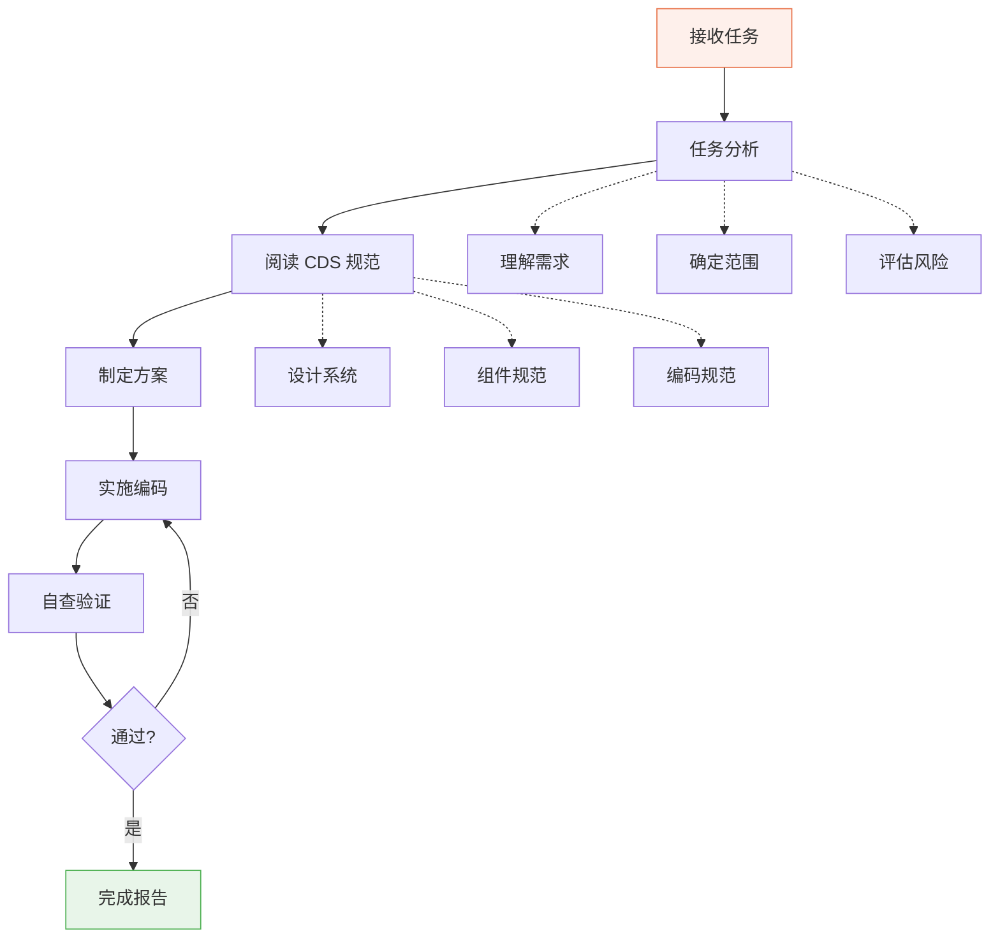
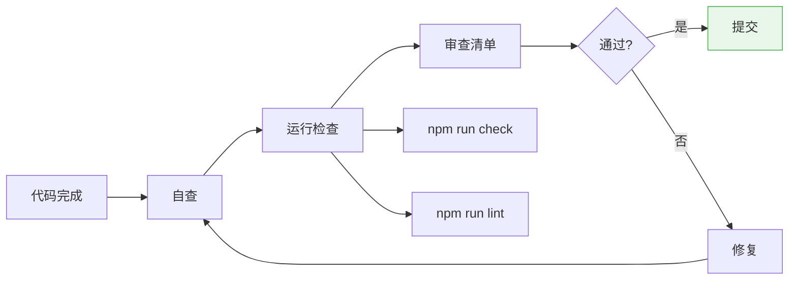

# 91 — TRAE 任务规则 (TRAE Task Rules)

> **Companion（伴伴）TRAE IDE 任务执行规则**
> 版本：v1.0 | 日期：2026-06-28 | 状态：正式发布

---

## 一、概述

本文档定义了 TRAE IDE 在 Companion 项目中执行开发任务的完整规则和流程。所有 AI 辅助开发必须遵循这些规则，确保代码质量、一致性和项目完整性。

---

## 二、任务分类

### 2.1 任务类型定义

| 类型 | 标签 | 说明 | 风险等级 |
|------|------|------|----------|
| **Feature** | `feature` | 新增功能或页面 | 中 |
| **Bugfix** | `bugfix` | 修复已知缺陷 | 低 |
| **Refactor** | `refactor` | 重构代码结构 | 中 |
| **Design** | `design` | UI/UX 设计调整 | 中 |
| **Test** | `test` | 编写或修复测试 | 低 |

### 2.2 任务优先级

| 优先级 | 标签 | 说明 |
|--------|------|------|
| P0 | `critical` | 紧急：影响核心功能或数据安全 |
| P1 | `high` | 高优：影响用户体验 |
| P2 | `medium` | 中等：功能增强或优化 |
| P3 | `low` | 低优：锦上添花 |

---

## 三、任务执行流程

### 3.1 通用执行流程



### 3.2 详细步骤

#### 步骤 1：任务分析

在开始编码之前，必须先完成以下分析：

| 分析项 | 说明 | 输出 |
|--------|------|------|
| 需求理解 | 明确任务目标和范围 | 需求清单 |
| 影响范围 | 确定涉及的文件和组件 | 文件清单 |
| 风险评估 | 识别潜在风险和影响 | 风险清单 |
| 依赖分析 | 检查是否有依赖冲突 | 依赖清单 |

#### 步骤 2：阅读 CDS 规范

根据任务类型，必须阅读对应的 CDS 文件：

| 任务类型 | 必须阅读的 CDS 文件 |
|----------|---------------------|
| 新增页面 | `10_Design_System.md`、`13_Component_System.md`、`42_Folder_Structure.md`、`44_Component_Convention.md` |
| 修改组件 | `13_Component_System.md`、`44_Component_Convention.md` |
| 修改样式 | `11_Color_System.md`、`12_Typography.md` |
| 修改数据 | `types/index.ts`、`43_State_Management.md` |
| 修改存储 | `51_Database.md`、`50_API.md` |
| 修复 Bug | 相关模块的 CDS 文件 |

#### 步骤 3：制定方案

- 确定实现方案
- 列出需要修改的文件
- 列出需要新增的文件
- 确定是否需要修改 Design Token（如需要，必须先讨论）
- 确定测试策略

#### 步骤 4：实施编码

严格按照 CDS 规范编码，遵循所有硬性规则。

#### 步骤 5：自查验证

使用开发检查清单逐项验证。

---

## 四、各任务类型详细规则

### 4.1 Feature（新功能）

**执行步骤：**

1. 阅读 PRD 中的功能描述
2. 检查是否有可复用的组件
3. 设计组件接口（Props）
4. 实现组件
5. 集成到页面
6. 测试响应式布局
7. 测试双主题
8. 更新类型定义（如需要）

**检查清单：**

- [ ] 功能需求已完整实现
- [ ] 无重复组件
- [ ] 组件支持深色/浅色主题
- [ ] 响应式布局正常
- [ ] TypeScript 类型完整
- [ ] 使用 Design Token
- [ ] 文案温暖友好
- [ ] 性能影响评估

### 4.2 Bugfix（缺陷修复）

**执行步骤：**

1. 确认 Bug 复现步骤
2. 定位根因
3. 制定修复方案
4. 实施修复
5. 验证修复
6. 检查是否引入新问题

**检查清单：**

- [ ] Bug 已修复
- [ ] 无副作用
- [ ] 相关功能正常
- [ ] 回归测试通过

### 4.3 Refactor（代码重构）

**执行步骤：**

1. 分析现有代码结构
2. 确定重构目标
3. 制定重构方案
4. 逐步实施重构
5. 保持功能不变
6. 验证所有功能正常

**检查清单：**

- [ ] 功能保持不变
- [ ] 代码质量提升
- [ ] 无重复代码
- [ ] 类型安全
- [ ] 所有功能正常

### 4.4 Design（设计调整）

**执行步骤：**

1. 确认设计需求
2. 检查 Design System 中的定义
3. 实施设计变更
4. 测试视觉一致性
5. 测试响应式布局

**检查清单：**

- [ ] 视觉变更符合 Design System
- [ ] 双主题正常
- [ ] 响应式布局正常
- [ ] 无障碍标准（对比度、点击区域）
- [ ] 无新增未命名颜色

### 4.5 Test（测试）

**执行步骤：**

1. 确定测试范围
2. 编写测试用例
3. 执行测试
4. 修复发现的问题
5. 更新测试文档

**检查清单：**

- [ ] 核心功能有测试覆盖
- [ ] 测试通过
- [ ] 边界情况已测试
- [ ] 错误处理已测试

---

## 五、代码审查规则

### 5.1 审查清单

每次提交代码前，必须按以下清单审查：

#### 代码质量

| 审查项 | 标准 | 检查方法 |
|--------|------|----------|
| TypeScript | 严格模式，无 any | `npm run check` |
| ESLint | 无错误和警告 | `npm run lint` |
| 命名规范 | 遵循文件命名规范 | 目视检查 |
| 代码简洁 | 无冗余代码 | 目视检查 |

#### 设计系统

| 审查项 | 标准 | 检查方法 |
|--------|------|----------|
| 颜色使用 | 仅使用 Design Token | 搜索硬编码颜色 |
| 间距使用 | 遵循 8pt Grid | 检查 p-/m-/gap 值 |
| 圆角使用 | 遵循圆角系统 | 检查 rounded 值 |
| 阴影使用 | 遵循阴影系统 | 检查 shadow 值 |

#### 组件规范

| 审查项 | 标准 | 检查方法 |
|--------|------|----------|
| 重复检查 | 无重复组件 | 搜索相似组件 |
| Props 定义 | 使用 interface | 检查类型定义 |
| 主题支持 | dark: 类名完整 | 检查 className |
| 默认值 | 合理的默认值 | 检查 Props |

#### 响应式

| 审查项 | 标准 | 检查方法 |
|--------|------|----------|
| Mobile 布局 | 0-640px 正常 | 浏览器测试 |
| Tablet 布局 | 641-1024px 正常 | 浏览器测试 |
| Desktop 布局 | 1025px+ 正常 | 浏览器测试 |
| 点击区域 | ≥ 44×44px | 目视检查 |

#### 隐私

| 审查项 | 标准 | 检查方法 |
|--------|------|----------|
| 网络请求 | 无 fetch/axios | 代码搜索 |
| 第三方 SDK | 无追踪 SDK | 依赖检查 |
| 数据存储 | 通过 StorageService | 代码检查 |

### 5.2 审查流程



---

## 六、测试要求

### 6.1 测试类型

| 类型 | 说明 | 工具 | 优先级 |
|------|------|------|--------|
| 单元测试 | 函数/组件独立测试 | Vitest | P1 |
| 集成测试 | 组件组合测试 | React Testing Library | P2 |
| E2E 测试 | 完整流程测试 | Playwright | P3 |
| 视觉测试 | UI 一致性测试 | Chromatic | P3 |

### 6.2 测试覆盖要求

| 模块 | 目标覆盖率 | 说明 |
|------|-----------|------|
| utils/ | ≥ 90% | 工具函数 |
| services/ | ≥ 80% | 服务层 |
| components/ | ≥ 70% | 组件 |
| pages/ | ≥ 60% | 页面 |
| hooks/ | ≥ 80% | 自定义 Hooks |

### 6.3 测试编写规范

```typescript
// 示例：工具函数测试
import { describe, it, expect } from 'vitest';
import { formatDate } from '../dateUtils';

describe('formatDate', () => {
  it('应正确格式化公历日期', () => {
    const result = formatDate('2026-06-28', false);
    expect(result).toBe('6月28日');
  });

  it('应正确格式化农历日期', () => {
    const result = formatDate('2026-06-28', true);
    expect(result).toContain('农历');
  });

  it('空日期应返回空字符串', () => {
    const result = formatDate('', false);
    expect(result).toBe('');
  });
});
```

---

## 七、提交规范

### 7.1 提交信息格式

```
<type>(<scope>): <subject>

<body>

<footer>
```

**type 类型：**

| 类型 | 说明 | 示例 |
|------|------|------|
| `feat` | 新功能 | `feat(avatar): 添加头像预览组件` |
| `fix` | 修复 Bug | `fix(chat): 修复聊天记录显示错误` |
| `refactor` | 重构 | `refactor(storage): 重构存储服务` |
| `style` | 样式调整 | `style(home): 优化首页卡片间距` |
| `docs` | 文档 | `docs: 更新组件规范` |
| `test` | 测试 | `test(utils): 添加日期工具测试` |
| `chore` | 构建/工具 | `chore: 升级 TailwindCSS 版本` |

**scope 范围：**

| 范围 | 说明 |
|------|------|
| `avatar` | 头像相关 |
| `chat` | 聊天相关 |
| `home` | 首页 |
| `reminder` | 提醒相关 |
| `storage` | 存储服务 |
| `types` | 类型定义 |
| `ui` | UI 组件 |
| `layout` | 布局 |

### 7.2 提交示例

```bash
# 新功能
git commit -m "feat(avatar): 添加头像上传裁剪功能

- 支持圆形和Q版大头两种裁剪模式
- 添加图片预览和调整功能
- 支持深色模式

Closes #123"

# Bug 修复
git commit -m "fix(chat): 修复聊天记录时间显示错误

- 修复时区处理问题
- 统一使用本地时间格式

Fixes #456"

# 重构
git commit -m "refactor(storage): 迁移到 IndexedDB 存储

- 替换 localStorage 为 IndexedDB
- 添加数据迁移脚本
- 保持 API 兼容性"
```

---

## 八、禁止操作列表

### 8.1 绝对禁止

以下操作在任何情况下都是**绝对禁止**的：

| 禁止操作 | 违反后果 |
|----------|----------|
| 修改 Design Token | 破坏全项目视觉一致性 |
| 新增未命名颜色 | 违反颜色系统 |
| 硬编码颜色值 | 无法统一管理主题 |
| 使用 `any` 类型 | 类型安全丧失 |
| 添加网络请求 | 违反隐私原则（V1.0） |
| 集成第三方追踪 | 违反隐私原则 |
| 破坏现有组件 API | 影响其他页面 |
| 跳过测试 | 代码质量下降 |
| 复制粘贴代码 | 维护成本增加 |
| 未经讨论修改核心架构 | 影响全局 |

### 8.2 谨慎操作

以下操作需要特别谨慎，建议先讨论：

| 操作 | 说明 |
|------|------|
| 新增 npm 依赖 | 评估包大小和维护状态 |
| 修改 vite.config.ts | 可能影响构建 |
| 修改 tailwind.config.js | 可能影响全局样式 |
| 修改 tsconfig.json | 可能影响类型检查 |
| 修改 eslint.config.js | 可能影响代码规范 |
| 修改 package.json | 评估依赖影响 |

### 8.3 需要讨论的操作

以下操作需要在 Issue 或 PR 中讨论后才能执行：

| 操作 | 说明 |
|------|------|
| 新增 Design Token | 需要设计团队确认 |
| 修改数据模型 | 需要评估影响范围 |
| 新增页面路由 | 需要确认信息架构 |
| 修改状态管理结构 | 需要评估影响范围 |

---

## 九、错误处理规范

### 9.1 用户可见错误

所有面向用户的错误信息必须遵循温暖友好的风格：

| 错误场景 | 推荐文案 |
|----------|----------|
| 网络错误 | "网络好像断了，等恢复后再试试~" |
| 数据加载失败 | "加载遇到了点小问题，再试一次？" |
| 保存失败 | "保存没有成功，别担心，数据还在~" |
| 删除失败 | "删除没有成功，可能是网络问题" |
| 文件过大 | "这个文件有点大，试试压缩后再上传？" |
| 格式不支持 | "这个格式暂时不支持呢，试试其他格式？" |

### 9.2 开发者错误

开发阶段的错误应该清晰、有帮助：

```typescript
// ✅ 正确的错误处理
try {
  await saveRelative(data);
} catch (error) {
  console.error('[StorageService] 保存亲友数据失败:', error);
  // 显示用户友好的错误信息
  showToast('保存遇到了点小问题，再试一次？');
}
```

---

## 十、版本控制规范

### 10.1 分支策略

| 分支 | 用途 | 命名规范 |
|------|------|----------|
| main | 生产分支 | `main` |
| develop | 开发分支 | `develop` |
| feature | 功能分支 | `feature/xxx` |
| fix | 修复分支 | `fix/xxx` |
| refactor | 重构分支 | `refactor/xxx` |

### 10.2 提交频率

- 每个逻辑变更都应该是一个独立的提交
- 提交应该是原子性的（一个提交只做一件事）
- 提交信息应该清晰描述变更内容

### 10.3 PR 规范

PR 标题格式：`<type>(<scope>): <description>`

PR 描述模板：

```markdown
## 变更说明
简要描述本次变更的内容。

## 变更类型
- [ ] 新功能
- [ ] Bug 修复
- [ ] 重构
- [ ] 样式调整
- [ ] 文档更新
- [ ] 其他

## 测试
- [ ] 本地测试通过
- [ ] 响应式布局正常
- [ ] 深色模式正常
- [ ] TypeScript 检查通过
- [ ] ESLint 检查通过

## 截图（如适用）
添加相关截图展示变更效果。

## 关联 Issue
Closes #xxx
```

---

> **Companion TRAE 任务规则 — 规范化开发，确保代码质量。**
