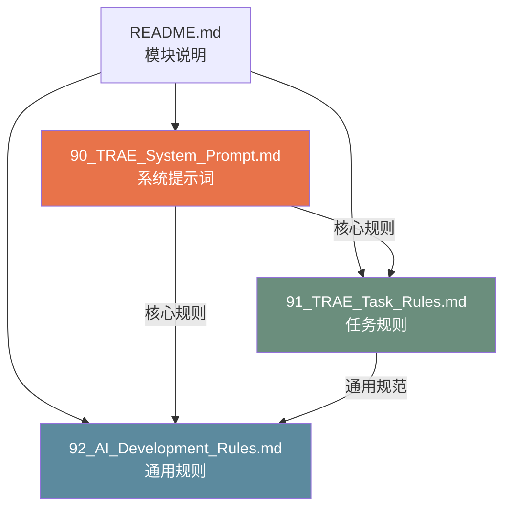

# 90 — Agent 规范说明 (Agent Specification Overview)

> **Companion（伴伴）AI 开发规范模块说明**
> 版本：v1.0 | 日期：2026-06-28 | 状态：正式发布

---

## 一、模块概述

`90_Agent/` 目录是 Companion 项目的 **AI 开发规范模块**，定义了所有 AI 开发工具在参与项目开发时必须遵循的规则和流程。

### 1.1 模块定位

| 维度 | 说明 |
|------|------|
| 定位 | AI 辅助开发的规范体系 |
| 目标 | 确保 AI 生成的代码符合项目标准 |
| 适用工具 | TRAE、Cursor、Claude Code、GitHub Copilot 等 |
| 重要性 | ⭐⭐⭐⭐⭐ 最核心的规范模块 |

### 1.2 为什么需要 Agent 规范？

AI 工具在辅助开发时，如果不遵循项目规范，可能会：

| 风险 | 后果 |
|------|------|
| 破坏 Design System | 视觉不一致 |
| 添加网络请求 | 违反隐私原则 |
| 生成重复代码 | 维护成本增加 |
| 使用错误的类型 | 类型安全丧失 |
| 忽略响应式 | 布局异常 |

Agent 规范通过明确的规则和检查清单，确保 AI 生成的代码**始终符合项目标准**。

---

## 二、文件说明

### 2.1 文件清单

| 文件 | 说明 | 重要性 |
|------|------|--------|
| [`90_TRAE_System_Prompt.md`](./90_TRAE_System_Prompt.md) | TRAE IDE 系统提示词 | ⭐⭐⭐⭐⭐ |
| [`91_TRAE_Task_Rules.md`](./91_TRAE_Task_Rules.md) | TRAE 任务执行规则 | ⭐⭐⭐⭐ |
| [`92_AI_Development_Rules.md`](./92_AI_Development_Rules.md) | AI 开发通用规则 | ⭐⭐⭐⭐ |
| [`README.md`](./README.md) | 模块说明（本文件） | ⭐⭐⭐ |

### 2.2 文件关系



### 2.3 各文件详解

#### 90_TRAE_System_Prompt.md（系统提示词）

**这是最重要的文件。** TRAE IDE 每次开发前都会读取此文件。

包含内容：
- 角色定义（AI 开发助手）
- 项目概述（技术栈、文件结构）
- **11 条硬性规则**（不可违反）
- 设计系统速查（颜色/间距/圆角/阴影/字号）
- 组件规范速查
- 编码规范
- 开发流程
- 完整的开发检查清单

#### 91_TRAE_Task_Rules.md（任务规则）

定义了 AI 执行开发任务的完整流程。

包含内容：
- 任务分类（Feature/Bugfix/Refactor/Design/Test）
- 任务执行流程
- 每种任务类型的详细步骤
- 代码审查规则
- 测试要求
- 提交规范
- 禁止操作列表

#### 92_AI_Development_Rules.md（通用规则）

适用于所有 AI 工具的通用开发规则。

包含内容：
- 代码生成规则
- 文件修改规则
- 新增文件规则
- 设计系统遵守规则
- 隐私规则
- 性能规则
- 测试规则
- 文档规则
- 完整的 Do/Don't 列表

---

## 三、如何配置不同 AI 工具

### 3.1 TRAE IDE 配置

TRAE IDE 是 Companion 项目的主要开发工具，原生支持 CDS 规范。

**配置步骤：**

1. 打开 TRAE IDE
2. 进入项目设置
3. 找到"系统提示词"或"Rules"配置
4. 将以下内容作为系统提示词：

```
按 Companion CDS v1.0 规范继续开发。请先阅读 CDS/90_Agent/90_TRAE_System_Prompt.md 和相关模块规范。

核心规则摘要：
1. 不能破坏 Design System
2. 不能修改 Design Token
3. 不能新增未命名颜色
4. 不能写重复组件
5. 新增页面必须响应式
6. 所有SVG必须可组合
7. 动画全部Lottie
8. 组件全部支持主题
9. 任何页面必须支持手机/平板/电脑
10. 隐私优先，所有数据本地存储
11. 温暖友好的UI文案
```

**使用方式：**

在 TRAE IDE 中，每次开始开发任务时，AI 会自动读取 `CDS/90_Agent/` 目录下的所有规范文件。

---

### 3.2 Cursor 配置

Cursor 使用 `.cursorrules` 文件来定义项目规则。

**配置步骤：**

1. 在项目根目录创建 `.cursorrules` 文件
2. 添加以下内容：

```
# Companion 项目规范

## 技术栈
- React 18 + TypeScript + Vite + TailwindCSS + Zustand
- Capacitor Android 打包
- localStorage 数据存储

## 核心规则
请阅读 CDS/90_Agent/90_TRAE_System_Prompt.md 了解完整规则。

简要规则：
1. 使用 TypeScript 严格模式，禁止 any 类型
2. 使用 Design Token（颜色 #E8734A、间距 8pt Grid、圆角 12/20/24px）
3. 支持深色/浅色主题（dark: 类名）
4. 响应式布局（Mobile/Tablet/Desktop）
5. 数据通过 StorageService 存储在 localStorage
6. 不添加任何网络请求
7. 不集成任何第三方 SDK
8. 面向用户的文案温暖友好

## 文件结构
src/
├── components/    # 共享组件
├── pages/         # 页面组件
├── hooks/         # 自定义 Hooks
├── services/      # 服务层
├── stores/        # 状态管理
├── types/         # 类型定义
└── utils/         # 工具函数

## 设计规范
详见 CDS/10_Design/ 目录
```

3. 保存文件后，Cursor 会在每次对话中自动加载此规则。

---

### 3.3 Claude Code 配置

Claude Code 使用 `.claude/rules` 目录来存放规则文件。

**配置步骤：**

1. 在项目根目录创建 `.claude/rules/` 目录
2. 创建规则文件：

```
.claude/
└── rules/
    ├── companion-rules.md    # 主规则文件
    └── design-system.md      # 设计系统规则
```

3. 主规则文件 `companion-rules.md` 内容：

```markdown
# Companion 项目开发规则

## 必读文件
开始任何开发任务前，请先阅读：
- CDS/90_Agent/90_TRAE_System_Prompt.md（系统提示词）
- CDS/90_Agent/92_AI_Development_Rules.md（通用规则）

## 核心约束
1. TypeScript 严格模式
2. Design Token 颜色系统
3. 深色/浅色双主题
4. Mobile/Tablet/Desktop 响应式
5. localStorage 本地存储
6. 隐私优先，无网络请求
7. 温暖友好的 UI 文案

## 技术栈
React 18 + TypeScript + Vite + TailwindCSS + Zustand + Capacitor
```

4. 设计系统规则 `design-system.md` 内容：

```markdown
# 设计系统规则

## 颜色
- 品牌主色: #E8734A
- 品牌浅色: #F09A76
- 品牌深色: #C45A2E
- 成功: #4CAF50
- 警告: #FF9800
- 错误: #EF5350
- 信息: #42A5F5

## 间距（8pt Grid）
p-1=4px, p-2=8px, p-3=12px, p-4=16px, p-6=24px, p-8=32px

## 圆角
rounded-xl=12px, rounded-[20px]=20px, rounded-[24px]=24px

## 阴影
shadow-sm, shadow-md, shadow-lg, shadow-xl
```

---

### 3.4 GitHub Copilot 配置

GitHub Copilot 使用 `.github/copilot-instructions.md` 文件。

**配置步骤：**

1. 在项目根目录创建 `.github/` 目录
2. 创建 `copilot-instructions.md` 文件

```markdown
# Companion 项目 Copilot 指令

## 项目概述
Companion（伴伴）是一个关系守护者 App，帮助用户用心记录、温柔记住每一段重要关系。

## 技术栈
- React 18 + TypeScript + Vite + TailwindCSS + Zustand
- Capacitor Android
- localStorage 数据存储

## 编码规范
1. 使用 TypeScript 严格模式，禁止 any
2. 使用 Design Token 颜色（主色 #E8734A）
3. 支持 dark: 深色模式
4. 响应式布局（sm/md/lg 断点）
5. 数据通过 storageService 存储

## 设计规范
- 品牌主色: #E8734A
- 间距: 8pt Grid (4/8/12/16/24/32px)
- 圆角: 12px(按钮) / 20px(卡片) / 24px(模态框)
- 阴影: shadow-md 默认
- 最小点击区域: 44x44px

## 禁止事项
- 不添加 fetch/axios 网络请求
- 不集成第三方 SDK
- 不硬编码颜色值
- 不使用 any 类型
- 不破坏现有组件

## 文件结构
src/components/ - 共享组件
src/pages/ - 页面
src/hooks/ - Hooks
src/services/ - 服务
src/stores/ - 状态
src/types/ - 类型
src/utils/ - 工具函数
```

3. 保存文件后，GitHub Copilot 会在每次建议代码时参考此指令。

---

## 四、使用最佳实践

### 4.1 开发前准备

在使用 AI 工具开发之前：

1. **阅读 CDS 规范** — 确保理解项目标准
2. **明确任务范围** — 确定需要修改的文件
3. **准备上下文** — 告诉 AI 当前的任务目标

### 4.2 与 AI 协作

在与 AI 协作开发时：

1. **提供清晰的指令** — 描述你想要实现的功能
2. **引用 CDS 规范** — "按照 CDS 规范实现..."
3. **审查 AI 生成的代码** — 对照检查清单验证
4. **及时修正** — 如果 AI 违反了规范，立即指出

### 4.3 代码审查

AI 生成的代码必须经过审查：

1. 运行 `npm run check` 检查 TypeScript
2. 运行 `npm run lint` 检查 ESLint
3. 对照开发检查清单逐项验证
4. 测试响应式布局和双主题

---

## 五、常见问题

### Q1: AI 生成的代码违反了 Design System 怎么办？

A: 立即指出违反的具体规则，要求 AI 按照规范重新生成。例如："请使用 Design Token #E8734A 而不是硬编码颜色值。"

### Q2: AI 尝试添加网络请求怎么办？

A: 明确告知："V1.0 阶段不允许任何网络请求，所有数据必须通过 StorageService 存储在 localStorage。"

### Q3: AI 生成了重复组件怎么办？

A: 指出已有组件的位置，要求 AI 复用而非新建。例如："src/components/ 目录中已有 AvatarCard 组件，请复用它。"

### Q4: 如何确保 AI 遵循响应式设计？

A: 明确指定断点要求："这个页面必须支持 Mobile (0-640px)、Tablet (641-1024px) 和 Desktop (1025px+) 三种布局。"

### Q5: AI 生成的文案太冷冰冰怎么办？

A: 提供正确的文案风格示例："请使用温暖友好的文案风格，参考 CDS 中的文案规范。"

---

## 六、规范更新

### 6.1 更新流程

| 步骤 | 说明 |
|------|------|
| 1 | 在 Issues 中提出更新建议 |
| 2 | 讨论并确认更新内容 |
| 3 | 修改对应的 CDS 文件 |
| 4 | 更新版本号和日期 |
| 5 | 通知所有开发者 |

### 6.2 版本管理

| 版本 | 日期 | 说明 |
|------|------|------|
| v1.0 | 2026-06-28 | 首次发布 |

---

> **Companion Agent 规范 — 让 AI 成为可靠的开发伙伴。**
